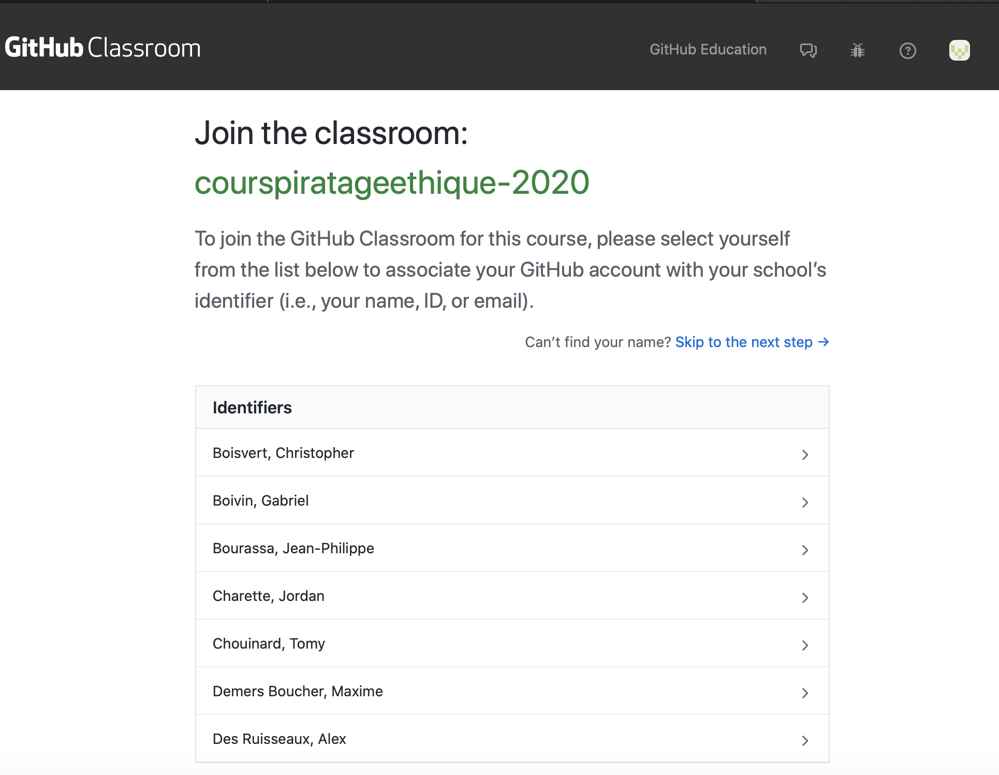

# Exercices - Sécuriser une application Web - Première partie

## Code source  

Le code source de l'application MonMur se trouve sur GitHub Classroom.

Connectez-vous et consultez le projet : [Projet du cours de Piratage Éthique](https://classroom.github.com/a/pn91WHmc)  

!!! figure "Choisissez votre nom dans la liste"  
      

Vous utiliserez GitHub pour les prochains cours. Veuillez faire un `commit` à la fin de chaque classe. Le projet est à remettre à la fin de la session.  

## VM contenant l'application Web  

L'application MonMur se trouve sur la VM [MonMur](../labo/Installation_MonMur_VirtualBox.md).

Durant cet exercice, vous aurez à sécuriser l'application contre les vulnérabilités suivantes :  

- Cas limites lors de l'envoi de commentaires  
- XSS  
- Injection PHP via le téléversement de fichiers  

L'application se trouve dans `/var/www`.
