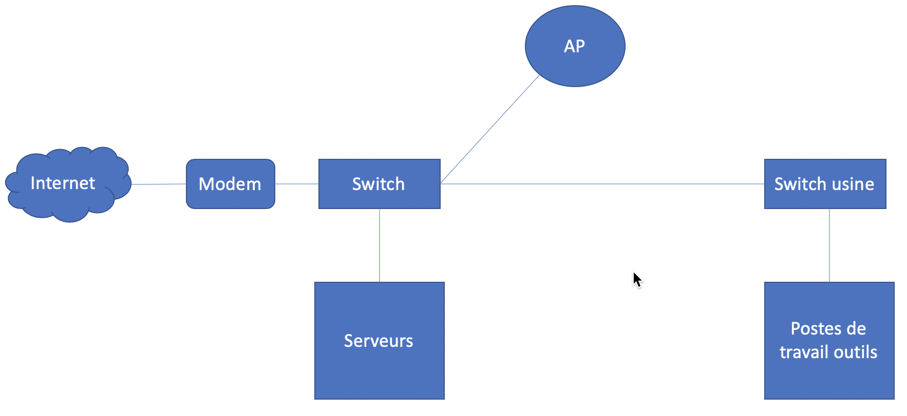

# Dossier de sécurité

# Mise en situation

## Description de l'entreprise

La compagnie Kerzo vous donne le contrat de mettre en place une stratégie de sauvegarde.

La compagnie a une usine de 50 employés.

## Employés de l'entreprise

| Nom de l'employé | Poste                         | Superviseur     |
| ---------------- | ----------------------------- | --------------- |
| Karine Béliveau  | présidente                    |
| Sandra Houle     | vice-présidente               | Karine Béliveau |
| Eric Perreault   | directeur TI                  | Sandra Houle    |
| Serge Gagnon     | directeur RH                  | Sandra Houle    |
| Pierre Michaud   | directeur d'usine             | Karine Béliveau |
| Mireille Boucher | directrice des communications | Sandra Houle    |

## Actifs de l'entreprise

### Serveurs

| Serveur | Fonction                                                  | Poids (augmentation)     |
| ------- | --------------------------------------------------------- | ------------------------ |
| PGI     | Contient le logiciel de gestion de la compagnie           | 20 gb (+1 gb par mois)   |
| FIC     | Contient les fichiers de la compagnie (Word, Excel, etc.) | 40 gb (+3 gb par mois)   |
| PAYE    | Contient le logiciel de paie                              | 10 gb (+500 mb par mois) |
| AD      | Contient le contrôleur de domaine, services DNS et DHCP   | 15 gb (stable)           |
| WEB     | Contient le site Web de l'entreprise                      | 20 gb (stable)           |

### Postes de travail outils

| Poste de travail | Fonction                           | Système d'exploitation |
| ---------------- | ---------------------------------- | ---------------------- |
| CNC1             | Robot manufacturier                | Windows XP             |
| PILEUR           | Machine pour piler les matériaux   | Windows 98             |
| SOUDEUSE         | Contrôleur du processus de soudage | Windows 7              |

### Diagramme réseau

## Informations diverses

Les heures d'opération sont du lundi au vendredi, de 8h à 12h et de 13h à 17h.

Le responsable de la paie entre ses données le lundi et génère la paie avant mardi midi.

L'ensemble des opérations dans l'usine est contrôlée par le PGI. Perdre plus d'une demie-journée de données serait catastrophique. Cependant, les plans de contingence font que la production peut fonctionner 8 heures sans le système informatique.
