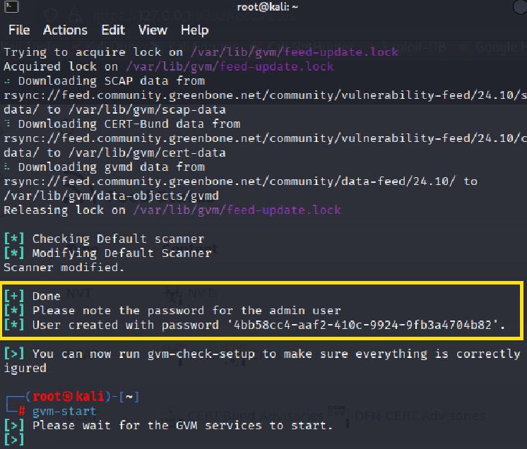
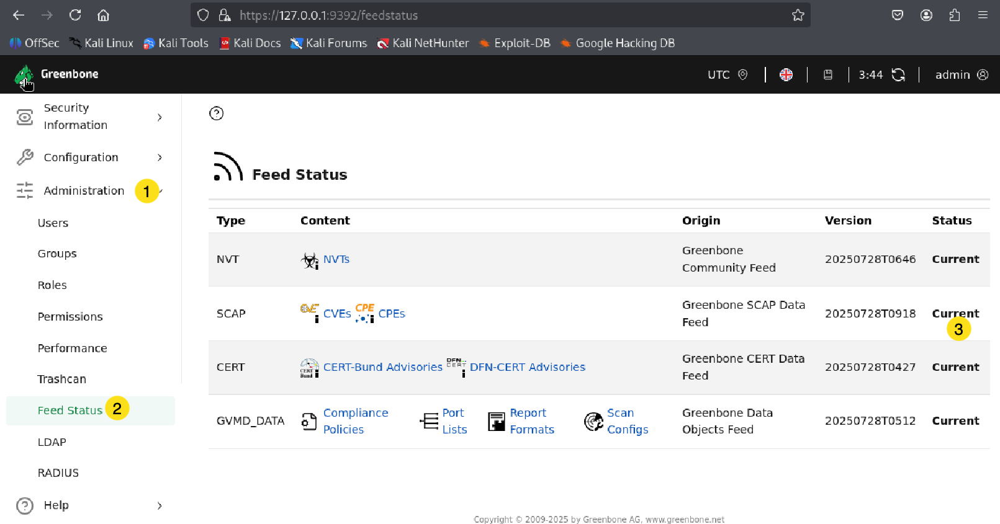

# Installation d'OpenVAS (Greenbone)

L'installation se fait dans la VW de Kali Linux.  

Mettre à jour apt :  

`sudo apt update`  

Pour installer OpenVAS :

`sudo apt install openvas`

Pour la configuration initiale :

`sudo gvm-setup`

!!! Warning   
    Prenez bien soin de prendre en note le mot de passe généré par `gvm-setup`. C'est essentiel pour se connecter au portail d'OpenVAS.  
    . 

Pour démarrer GVM :  

`sudo gvm-start`

!!! important  
    Lors de la première exécution, veuillez attendre 4 à 6 heures pour que la base de données de GVM se génère.    

Ouvrir la console web :

https://127.0.0.1:9392/

Pour voir le status des "feeds" de OpenVas :  

1. Administration 
2. Feed Status  
3. Assurez-vous que le status est à **current**.

  
