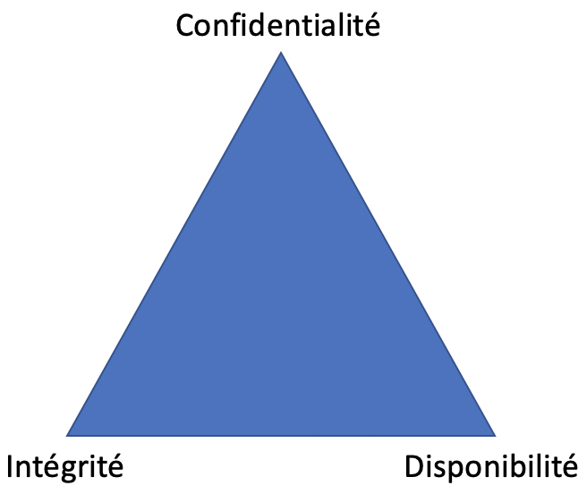

# Introduction

## Certifications

Plusieurs certifications existent sur le marché pour la cybersécurité. Voici les deux les plus connues

**CISSP** : Focus sur la protection des actifs de l'entreprise  
**CEH** : Focus sur l'attaque (Piratage éthique)

## Triangle de sécurité  

!!! figure "Triangle de sécurité"
    
    La base du CISSP  

Les 3 piliers de la cybersécurité :  

Pilier  | Description  | Attaque typique
--|---|--
Confidentialité  | Conserver les données privées, hors de portée de personnes malicieuses  |  Vol de données
Intégrité  | Garder les données conformes  |  Modification illicite de données
Disponibilité  | Pouvoir accéder aux données lorsque requis  | Attaque DoS

## Vulnérabilités, menaces et exploiter les failles

### Vulnérabilité

Une vulnérabilité est une faiblesse dans un système ou dans son design qui peut être exploitée.

Une vulnérabilité peut être trouvée dans :

- Un système d'exploitation
- Un protocole
- Une application
- Du matériel
- Un design de système

Exemples de vulnérabilités :  

- Injection SQL   
- Dépassement de mémoire tampon (Buffer Overflow)  

La communauté de cybersécurité compile la liste des vulnérabilités nommée CVE (Common vulnerabilities and exposures)

### Menace

Une menace est un danger potentiel d'un actif.

### Exploiter une faille (Exploit)

Dans ce cours, nous utiliserons le terme anglophone _exploit_ pour parler de séries de commandes ou un logiciel qui prennent avantages d'une vulnérabilité pour causer du tort à un système.

Deux grandes catégories d'_exploits_, celles qui sont locales et celles qui sont à distance.

## Pourquoi du piratage éthique?

Les coûts reliés à une attaque pour une grande entreprise est en moyenne de 4 millions.

Plus tard est détectée l'attaque, plus c'est couteux.

Un pirate éthique permet de découvrir les failles de sécurité de l'entreprise, pour mieux la protéger. C'est un peu comme un voleur qui ferait le tour de ta maison pour te dire comment il pourrait s'y introduire pour faire un vol.

### Équipe rouge VS équipe bleue

Dans beaucoup de grandes entreprises, l'équipe de sécurité se séparent en deux, avec l'équipe rouge qui s'occupe de l'offensive (trouver les vulnérabilités) et l'équipe bleue s'occupe de la défensive (SOC, Gestion de rustine, etc.)

## Outils utilisés

Le principal outil utilisé sera Kali Linux. Cette distribution Linux, basée sur Debian, regroupe une grande quantité d'outils utiles aux tests de pénétration.

## Laboratoire du cours

Chaque étudiante et étudiant aura son propre laboratoire sur son ordinateur. Les différentes machines virtuelles (VM) seront démarrées dans VirtualBox.

Machine 1 - L'attaquant : Kali Linux ([Installer Kali](../labo/Installation_Kali_VirtualBox.md))

Machine 2 - Serveur cible : Metasploitable ([Installer Metasploitable](../labo/Installation_Metasploitable_VirtualBox.md))

Machine 3 - Poste de travail Windows XP ([Installer Windows XP](../labo/Installation_WindowsXP_VirtualBox.md))

## Lectures supplémentaires

[Programme CEH](https://www.eccouncil.org/programs/certified-ethical-hacker-ceh/)  
[Programme CISSP](https://www.isc2.org/Certifications/CISSP)  
[Kali Linux by Offensive Security](https://www.kali.org/)  
[Liste des outils de Kali Linux](https://tools.kali.org/tools-listing)  
[OWASP - Vulnerabilities](https://owasp.org/www-community/vulnerabilities/)  
[CVE List](https://cve.mitre.org/cve/)  