# Écoute du réseau avec Wireshark

Wireshark est un analyseur de protocole réseau. Avec cet outil, nous pouvons collecter tous les paquets IP qui se transigent sur le réseau.

Dans notre laboratoire, Wireshark sera utilisé dans Kali. Normalement, VirtualBox gère le réseau comme un commutateur (_switch_). Le trafic réseau entre 2 machines ne peut pas être vu par une 3ème machine.

Ex:

Machine A : Windows XP  
Machine B : Metasploitable  
Machine C : Kali  

Quand la machine A communique avec la machine B, seulement la machine A et la machine B _voient_ les paquets. Ceux-ci sont invisibles pour la machine C.

Il y a cependant une manière de contourner ceci, pour que Kali puisse _voir_ le trafic des autres VM. C'est le mode _promiscuous_.

!!! figure "Dans les configurations de la VM Kali, dans la section Network, changez le Promiscuous Mode_ à Allow All"
    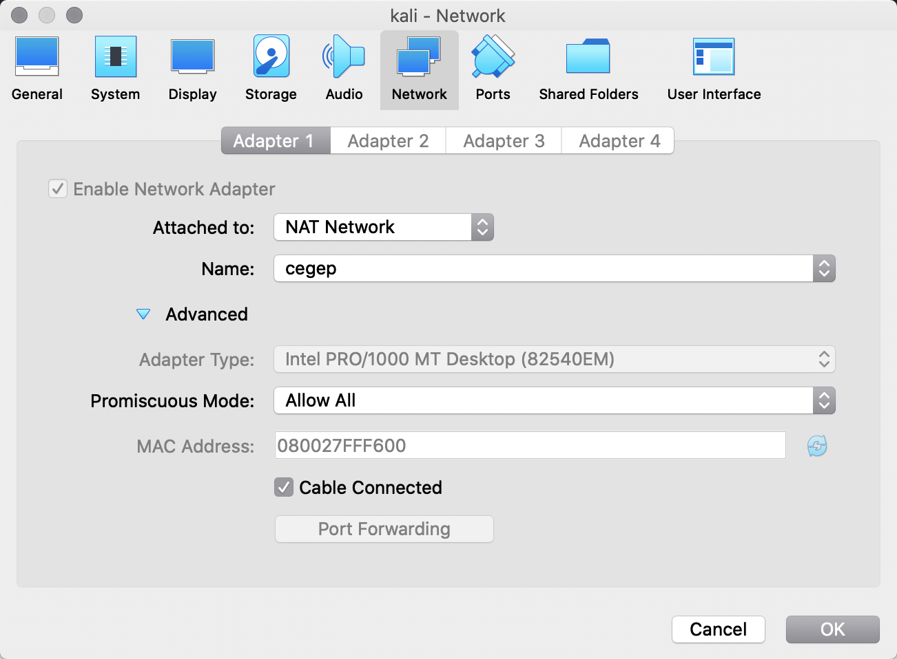

## Démarrer une écoute du réseau

!!! figure "Écran principal de Wireshark"
    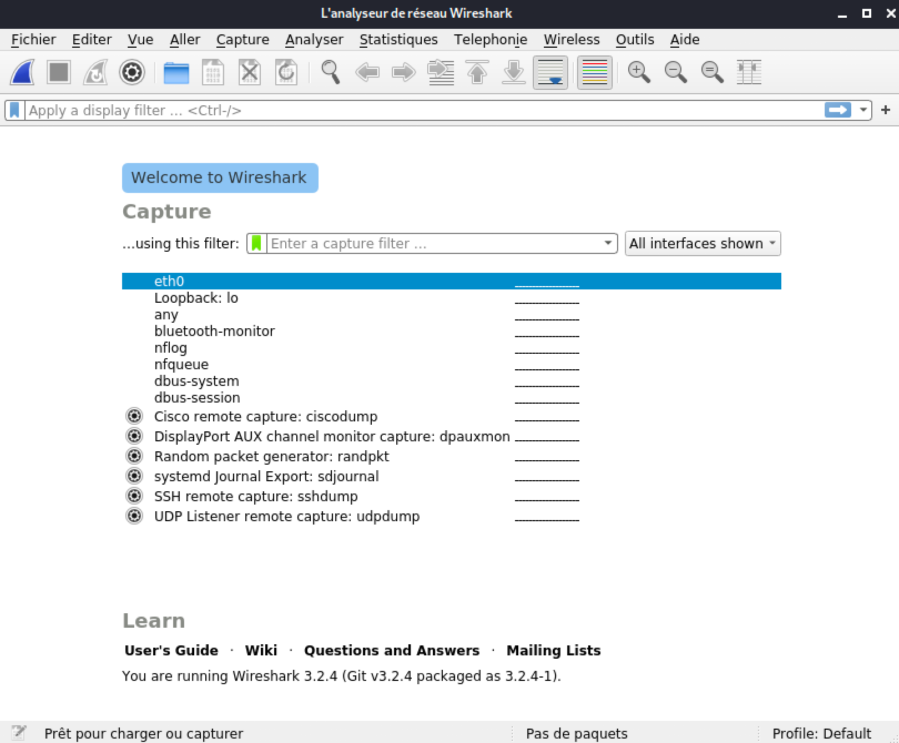

!!! figure "Pour démarrer l'écoute, double-cliquez sur eth0."
    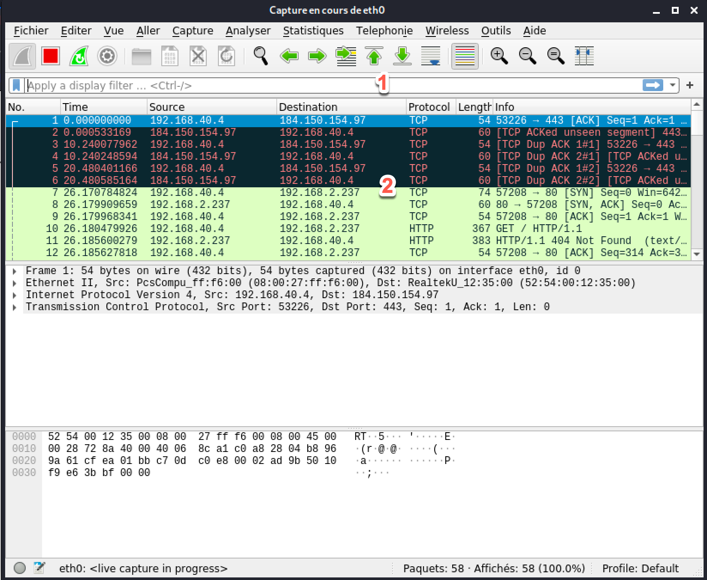
    1. Interface de filtre  
    2. Liste des paquets transmis  

Avant d'aller plus loin, disons que nous sommes allés sur la page principale de Google.

## Filtres

Une des premières choses qu'un ordinateur fait lorsque nous voulons accéder à une page Web et de faire un requête au serveur DNS.

!!! figure "Recherchons les paquets DNS dans notre capture"
    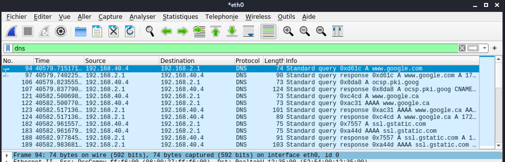

Regardez les deux premières entrées :

La première montre notre ordinateur (192.168.40.4) fait une demande de requête DNS au serveur DNS (192.168.2.1). La seconde entrée montre la réponse du serveur DNS à notre ordinateur.

!!! figure "Pour trouver la réponse spécifique à une requête, on peut activer un filtre en quelques étapes"
    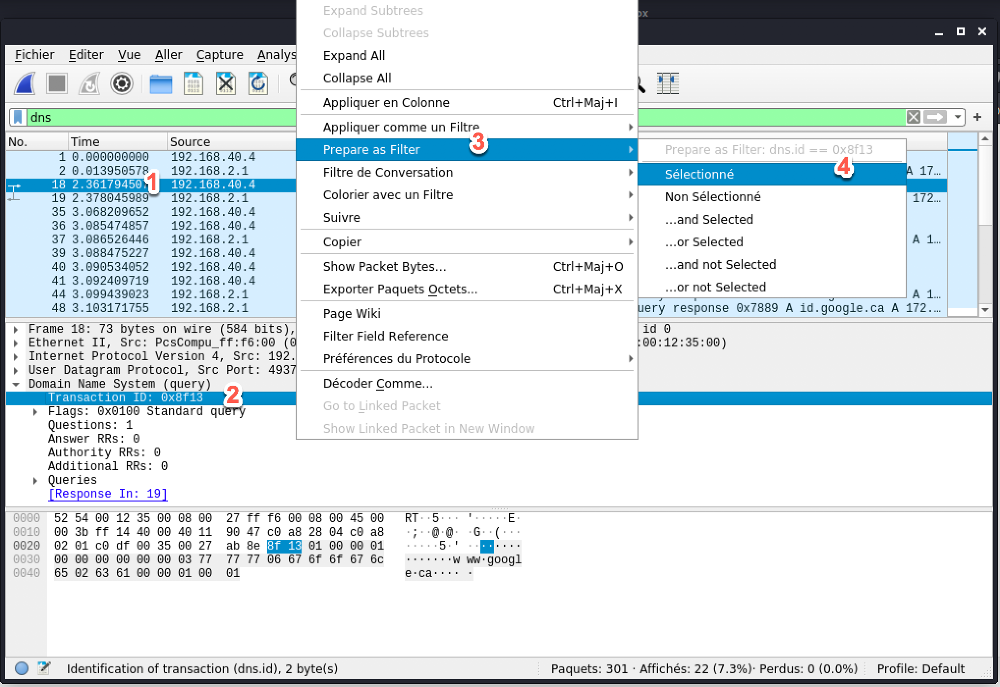
    1. Cliquer sur la transaction dns  
    2. Dans la section Domain Name System (query), faire un clic droit sur l'item transaction id  
    3. Sélectionner le menu Prepare as filter  
    4. Sélectionner le menu Sélectionné  

Ce que ça donne est le filtre `dns.id==<id_transaction>`

!!! figure "Il est aussi possible de l'inscrire manuellement"
    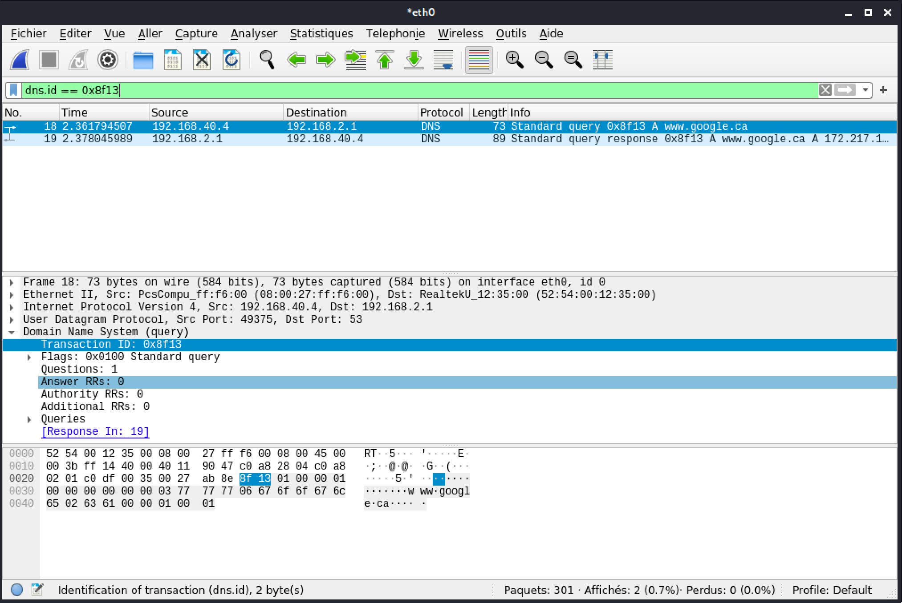

!!! figure "Pour voir les paquets qui sont reçus du serveur de Google, appliquons un différent filtre"
    `ip.src == 172.217.13.195`
    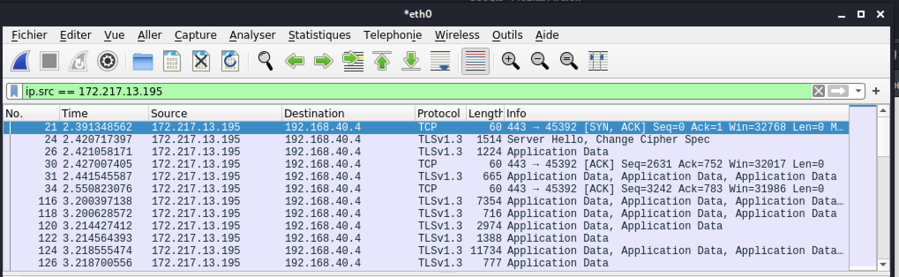

!!! figure "Pour voir les paquets envoyés ET reçus du serveur de Google"
    `ip.src == 172.217.13.195 or ip.dst == 172.217.13.195`
    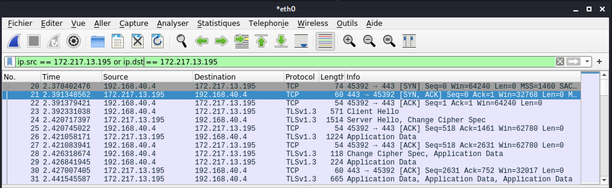

Prendre note des 3 premières transactions avec le protocole TCP. On peut y voir clairement la négociation à 3 étapes (_3-way-handshake_) de TCP entre les deux intervenants.

À noter que `ip.addr == 172.217.13.195` est équivalent à `ip.src == 172.217.13.195 or ip.dst == 172.217.13.195`

Autres recherches possibles :

`tcp.port == 443`  
`data-text-lines contains "twiki"`  
`http.request.method == "GET"`  

## nmap

Qu'arrive-t'il lorsque nous utilisons la commande nmap?

Exécutons la commande suivante :

`sudo nmap -sS T4 192.168.40.7`

!!! figure "Résultat de nmap dans Wireshark"
    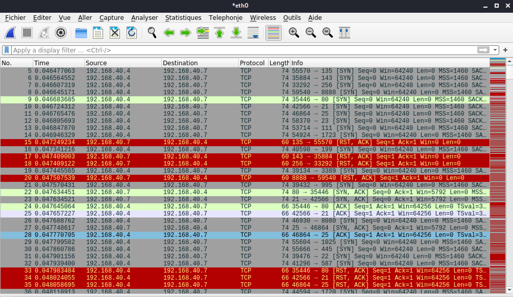
    Disons que ce n'est pas discret!!!

## Nitko

Qu'arrive-t'il lorsque nous utilisons la commande nitko?

Exécutons la commande suivante :

`nitko -h 192.168.40.7`

!!! figure "Résultats de nitko dans Wireshark"
    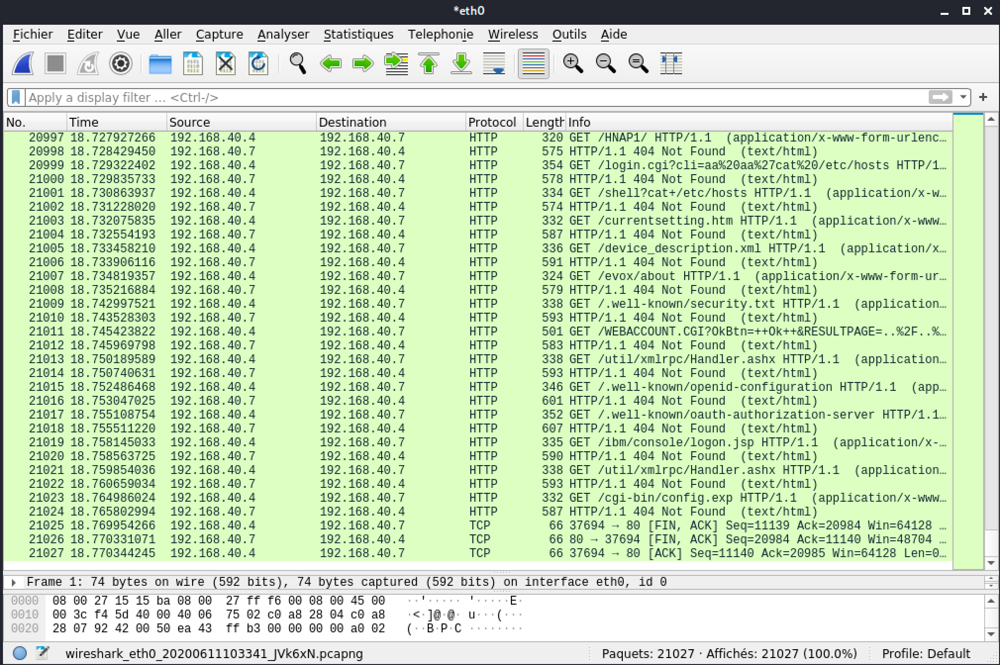
    Impossible de passer inaperçu!

## Protocoles insécures

Wireshark peut nous aider à espionner les victimes lorsqu'ils utilisent des protocoles non sécuritaires.

### FTP

!!! figure "Voici la transaction ftp"
    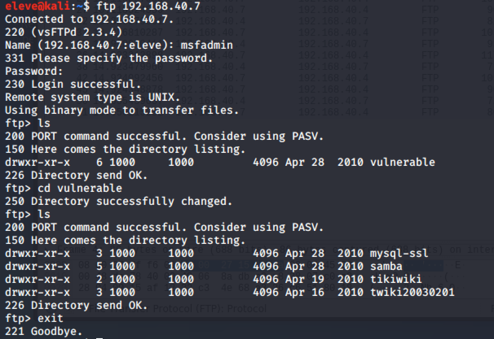

!!! figure "Résultat de ftp dans Wireshark"
    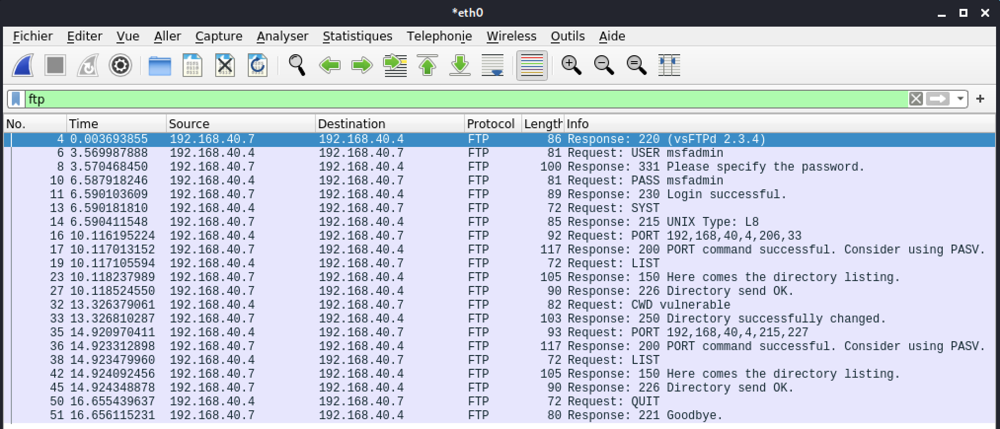
    Avez-vous trouvé le mot de passe utilisé?

### Telnet

!!! figure "Voici la transaction telnet"
    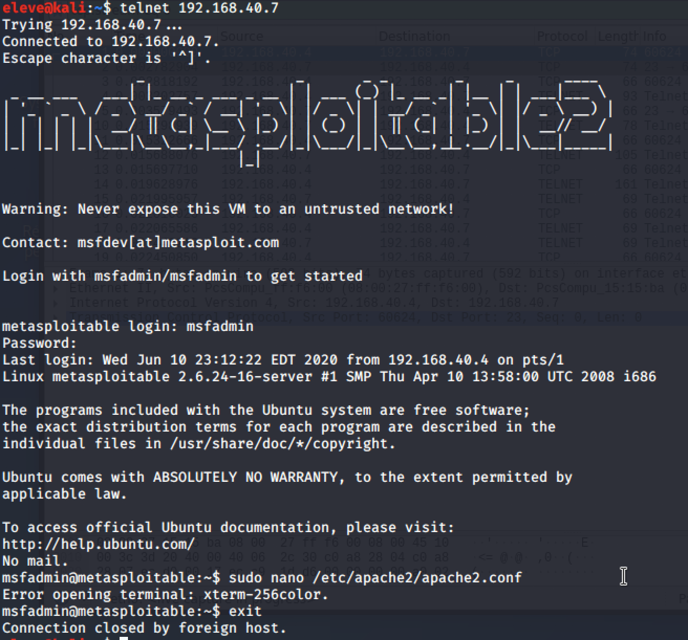

!!! figure "Résultat de telnet dans Wireshark"
    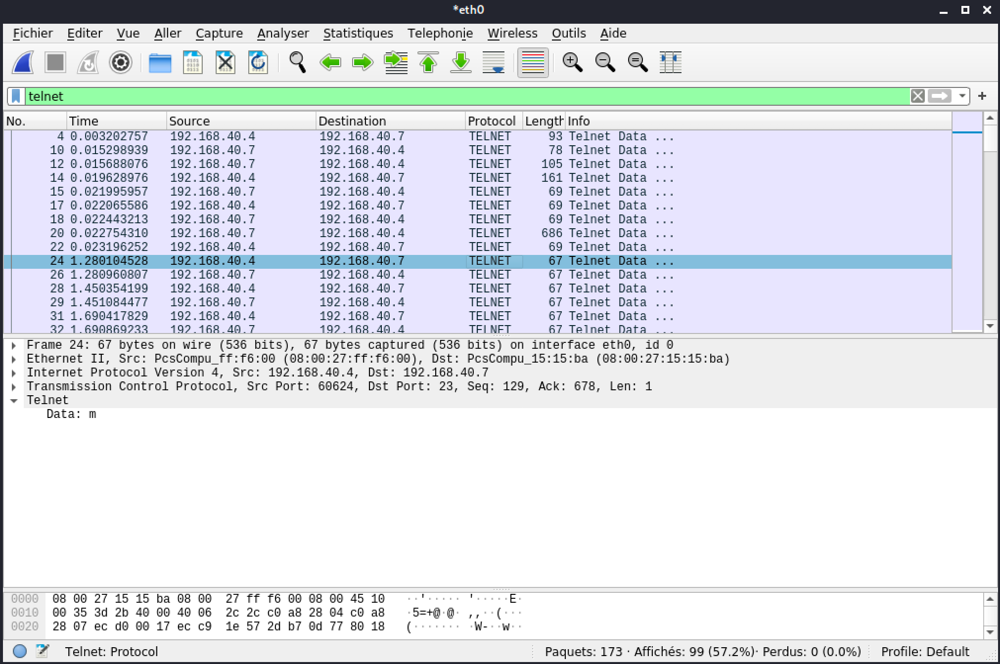
    Ce n'est pas très facile de voir ce qui se passe. Telnet envoie les touches appuyées une par une...

!!! figure "Une fonctionnalité de Wireshark est de recueillir la communication ou conversation avec sa fonction suivre le flux"
    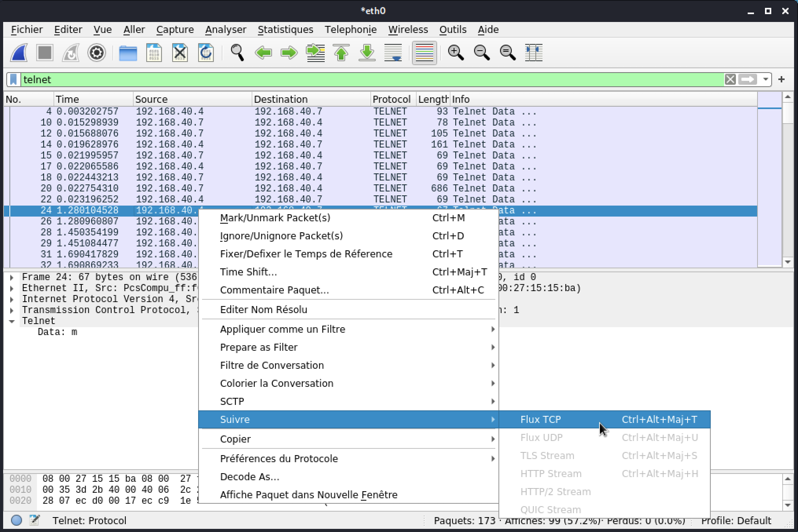

!!! figure "Résultat de suivre le flux"
    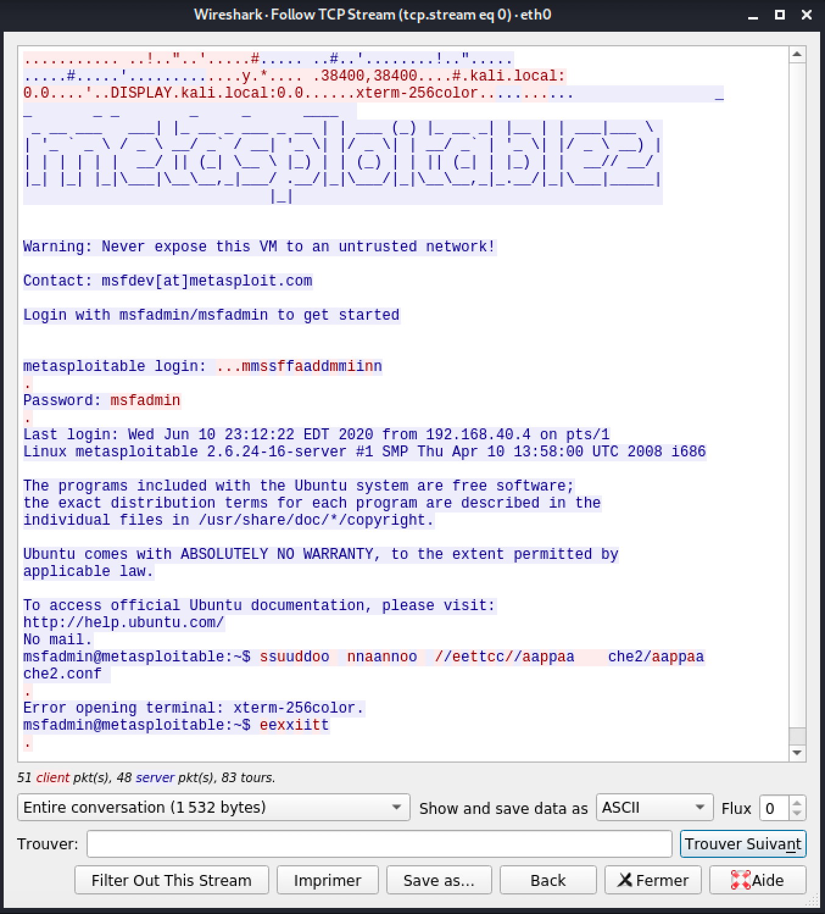

!!! important  
    Prenez quelques minutes pour faire votre [cartographie](../outils/cartographie.md) de la leçon d'aujourd'hui!   

## Testez vos connaissances  

[Petit quiz sur l'écoute du réseau](https://forms.office.com/r/21wbTS7464)  
