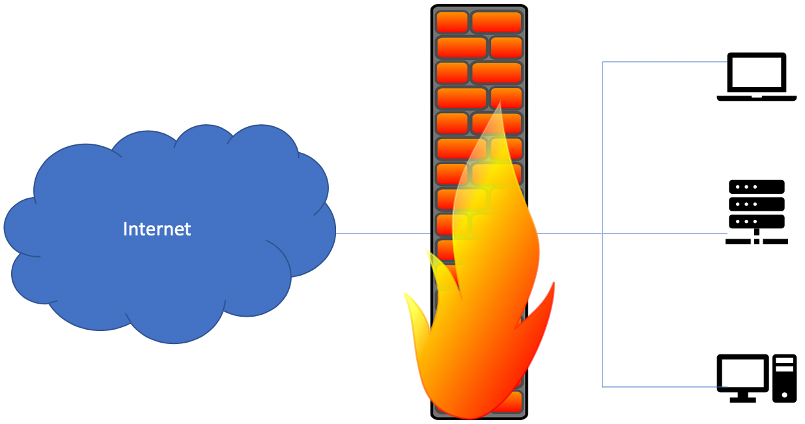
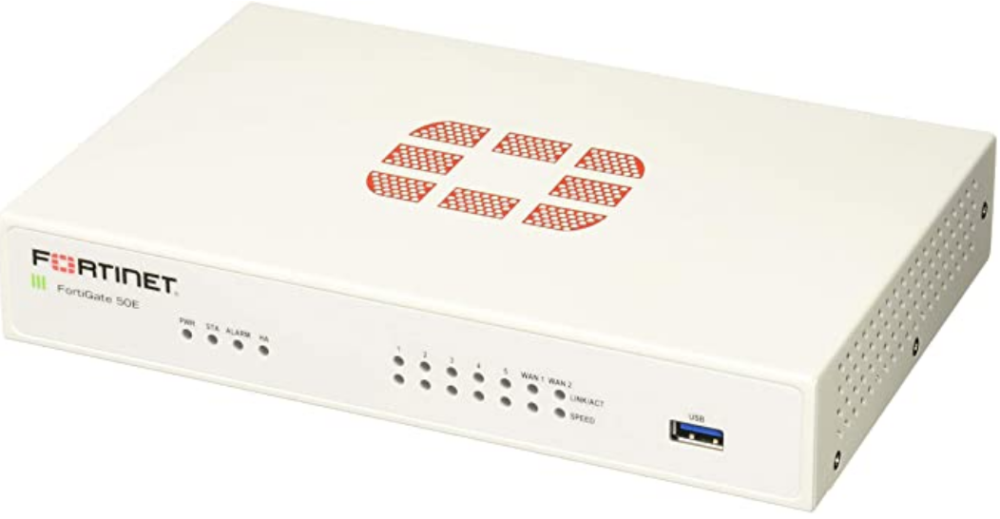
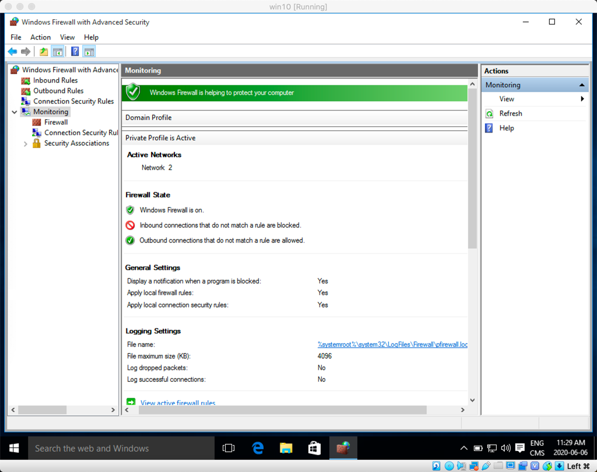
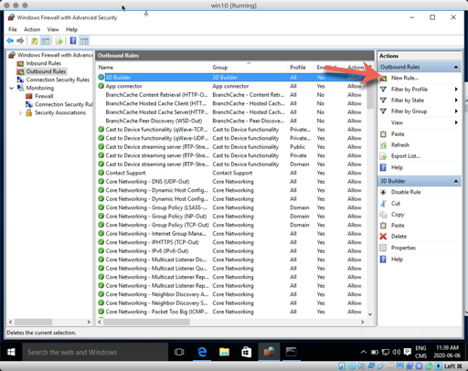
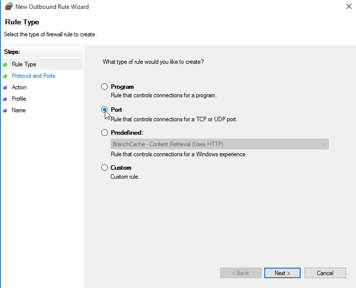
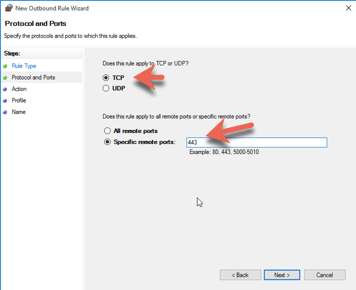
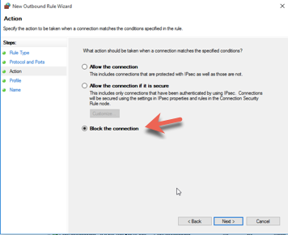
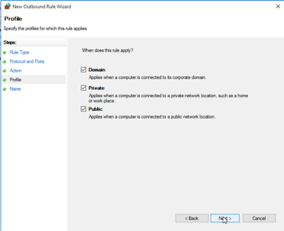
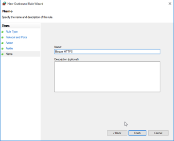

# Les pare-feux

Définition de wikipedia :

Un pare-feu est un logiciel et/ou un matériel permettant de faire respecter la politique de sécurité du réseau, celle-ci définissant quels sont les types de communications autorisés sur ce réseau informatique. Il surveille et contrôle les applications et les flux de données (paquets).

Types de pare-feux :  

- Pare-feu sans état (stateless firewall)
- Pare-feu à états (stateful firewall)
- Pare-feu applicatif
- Pare-feu personnel

Un pare-feu est typiquement utilisé entre des zones réseaux de différentes natures. (ex: Internet vs réseau interne)

## Pare-feu sans état

Un pare-feu très simpliste. Il agit sur chaque paquet indépendamment, sans tenir compte du protocole. Se configure avec des règles ou des filtres.

Ex:

Source : 10.0.0.0/24  Port : Tous

Destination : 192.168.0.1 Port : 80

Règle : Permettre (_allow_)

## Pare-feu avec état

Un pare-feu avec une certaine capacité à se souvenir. En effet, les pare-feux avec état conservent en mémoire les conversations TCP qui sont établies entre deux hôtes pour mieux contrôler le trafic entre les segments de réseau.

## Pare-feu applicatif

Un pare-feu avec une bonne connaissance de certains protocoles, permettant des règles de filtres évoluées pour restreindre ce qui peut passer, selon l'utilisation du protocole utilisé. Par exemple, la commande GET de HTTP pourrait être permise, mais pas la commande PUT.

## Pare-feu personnel

Un type de pare-feu avec état qui est installé sur les postes de travail.

## Pare-feu matériel

Grands manufacturiers de pare-feux :

- Cisco   
- Juniper  
- Fortinet  
- CheckPoint  
- SonicWall  

Appareils spécialisés qui n'ont qu'une fonction, protéger le réseau interne d'une compagnie.

## Pare-feu logiciel

### Windows

Le pare-feu de Microsoft Windows est un pare-feu personnel.

Le pare-feu de Windows peut filtrer selon :

- Le port
- L'application

Pour créer un règle qui empêche le trafic sur 443 :

### Linux

Voici quelques pare-feux disponibles pour Linux :

- IPTables  
- ShoreWall
- UFW
- pfSense
- Endian

Pour le cours, UFW sera utilisé.

Pour l'installation :

`sudo apt-get install ufw`

Pour vérifier le status du pare-feu :

`sudo ufw status`

Pour activer le pare-feu :

`sudo ufw enable`

Pour désactiver le pare-feu :

`sudo ufw disable`

Pour permettre un protocole spécifique (ex: ssh) :

`sudo ufw allow ssh`

(Ça permet ssh sur tcp et udp) Pour tcp seulement :

`sudo ufw allow ssh/tcp`

Pour voir la liste des services que connait UFW :

`less /etc/services`

Pour restreindre un protocole spécifique (ex: ftp) :

`sudo ufw deny ftp`

Pour effacer une règle :

`sudo ufw delete deny ftp`

Pour permettre un port spécifique (ex: 8080) :

`sudo ufw allow 8080`

Pour permettre un actif spécifique de se connecter à n'importe quel port :

`sudo ufw allow from 192.168.2.10`

En combinant, on peut faire une règle plus spécifique :

`sudo ufw allow from 192.168.2.10 to any port ssh`

Pour voir la liste des règles numérotées :

`sudo ufw status numbered`

Pour effecer une règle par son numéro :

`sudo ufw delete 3`

Pour réinitialiser le pare-feu :

`sudo ufw reset`

Méthode pour configurer un pare-feu :

1. Assurez-vous que la règle par défaut est de restreindre (_deny_)
2. N'ouvrez que les ports qui sont nécessaires, que pour les clients nécessaires.

Ex : Pour un serveur Web utilisé qu'à l'interne de notre sous-réseau.

`sudo ufw reset`

`sudo ufw default deny`

`sudo ufw allow from 192.168.40.0/24 to any port http`

`sudo ufw allow from 192.168.40.0/24 to any port https`

`sudo ufw enable`

!!! important  
    Prenez quelques minutes pour faire votre [cartographie](../outils/cartographie.md) de la leçon d'aujourd'hui!   

## Testez vos connaissances  

[Petit quiz sur les pare-feux](https://forms.office.com/r/kGciDMVBy8)
