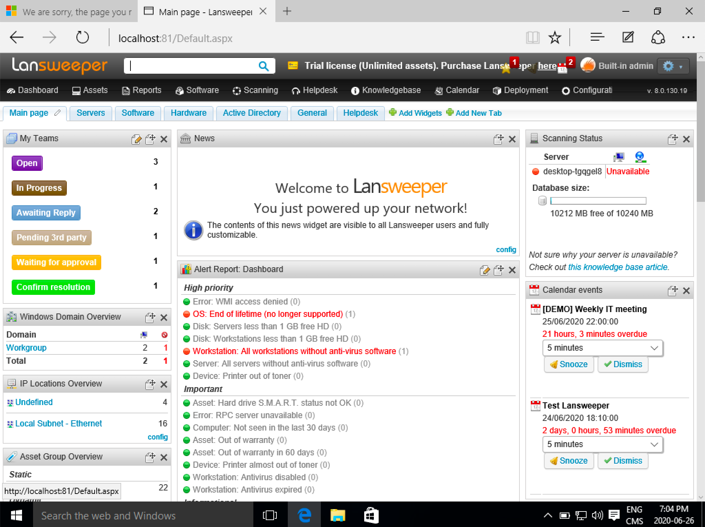
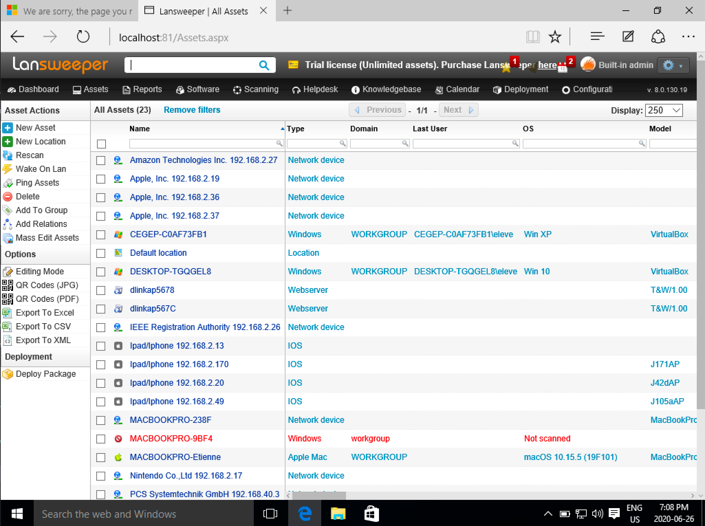
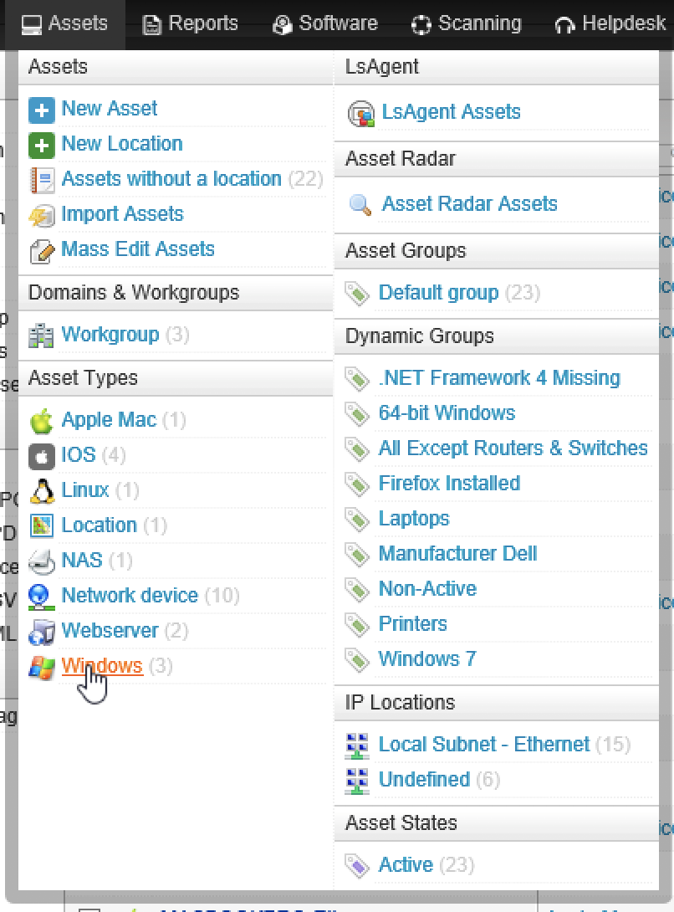
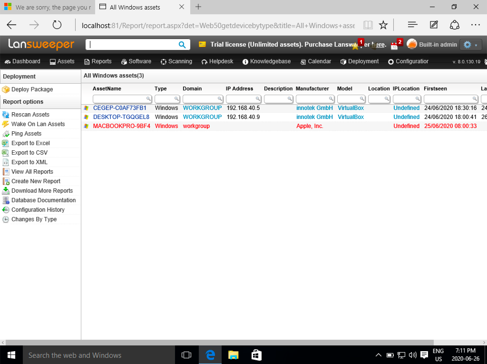
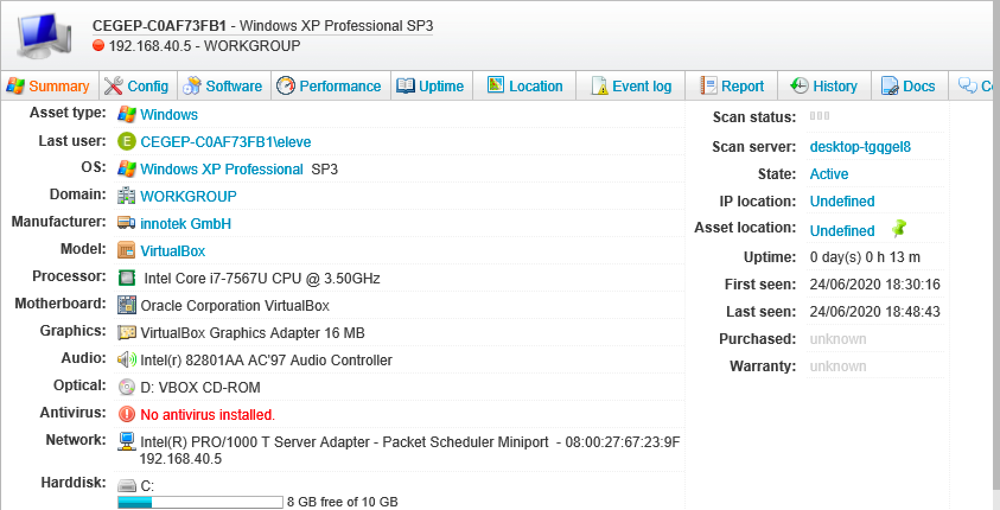
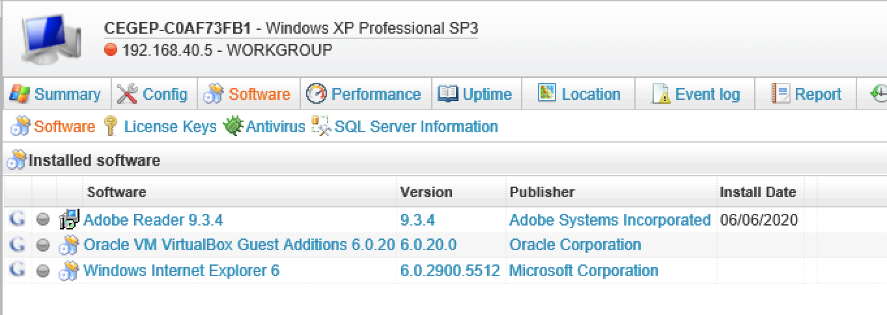
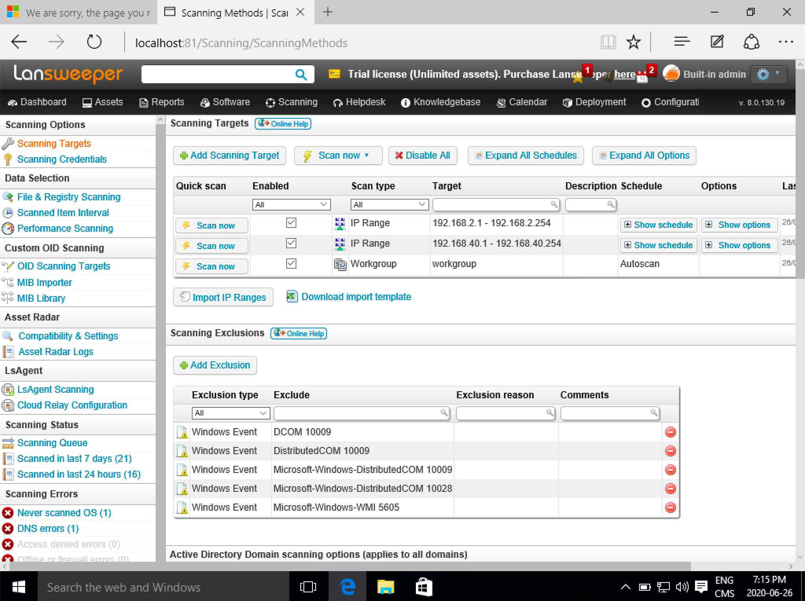

# Inventaire d'actifs

## Types d'actifs

Un actif peut être :

- Un ordinateur
- Un serveur
- Une base de données
- Un logiciel
- Un périphérique
- Etc.

## Classification d'actifs

La classification d'actifs en entreprise peut changer d'une compagnie à l'autre. On rencontre souvent ces classes :

1. Public : Réfère à un actif qui peut être consulté par tout le monde, même à l'extérieur de l'entreprise. Par exemple : le site Web de l'entreprise  
2. Interne : À usage interne de l'entreprise seulement. Par exemple : Le ERP de l'entreprise.  
3. Confidentiel : Pour un usage réservé à certaines personnes dans l'organisation. Par exemple : Les données de paie.  

La classification aide dans la pratique de cybersécurité pour déterminer les moyens à prendre pour sécuriser les actifs.

## Propriétaire d'actifs

En entreprise, il est important de déterminer qui est le propriétaire de l'actif. C'est ce dernier qui prendra les décisions selon vos recommandations de sécurité.

Le propriétaire a la responsabilité de :

- Classifier l'actif  
- Déterminer la politique d'accès de l'actif  
- Déléguer les responsabilités de gestion à un gardien  

Le gardien (souvent le département TI) a la responsabilité de :  

- Prendre les sauvegardes  
- S'assurer des bons niveaux d'accès  
- Protéger les actifs  
- Ajouter ou retirer des utilisateurs  
- Documenter l'actif  

## Dossier de sécurité

Dans le dossier de sécurité d'une entreprise, il y aura une section sur l'inventaire où la liste des actifs et les informations suivantes :  
- Le nom de l'actif  
- Une brève description  
- Le propriétaire de l'actif  
- La classification  
- La fréquence de sauvegarde  

Ex :  

Nom  | Description  | Propriétaire  | Classification  | Fréquence de sauvegarde  
--|---|---|---|--  
PAIE  | Base de données de la paie des employés  | Serge Gagnon, directeur RH  | Confidentiel  | Complet le mercredi soir
ERP  | Serveur du progiciel de gestion intégrée  | Sandra Houle, vice-présidente  | Interne  | Complet le dimanche, différentiel les autres soirs   
BUREAU  | Serveur de fichiers  | Pierre Michaud, directeur d'usine  | Interne  | Complet le dimanche, différentiel les autres soirs   
WEB  | Site Web de l'entreprise  | Mireille Boucher, directrice des communications  | Public  | Complet le dimanche seulement   

## Outils de découverte d'inventaire d'actifs sur le réseau  

Avoir un inventaire de tout ce qui est connecté sur le réseau de l'entreprise est une nécessité pour un professionnel de la cybersécurité. En effet, il ne faut qu'un actif non protégé pour que le pirate puisse prendre d'assault le réseau interne.  

Pour être bien protégé, il faut connaître ces informations :  

- Les systèmes d'exploitation, leurs versions et leurs niveaux de rustines (_patch_)  
- Les logiciels installés et leurs versions  
- Les aspects matériels tels que le processeur et autres périphériques

Ce peut être très fastidieux de comptabiliser tout ça à la main et le risque est grand que l'information ne soit pas à jour.

Pourquoi faut-il savoir tout ça?  **Pour déterminer quel actif est à risque lorsque le fournisseur émet un avis de faille.**

Ex: Le mardi de chaque semaine, Microsoft annonce les nouvelles rustines qui colmatent les trous de sécurité. (_Microsoft Patch Tuesday_). Avec un inventaire à jour, il est facile de déterminer quel actif doit recevoir la rustine.

Un outil très connu sur le marché se nomme **LanSweeper**.

Page principale de LanSweeper :  

Page des actifs de LanSweeper :  

Sélectionner les actifs fonctionnant sur Windows :  

Le résultat de la sélection :  

Le détail d'un actif :  

Les logiciels installés :  

Le logiciel fait la découverte d'actifs en balayant le réseau :  

!!! important  
    Prenez quelques minutes pour faire votre [cartographie](../outils/cartographie.md) de la leçon d'aujourd'hui!   

## Testez vos connaissances  

[Petit quiz sur l'inventaire d'actifs](https://forms.office.com/r/Ybvg5jQj53)  
