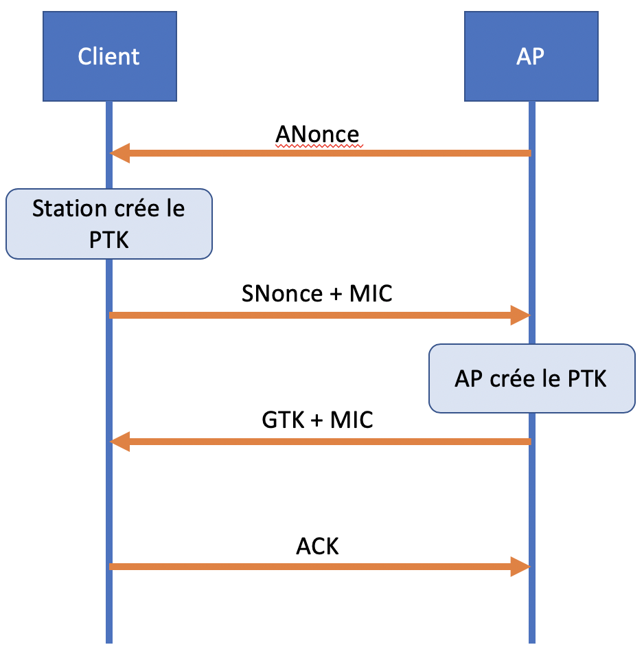
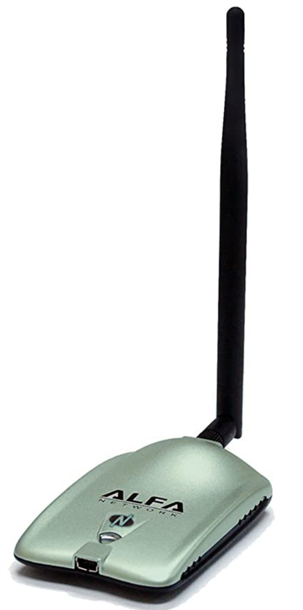
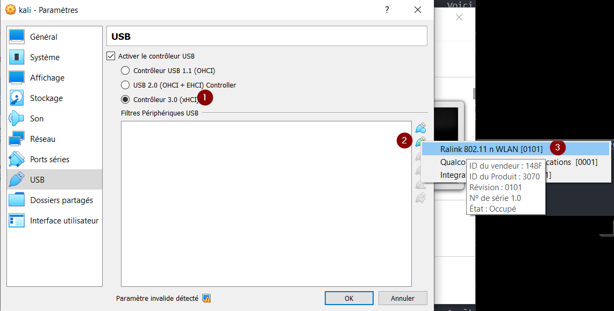

# Pénétration de réseau sans-fils

## Nature du réseau sans-fils

Le protocole 802.11 permet la communication entre appareils via les ondes radio. Les ondes radio voyagent librement dans l'air et peuvent être écoutées par n'importe quel appareil qui se trouve assez proche pour recevoir l'onde.

C'est pourquoi il a fallu avoir des protocoles de chiffrement des paquets d'informations envoyées, pour éliminer l'écoute illicite.

## Protocoles de sécurité

Il y a 3 protocoles de chiffrement des communications sans-fils :  
- WEP : Très insécure, utilise l'algorithme RC4  
- WPA : Utilise TKIP et est basé sur WEP  
- WPA2 : Utilise AES, jugé très sécuritaire, même aujourd'hui  

## WPA2 et l'échange en 4 étapes

WPA2 utilise un échange entre le point d'accès (_access point ou AP_) et le client en 4 étapes (_4-way handshake_). L'échange est pour prouver que AP et le client connaissent tous les deux la clé de chiffrement, sans divulguer la clé. Les deux parties chiffrent des messages pour l'autre avec la clé et lorsqu'ils déchiffrent le message de l'autre, ils ont la certitude que l'autre possède la clé.

1. L'AP envoie une valeur nonce (ANonce) au client. Le client se sert du nonce pour construire sa clé.
2. Le client envoie sa propre valeur nonce (SNonce) à l'AP et code d'intégrité de message (_MIC - Message Integrity Code_) qui inclus l'authentication.
3. L'AP construit et envoi le GTK (_Group Temporal Key_) ainsi que son MIC.
4. Le client envoi une confirmation à l'AP

Tout se passe en texte clair, il est donc possible d'écouter et de conserver dans un fichier PCAP pour faire un attaque par dictionnaire.

## Équipement requis

Pour pouvoir utiliser les outils dans Kali pour une attaque du réseau sans-fils, il faut un appareil de connectivité WIFI qui supporte les deux modes suivants :  
- Monitoring
- Injection de paquets (_packet injection_)

Ce ne sont pas toutes les cartes wifi qui supportent ces deux modes.

Voici le modèle utilisé dans ce cours :  

## Configurer l'appareil WIFI  

Dans VirtualBox, changez les paramètres USB de la VM Kali.  

  

1- Utiliser le contrôleur USB 3.0  
2- Ajouter un filtre USB  
3- Choisir Ralink  

## Aircrack-ng

Aircrack-ng est une suite d'outils pour écouter le réseau sans-fils, forcer la réauthentification et faire une attaque par dictionnaire.

### Mettre sa carte en mode monitoring

Arrêter tous les processus qui utilisent la carte wifi :  

`airmon-ng check kill`

Utiliser la commande airmon-ng pour démarrer le mode monitoring.

`airmon-ng start wlan0`

Le device s'appellera **wlan0mon**.

### Écouter les ondes

Écouter les ondes pour trouver l'AP à pénétrer.

`airodump-ng wlan0mon`

Trouvez votre AP et copiez le BSSID.  Notez aussi le canal (_channel_) utilisé par l'AP.

### Écouter les communications de l'AP  

Il faut maintenant écouter attentivement les communications entre les clients et l'AP ciblé.

`airodump-ng --bssid AA:AA:AA:AA:AA:AA -c 11 --write prefixe wlan0mon`  

Le monitoring est démarré. Il faut maintenant attendre qu'il y ait une authentification par un client.

### Forcer une authentification  

Dans une autre fenêtre de terminal, nous allons forcer l'authentification d'un client.

`aireplay-ng -0 0 -a AA:AA:AA:AA:AA:AA wlan0mon`

Ça force tous les clients à s'authentifier.

Une fois que vous voyez la mention "WPA Handshake" dans airodump-ng, vous pouvez arrêter les deux outils.

### Attaque par dictionnaire

Il faut maintenant attaquer le _handshake_ avec une liste de mots de passe. Une liste disponible sur Internet de plus de 64 millions de mots de passe se trouve ici :

[Crackstation](https://crackstation.net/crackstation-wordlist-password-cracking-dictionary.htm)

Notez qu'utiliser cette liste peut prendre plus de 24 heures pour cracker le mot de passe du Wifi.

Pour démarrer l'attaque par dictionnaire :  

`aircrack-ng prefixe-01.cap -w mots_de_passe`  

Une fois l'outil terminé, nous avons la clé!

!!! important  
    Prenez quelques minutes pour faire votre [cartographie](../outils/cartographie.md) de la leçon d'aujourd'hui!   

## Testez vos connaissances  

[Petit quiz sur la pénétration de réseau sans-fils](https://forms.office.com/r/C3TiPCCbRi)  
