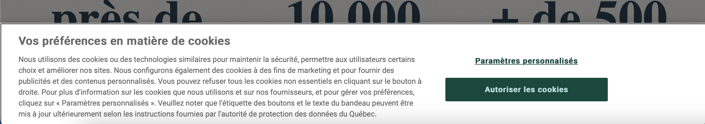

# Lois à connaître en informatique

## Loi 25 au Québec

La Loi modernisant des dispositions législatives en matière de protection des renseignements personnels.  

Cette loi doit être appliquée à toutes les institutions qui collectent des renseignements personnels au Québec.  

La loi concerne seulement les données de personnes physiques, donc pas applicable pour les données identifiant les entreprises et les institutions.  

Que sont les renseignements personnels ?  

- Nom et prénom,  
- date de naissance,  
- adresse,  
- numéro de téléphone personnel,  
- le courriel personnel,     

Que sont les renseignements personnels sensibles ?  

- renseignements biométriques,  
- numéro d'assurance sociale,  
- numéro d'assurance maladie,  
- numéro de carte de crédit,  
- données médicales,  
- numéro de permis de conduire,  
- conditions de travail (incluant salaire),  
- dossier de crédit,  

Qu'est-ce qui exclut de la loi ?  
- Le titre de votre poste,  
- Le numéro de téléphone au bureau,  
- Le courriel professionnel,  

Que prévoit la Loi ?  

Protéger les renseignements personnels sensibles contre la diffusion, la divulgation, la modification et la réutilisation.  

Chaque entreprise ou institution doit désigner un responsable de la protection des informations personnelle.  Si telle personne n'est pas désignée, c'est le plus haut dirigeant qui prend le rôle par défaut.  

Que doit-on faire pour protéger les renseignements personnels (sensibles ou non) ?  

- Les renseignements personnels doivent n'être accessibles qu'aux personnes autorisées.  
- Aucun renseignement personnel ne doit être transmis via un moyen non sécurisé. (Par exemple par courrier électronique ou par FTP).  Utiliser le chiffrement s'il vous faut utiliser le courrier électronique.  
  
Quels sont les autres devoirs des entreprises ?  

- les entreprises doivent détruire les renseignements personnels lorsque les fins auxquelles ils ont été recueillis ou utilisés sont accomplies.  
- les entreprises doivent divulguer à la Commission d'accès à l'information la création d'une banque de renseignements biométriques au moins 60 jours avant sa mise en place.  
- Sauf exception, un renseignement personnel ne pourra être utilisé à une autre fin par une organisation, à moins que la personne concernée n’y consente.  
- À compter du 22 septembre 2023, les personnes pourront demander aux entreprises de cesser de diffuser leurs renseignements personnels ou de désindexer tout hyperlien rattaché à leur nom donnant accès à des renseignements si cette diffusion leur cause préjudice ou contrevient à la loi ou à une ordonnance judiciaire (droit à l’effacement ou à l’oubli).  
- Les organisations devront aviser la Commission et les personnes concernées de tout incident de confidentialité impliquant un renseignement personnel qu’elles détiennent et présentant un risque de préjudice sérieux.
- les organisations recueillant des renseignements personnels auprès de la personne concernée en ayant recours à une technologie comprenant des fonctions permettant de l’identifier, de la localiser ou d’effectuer un profilage de celle-ci devront au préalable l’informer :

  -   Du recours à une telle technologie ;
  -   Des moyens offerts pour activer les fonctions permettant d’identifier, de localiser ou d’effectuer un profilage. En d’autres mots, ces technologies ne pourront être activées par défaut; ce sera à la personne concernée de les activer si elle le souhaite.

### Section de la loi sur les témois (cookies)

La loi 25 prévoit que les organisations devront obtenir le consentement de la personne concernée avant de recueillir, d’utiliser ou de communiquer des renseignements personnels à l’aide de témoins (cookies) ou de technologies similaires.

Les organisations devront également informer les personnes concernées de la finalité de l’utilisation de ces technologies et des moyens offerts pour les désactiver.

[Pour plus de détails](https://www.cai.gouv.qc.ca/espace-evolutif-modernisation-lois/)   

## PIPEDA pour le reste du Canada

En français : La Loi sur la protection des renseignements personnels et les documents électroniques (LPRPDE)

[Pour en savoir plus](https://www.priv.gc.ca/fr/sujets-lies-a-la-protection-de-la-vie-privee/lois-sur-la-protection-des-renseignements-personnels-au-canada/la-loi-sur-la-protection-des-renseignements-personnels-et-les-documents-electroniques-lprpde/)

Les organisations assujetties à des lois provinciales essentiellement similaires en matière de protection des renseignements personnels sont habituellement exonérées de la LPRPDE en ce qui a trait à la collecte, à l’utilisation ou à la communication de renseignements personnels au sein de cette province.

- Toutes les entreprises qui exercent des activités au Canada
- Les organisations sous réglementation fédérale qui exercent leurs activités au Canada sont toujours assujetties à la LPRPDE.

Ex:
- Les banques  
- Les aéroports  
- Les radiodiffuseurs  

La LPRPDE protège essentiellement de la même manière que la loi 25 du Québec.  

## Code criminel  

Le piratage est considéré criminel au sens de la loi.  

D'après le code criminel du Canada (R.S.C 1985 c. C-46) :  

### Interception des communications  

184 (1) Quiconque, au moyen d’un dispositif électromagnétique, acoustique, mécanique ou autre, intercepte sciemment une communication privée est coupable :  

a) soit d’un acte criminel passible d’un emprisonnement maximal de cinq ans;  

b) soit d’une infraction punissable sur déclaration de culpabilité par procédure sommaire.  

### Utilisation non autorisée d’ordinateur  

342.1 (1) Est coupable d’un acte criminel et passible d’un emprisonnement maximal de dix ans ou d’une infraction punissable sur déclaration de culpabilité par procédure sommaire, quiconque, frauduleusement et sans apparence de droit :  

a) directement ou indirectement, obtient des services d’ordinateur;  

b) au moyen d’un dispositif électromagnétique, acoustique, mécanique ou autre, directement ou indirectement, intercepte ou fait intercepter toute fonction d’un ordinateur;  

c) directement ou indirectement, utilise ou fait utiliser un ordinateur dans l’intention de commettre une infraction prévue aux alinéas a) ou b) ou à l’article 430 concernant des données informatiques ou un ordinateur;  

d) a en sa possession ou utilise un mot de passe d’ordinateur qui permettrait la perpétration des infractions prévues aux alinéas a), b) ou c), ou en fait le trafic ou permet à une autre personne de l’utiliser.  

[Pour en savoir plus](https://laws-lois.justice.gc.ca/fra/lois/c-46/textecomplet.html)  

### Fraude  

380 (1) Quiconque, par supercherie, mensonge ou autre moyen dolosif, constituant ou non un faux semblant au sens de la présente loi, frustre le public ou toute personne, déterminée ou non, de quelque bien, service, argent ou valeur :  

a) est coupable d’un acte criminel et passible d’un emprisonnement maximal de quatorze ans, si l’objet de l’infraction est un titre testamentaire ou si la valeur de l’objet de l’infraction dépasse cinq mille dollars;  

b) est coupable :  

(i) soit d’un acte criminel et passible d’un emprisonnement maximal de deux ans,  

(ii) soit d’une infraction punissable sur déclaration de culpabilité par procédure sommaire,  

si la valeur de l’objet de l’infraction ne dépasse pas cinq mille dollars.  

### Méfait à l’égard de données informatiques  

(1.1) Commet un méfait quiconque volontairement, selon le cas :  

a) détruit ou modifie des données informatiques;  

b) dépouille des données informatiques de leur sens, les rend inutiles ou inopérantes;  

c) empêche, interrompt ou gêne l’emploi légitime des données informatiques;  

d) empêche, interrompt ou gêne une personne dans l’emploi légitime des données informatiques ou refuse l’accès aux données informatiques à une personne qui y a droit.  

Peine  

(2) Est coupable d’un acte criminel et passible de l’emprisonnement à perpétuité quiconque commet un méfait qui cause un danger réel pour la vie des gens.  

Idem  

(3) Quiconque commet un méfait à l’égard d’un bien qui constitue un titre testamentaire ou dont la valeur dépasse cinq mille dollars est coupable :  

a) soit d’un acte criminel et passible d’un emprisonnement maximal de dix ans;  
 
b) soit d’une infraction punissable sur déclaration de culpabilité par procédure sommaire.  

Idem  

(4) Quiconque commet un méfait à l’égard d’un bien, autre qu’un bien visé au paragraphe (3), est coupable :  

a) soit d’un acte criminel et passible d’un emprisonnement maximal de deux ans;  

b) soit d’une infraction punissable sur déclaration de culpabilité par procédure sommaire.  

## Lois 101 et 96 au Québec

La charte de la langue française au Québec est un ensemble de règles protégeant le Français au Québec. Toute entreprise ayant au moins 25 employés résidents au Québec doit respecter cette charte.  

Quels sont les droits des employés ?  

- Pouvoir travailler en français.  
- Leurs outils de travail doivent être adaptés à la langue française.  
  - Ça inclut les ordinateurs et tous les logiciels qui sont utilisés pour effectuer des tâches.  
- Tout document doit être en français.  
- Toutes les formations doivent être en français.  

Quels sont les devoirs des entreprises ?  
- Ne pas obliger les employés de connaître une autre langue que le français.  
- Offrir tout produit ou service en français.  
- Les communications avec les clients québécois doivent être en français par défaut et par la suite le client peut choisir de changer la langue.  

## Loi canadienne anti-pourriel  

Qu'est-ce qu'un pourriel?
- Un courriel non sollicité.  

Qu'est-ce qu'un pourriel au sens de la loi?  

Selon la LCAP : "
La définition la plus simple du pourriel est le courriel non sollicité, bien qu'il puisse aussi comprendre les messages texte et les logiciels non sollicités.

La définition juridique de pourriel comprend également :

- la modification non autorisée de données de transmission;  
- l'installation de programmes informatiques sans consentement;  
- les représentations électroniques fausses ou trompeuses (y compris les sites Web);  
- l'enregistrement d'adresses (collecte ou utilisation d'adresses de courriel ou d'autres adresses électroniques sans permission);  
- la collecte de renseignements personnels en accédant illégalement à un système informatique ou à un appareil électronique.  
"

La LCAP exige que tout envoi de courriel commercial soit consenti par le destinataire.  

Les messages doivent contenir : 
- Le nom commercial de l'entreprise;  
- Une adresse postale actuelle et un numéro de téléphone;  
- une adresse électronique ou une adresse de site Web;  
- Des coordonnées exactes qui seront valides pendant au moins 60 jours après l’envoi du message;  
- Un mécanisme de désabonnement conforme;  

De plus, n’oubliez pas que chaque demande de désabonnement doit être traitée dans les 10 jours ouvrables ou moins et sans frais pour le destinataire.  

[Pour plus de détails](https://www.combattrelepourriel.gc.ca/eic/site/030.nsf/fra/accueil)  

## Testez vos connaissances  

[Petit quiz sur la loi](https://forms.office.com/r/exFTCptnPy)  
