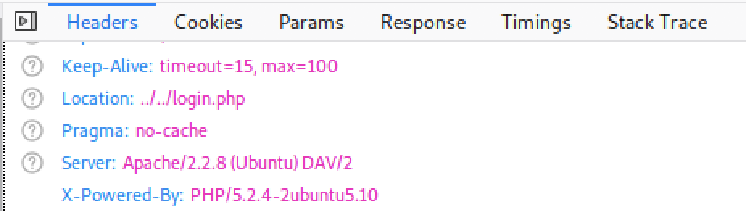
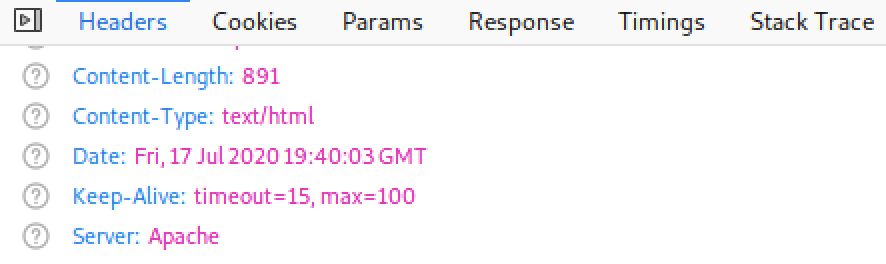
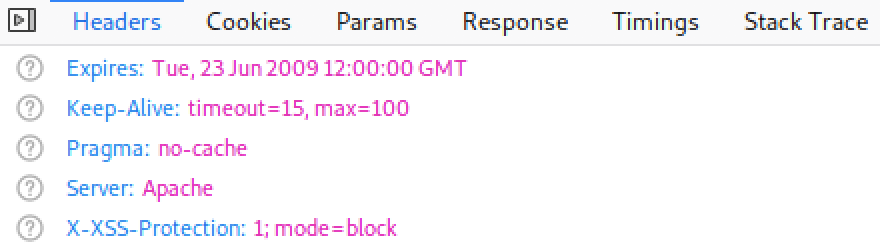
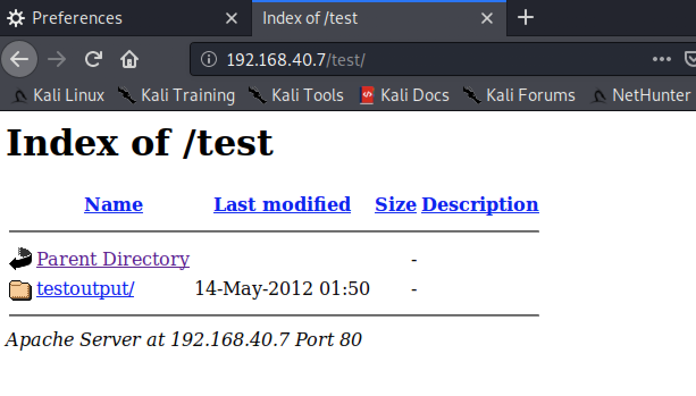
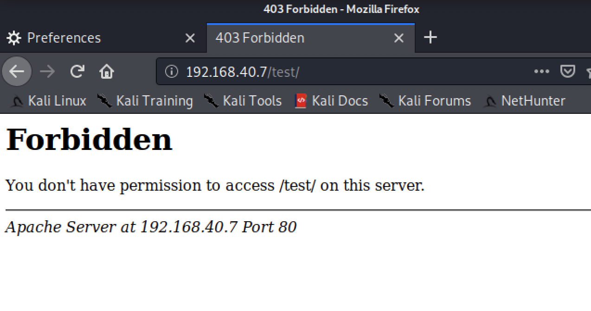
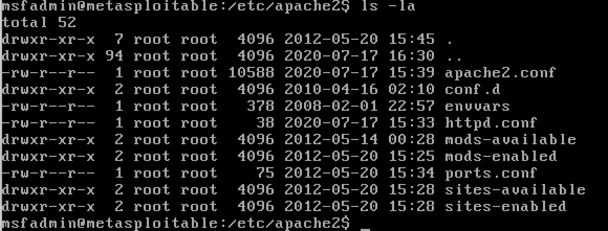
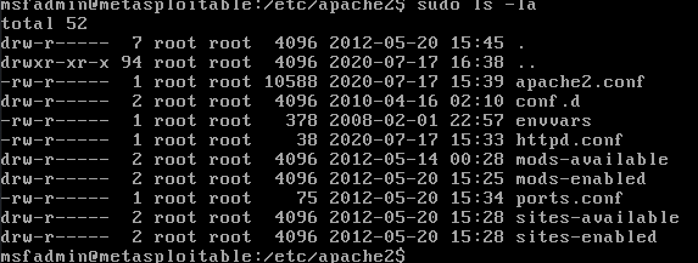
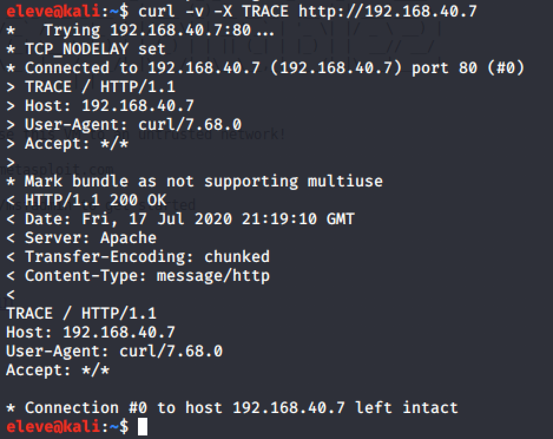
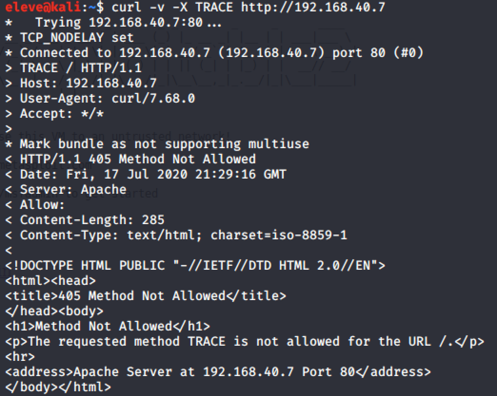
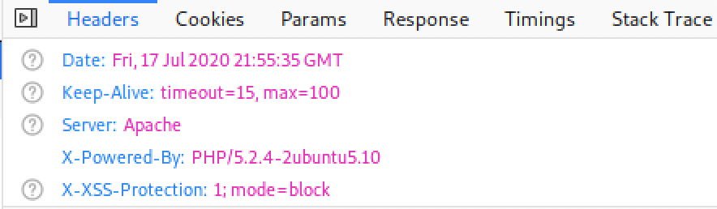

# Sécuriser un serveur Web Apache  

Ce cours explique une manière de sécuriser un serveur Web (dans ce cas-ci Apache) pour que ce soit plus difficile aux pirates d'en découvrir les vulnérabilités et par le fait même de le pénétrer.  

## Fichier de configuration d'Apache  

!!! warning "Information"  
    Selon la version d'Apache, le fichier de configuration peut être différent. Pour la version utilisée dans Metasploitable, le fichier se retrouve dans `/etc/apache2/apache2.conf`. À titre de référence, l'appellation **fichier de configuration** sera employé dans le reste du document.

## Cacher la version d'Apache  

Il est bien utile pour un pirate de connaître la version du serveur Web. Avec les bases de données de CVE, trouver les vulnérabilités est un jeu d'enfant.

!!! figure "Vérification dans Firefox"
      
    Il est simple de découvrir la version d'Apache et de PHP à l'aide d'un fureteur.  

Dans le fichier de configuration de sécurité (`/etc/apache2/conf-enabled/security.conf`), changer ces deux instructions :  

```
ServerTokens Prod
ServerSignature Off
```

Redémarrer le serveur :  

`sudo /etc/init.d/apache2 restart`  

!!! figure "Vérification dans Firefox après le changement"
      
    On ne voit maintenant que **Apache**.  

## Cacher la version de PHP  

Comme pour la version d'Apache, il est fortement recommandé de cacher la version de PHP.  

Les **fichier de configuration PHP** se trouvent dans `/etc/php/7.3/apache2/php.ini` et `/etc/php/7.3/cgi/php.ini`.

Dans les fichiers de configuration de PHP, changer la ligne suivante :  

```
expose_php = Off
```

Redémarrer le serveur.

!!! figure "Vérification dans Firefox après le changement"
    
    On ne voit plus la mention PHP.  


## Désactiver le parcours de la liste des fichiers  

Le parcours de la liste de fichiers est une option qui permet d'afficher le contenu d'un répertoire lorsqu'il n'y a pas de fichier représentant une page Web, tel que `index.html` ou `index.php`.  

!!! figure "Parcours d'un répertoire avec Firefox"  
    
    On peut y découvrir des trésors!  

Pour toutes les instructions Directory qui se trouvent dans les fichiers du répertoire `/etc/apache2/sites-enabled` :  

```
<Directory /var/www>
Options -Indexes
</Directory>
```
Redémarrer le serveur.  

!!! figure "Parcours d'un répertoire avec Firefox après le changement"
    
    On ne peut plus accéder à un répertoire.  

## Protéger les fichiers de configuration  

Par défaut, les fichiers de configuration d'Apache peuvent être consultés par tous les utilisateurs du système (644). Il est recommandé d'enlever ce droit (640).  

!!! figure "Liste des fichiers du répertoire de configuration"  
      
    Notez les droits : rw-r--r--  

Pour enlever les droits aux utilisateurs :  

```  
cd /etc/apache2  
sudo chmod -R 640 .  
```  

!!! figure "Liste des fichiers du répertoire de configuration après le changement"  
      
    Les droits sont maintenant rw-r-----  

## Protéger les configurations contre le surclassement  

Malgré les configurations faites par l'administrateur, les utilisateurs peuvent en modifier certaines à l'aide de fichiers `.htaccess`. Il est recommandé de désactiver cette fonctionnalité.  

Trouver l'instruction Directory qui représente la racine du site, qui se trouvent dans un des fichiers du répertoire `/etc/apache2/sites-enabled` :  

```
<Directory />
AllowOverride None  
</Directory>
```  
Redémarrer le serveur.  

## Les méthodes de requêtes HTTP  

Les serveurs Web supportent beaucoup de méthodes HTTP qui ne sont pas nécessaires en général et peuvent être dangeureuses.  

Normalement, on peut limiter les méthodes à **GET**, **POST**, **HEAD**.  

Pour toutes les instructions Directory qui se trouvent dans les fichiers du répertoire `/etc/apache2/sites-enabled` :  

```
<Directory /var/www>  
  <LimitExcept GET POST HEAD>  
    deny from all
  </LimitExcept>  
</Directory>  
```

Redémarrer le serveur.  

## Désactiver HTTP TRACE  

HTTP TRACE est une méthode qui est activée par défaut sur les serveurs Apache. Cette méthode est considérée dangereuse par les experts.  

Pour vérifier si elle est active :  

`curl -v -X TRACE http://192.168.40.7`  

!!! figure "Résultat de curl"  
      
    Le _trace_ est réussi.  

Dans le fichier de configuration, ajouter cette instruction :  

```
TraceEnable off
```
Redémarrer le serveur.  

!!! figure "Résultat de curl après le changement"  
    
    Le _trace_ ne fonctionne plus.  

## Protection contre le Cross Site Scripting  

Vous avez vu à un cours précédent ce qu'est le _Cross Site Scripting_. Voici comment désactiver ceci.  

Dans le fichier de configuration, ajouter cette instruction :  

```
Header set X-XSS-Protection "1; mode=block"  
```

Il faut bien sûr avoir activé le module headers en exécutant ces deux commandes :  

```
sudo a2enmod headers  
sudo /etc/init.d/apache2 force-reload   
```

Redémarrer le serveur.  

!!! figure "Header tel que vu dans Firefox après le changement"
    
    La protection est là...  

!!! warning "Attention"  
    Cette protection n'est pas utilisée par tous les fureteurs. Par exemple, Firefox ne supporte pas ce paramètre.  


!!! important  
    Prenez quelques minutes pour faire votre [cartographie](../outils/cartographie.md) de la leçon d'aujourd'hui!   

## Testez vos connaissances  
[Petit quiz sur la sécurisation d'Apache](https://forms.office.com/r/tiqW75PGse)  
