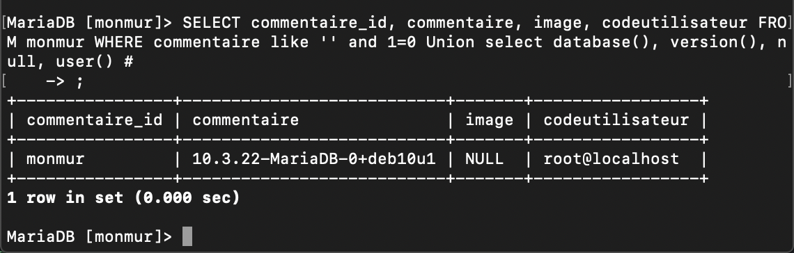

# Protection contre les injections SQL

## Injection
[OWASP_Injection] : https://owasp.org/www-project-top-ten/OWASP_Top_Ten_2017/Top_10-2017_A1-Injection

Avant de protéger notre application, testons la possibilité d'injecter du SQL.  

La place la plus probable est l'outil de recherche.  

Essayons ceci :  `' and 1=0 Union select 1,2,3,4 #`

On voit ici que le champ 3 correspond à l'image, peu utile pour notre test.

Essayons ceci :  `' and 1=0 Union select database(), version(), null, user() #`

C'est clair que notre application Web est susceptible à une attaque par injection SQL.  

Examinons pourquoi notre application est vulnérable. Prenons le code qui interroge la base de données :  

```
function listeCommentaires($criteres_recherche){
  $conn = creerConnexion();
  $requete = "SELECT commentaire_id, commentaire, image, codeutilisateur FROM monmur WHERE commentaire like '$criteres_recherche' ORDER BY commentaire_id DESC";

  return $conn->query($requete);
}
```

Lorsque nous injectons notre SQL, par exemple `' and 1=0 Union select database(), version(), null, user() #`, la variable `$requete` contient la requête suivante : `SELECT commentaire_id, commentaire, image, codeutilisateur FROM monmur WHERE commentaire like '' and 1=0 Union select database(), version(), null, user() #'`

!!! figure "Exécutons la requête dans MySQL"  
      

## Se protéger des injections  

Au lieu de composer la requête en manipulant la chaîne de caractères, MySQLi à un outil de préparation de requête :  

```
$requete = $dbConnection->prepare('SELECT * FROM utilisateurs WHERE nom = ?');
$requete->bind_param('s', $nom);  // 's' spécifie que le type => 'string'
$requete->execute();
```

Donc, pour notre fonction ListeCommentaires :  

```
function listeCommentaires($criteres_recherche){
  $conn = creerConnexion();
  $requete = $conn->prepare("SELECT commentaire_id, commentaire, image, codeutilisateur FROM monmur WHERE commentaire like ? ORDER BY commentaire_id DESC");
  $requete->bind_param('s', $criteres_recherche);
  $requete->execute();
  return $requete->get_result();
}
```

## Protéger la base de données  

### Table des droits de MySQL  

Privilège  | Contexte  
--|--  
select  |  tables  
insert  |  tables  
update  |  tables  
delete  |  tables  
index   |  tables  
alter   |  tables  
create  |  base de données, tables, ou indexes  
drop    |  base de données ou tables  
grant   |  base de données ou tables  
references  |  base de données ou tables  
reload  |  administration de serveur  
shutdown  |  administration de serveur  
process  |  administration de serveur  
file  |  Accès aux fichiers du serveur  

Il est facile pour un développeur de donner tous les droits à un utilisateur de bd comme suit :  

```
CREATE USER 'monmur'@'localhost' IDENTIFIED BY 'cegep2020';
GRANT ALL PRIVILEGES ON *.* TO 'monmur'@'localhost';
```

Cependant, c'est très dangereux.  Si quelqu'un a accès au code utilisateur, il peut tout faire, incluant ceci :  

```
DROP DATABASE IF EXISTS monmur;
```

Il faut donc utiliser un utilisateur avec le minimum de droits possible pour le bon fonctionnement de l'application.  

Privilège minimum  | Raison   
--|--  
select  | Pour lire les tables  
insert  | Pour insérer les commentaires et les codes utilisateurs  
update  | Pour mettre à jour un commentaire      
delete  | Pour supprimer un commentaire ou un code utilisateur

Il faut aussi restreindre le code utilisateur à la base de données de l'application seulement.  

Pour notre application, le script de création d'utilisateur ressemblerait à ceci :  

```
CREATE USER 'monmur'@'localhost' IDENTIFIED BY 'cegep2020';
GRANT SELECT, INSERT, UPDATE, DELETE ON 'monmur'.* TO 'monmur'@'localhost';  
```

Pour augmenter la sécurité encore plus, ce serait d'utiliser plusieurs utilisateurs, selon la section de l'application.  Par exemple :  

Page  | Droit minimal   
--|--  
monmur.php  | select, insert de la table commentaires  
login.php  |  select de la table utilisateurs  
modifier.php  |  select, update de la table commentaires  

Il serait possible de créer plusieurs utilisateurs et les utiliser adéquatement dans l'application.  

## Lecture supplémentaires  
[SQLi et PHP - Cheat Sheet](https://cheatsheetseries.owasp.org/cheatsheets/SQL_Injection_Prevention_Cheat_Sheet.html#escaping-sqli-in-php)  
[PHP Security](https://phpsecurity.readthedocs.io/en/latest/index.html)  

!!! important  
    Prenez quelques minutes pour faire votre [cartographie](../outils/cartographie.md) de la leçon d'aujourd'hui!   

## Testez vos connaissances  
[Petit quiz sur la protection d'injection SQL](https://forms.office.com/r/9NLyJBkyV3)  
