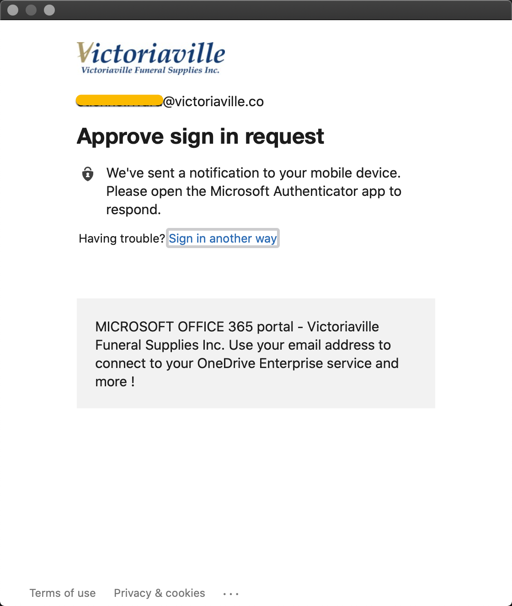
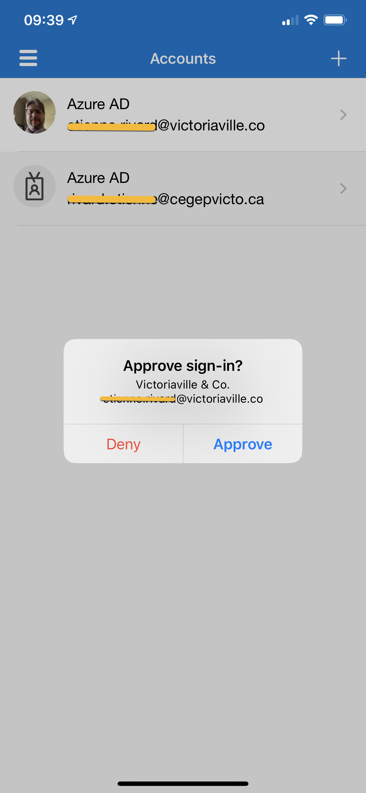

# Authentification dans une application Web  

## Authentification

L'authentification est l'action de valider que l'utilisateur est bien celui qu'il prétend être. En cybersécurité, on distingue 3 facteurs d'authentification possibles :

1- Ce qu'on sait : un mot de passe par exemple  
2- Ce qu'on possède : une clé physique, un téléphone  
3- Ce qu'on est : une empreinte digitale, une lecture de la rétine  

L'authentification nécessite au moins un facteur pour être sécuritaire; plusieurs facteurs apportent une meilleure sécurité.

C'est pourquoi de plus en plus de compagnies poussent leurs utilisateurs à utiliser l'authentification à multiples facteurs, aussi connu sous l'appellation 2FA (2 factors authentication).  

Exemple 1:  

Une banque peut envoyer un TOTP (Temporary one time password) via SMS ou par courriel pour confirmer l'identité de l'utilisateur :  

1- L'utilisateur s'identifie avec son code utilisateur.  
2- L'utilisateur confirme son identité avec son mot de passe. (1er facteur, ce qu'on sait)  
3- La banque envoie un TOTP par SMS à l'utilisateur.
4- L'utilisateur confirme son identité une seconde fois avec le TOTP reçu via son téléphone intelligent (2ème facteur, ce qu'on possède)  

Exemple 2 :

Multifacteurs avec un compte Office 365.  

1- L'utilisateur s'identifie avec son code utilisateur.  
2- L'utilisateur confirme son identité avec son mot de passe. (1er facteur, ce qu'on sait)  
3- Office 365 envoie un message à l'application mobile de l'utilisateur pour confirmer son identité :  


4- L'utilisateur presse le bouton d'approbation pour confirmer qu'il est bien celui qui se connecte au système :  


### Validation de la robustesse de mots de passe  

Lorsque l'utilisateur choisi son mot de passe, il faut s'assurer qu'il respecte les règles minimales de mot de passe.

Vous pouvez par exemple avoir ce minimum :  

- Au moins 15 caractères  
- Au moins une minuscule  
- Au moins une majuscule  
- Au moins un chiffre  
- Au moins un caractère spécial  

### Utilisation de multi-facteurs

Pour l'authentification multi-facteurs, voici un module PHP qui permet d'utiliser l'outil de Google.  

[PHP Package Google Auth](https://github.com/PHPGangsta/GoogleAuthenticator)  

Voici comment intégrer 2FA dans MonMur :  

login.php :  
```
<?php

  require_once('database.php');
  require_once('commun.php');

  session_start();

  $erreur = '';

  if($_SERVER["REQUEST_METHOD"] == "POST"){
      if(authentifier($_POST['codeutilisateur'], $_POST['motdepasse'])) {
        if (lireCompteMultifacteur($_POST['codeutilisateur']) =='') {
          $_SESSION['codeutilisateur'] = $_POST['codeutilisateur'];
          retourAuMur();
        } else {
          $_SESSION['codeutilisateur2FA'] = $_POST['codeutilisateur'];
          aller2FA();
        }
      }else {
         $erreur = "Votre code utilisateur ou mot de passe est invalide";
      }
   }

   // Dessiner l'interface utilisateur
   $html = debutHtml()
    . '<div class="login">'
    . '<h2 class="center">Se connecter</h2>'
    . '<form name="login" action="login.php" method="POST">'
    . '<div class="form-panel">'
    . '<div class="form-group">'
    . '<input class="form-control" type="text" placeholder="Entrez le code utilisateur" name="codeutilisateur" required>'
    . '</div>'
    . '<div class="form-group">'
    . '<input class="form-control" type="password" placeholder="Entrez le mot de passe" name="motdepasse" required>'
    . '</div>'
    . "<div class='erreur'>$erreur</div>"
    . '<button class="grosbouton" type="submit">CONNEXION</button>'
    . '<div class="petitbouton"><a href="creercompte.php">Créer un compte</a></div>'
    . '</div>'
    . '</form>'
    . '</div>'
    . finHtml();

   print $html;
?>
```

login2FA.php :  
```
<?php

  require_once('database.php');
  require_once('commun.php');
  require_once('GoogleAuthenticator.php');

  session_start();

  $erreur = '';

  if($_SERVER["REQUEST_METHOD"] == "POST"){
      if(isset($_POST['reponse'])) {
        $secret = lireCompteMultifacteur($_SESSION['codeutilisateur2FA']);

        $ga = new PHPGangsta_GoogleAuthenticator();
        $checkResult = $ga->verifyCode($secret, $_POST['reponse'], 2);    // 2 = 2*30sec clock tolerance
        if ($checkResult) {
          $_SESSION['codeutilisateur'] = $_SESSION['codeutilisateur2FA'];
          retourAuMur();
        } else {
            $erreur = "Erreur lors de l'entrée du code. Veuillez réessayer.";
        }
      }
   }

   // Dessiner l'interface utilisateur
   $html = debutHtml()
    . '<div class="login">'
    . '<h2 class="center">Entrez votre code de l\'authenticateur</h2>'
    . '<form name="login" action="login2FA.php" method="POST">'
    . '<div class="form-panel">'
    . '<div class="form-group">'
    . '<input class="form-control" type="text" name="reponse" required>'
    . '</div>'
    . "<div class='erreur'>$erreur</div>"
    . '<button class="grosbouton" type="submit">CONNEXION</button>'
    . '</div>'
    . '</form>'
    . '</div>'
    . finHtml();

   print $html;
?>
```

## Lecture supplémentaires

[OWASP_Broken_Auth](https://owasp.org/www-project-top-ten/OWASP_Top_Ten_2017/Top_10-2017_A2-Broken_Authentication)  

!!! important  
    Prenez quelques minutes pour faire votre [cartographie](../outils/cartographie.md) de la leçon d'aujourd'hui!   

## Testez vos connaissances  
[Petit quiz sur l'authentification](https://forms.office.com/r/kjDgGi7zMN)  
