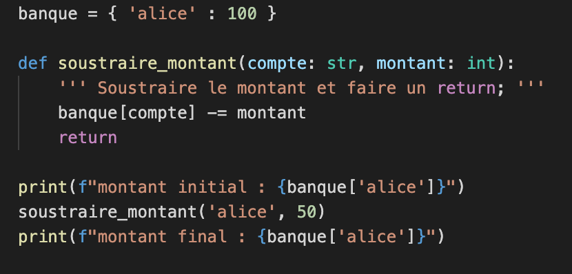
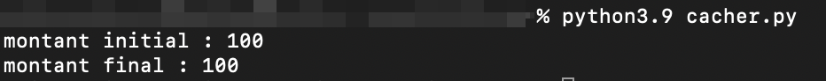
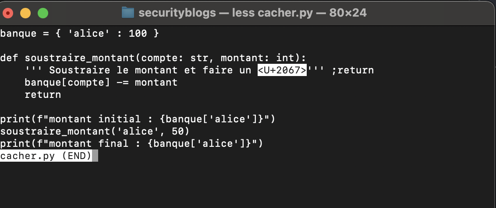

## Cacher du code malicieux  

Deux chercheurs ont trouvé une façon de cacher du code malicieux en pleine vue des programmeurs.  

C'est en utilisant des caractères UNICODE qui controllent normalement l'écriture droite-à-gauche pour les langues telles que l'Arabe.  

Voici le code dans Visual Studio Code :  

Voici le résultat du code exécuté :  

Voici le code si on l'affiche avec un éditeur qui ne supporte pas totalement UNICODE :  

  

Pour plus d'information, consulter le site [Trojan Source](https://trojansource.codes)  
