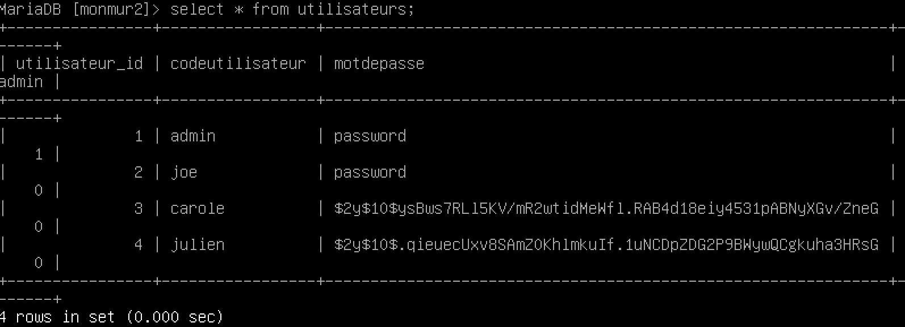

# Chiffrement et données sensibles

## Pourquoi chiffrer

Le chiffrement des données est essentiel pour les protéger contre la consultation non autorisée et contre toute forme de manipulation.  

## Quoi chiffrer  

Voici quelques types de données qui doivent être chiffrées :  

- Données personnelles permettant d'identifier un individu (NAS, Adresse, Date de naissance, Numéro de permis, Numéro de passeport, etc.)  
- Données médicales (Problèmes de santé, conditions médicales, interventions, groupe sanguin, etc.)  
- Données bancaires (Cartes de crédit, comptes de banque)  
- Mots de passe  
- Information privilégiée d'entreprise (Recettes, propriété intellectuelle)  

## Quand chiffrer  

Pour protéger adéquatement les données, il est recommandé de chiffrer les données au repos et en transit.  

Au repos : les données qui sont entreposées dans la base de données. Utile pour se protéger contre le vol de la base de données par un pirate qui a obtenu accès à la base de données.  

En transit : Chiffrer les communications entre le serveur et le client. Utile pour se protéger contre l'écoute des communications par un pirate.  

## Comment chiffrer  

Différentes techniques de chiffrement existent et il faut choisir la bonne selon la situation.  

Trois grandes catégories :  

Catégorie  | Clé | Utilisation    
--|---|--
Chiffrement symétrique  | Même clé pour chiffrer et déchiffrer  |  Utile lorsqu'il y a peu d'intervenants.   
Chiffrement asymétrique  | Une clé pour chiffrer, une autre pour déchiffrer  |  Réduit la complexité lorsqu'il y a beaucoup d'intervenants.   
Hashing  | Chiffrement sans déchiffrement possible | Utile pour conserver les mots de passe   

Prenons comme exemple un site Web contenant des données sensibles.  Ce site nécessite un code utilisateur avec mot de passe.

Il y a 3 endroits où le chiffrement sera utilisé :

1- Lors de l'envoi du mot de passe, le site utilisera le hashing.  
2- Lors de la sauvegarde des données sensibles et lors des lectures subséquentes, le module d'accès à la base de données utilisera un chiffrement symétrique car le module est le seul à posséder le mot de passe. (Données au repos)  
3- Lors de la transmission des données entre le serveur et le client, il y aura un chiffrement asymétrique initial suivi d'une transmission avec un chiffrement symétrique. (Protocole HTTPS)  

!!! important  
    Lorsque vous utilisez des clés de chiffrement dans votre code, il est important de ne pas laisser en texte clair les clés dans votre git. 


## Chiffrement du mot de passe  

Une méthode simple pour chiffrer le mot de passe en PHP est l'utilisation de la fonction `password_hash()`.  Dans notre application, la fonction sera utilisée lors de l'écriture du mot de passe :

```
function creerCompte($code_utilisateur, $mot_de_passe){
  $conn = creerConnexion();
  $requete = $conn->prepare("INSERT INTO utilisateurs (codeutilisateur, motdepasse) VALUES(?, ?)");
  $mot_de_passe_chiffre = password_hash($mot_de_passe, PASSWORD_DEFAULT);
  $requete->bind_param('ss', $code_utilisateur, $mot_de_passe_chiffre);
  return $requete->execute();
}
```

Lorsqu'un compte est créé, le mot de passe est maintenant chiffré dans la base de données.

!!! figure "Table utilisateurs"  
      
    Notez que Carole et Julien ont le même mot de passe, mais la fonction génère un hash différent.  

Il faut aussi changer la manière de vérifier si l'utilisateur a le bon mot de passe, en utilisant la fonction `password_verify()` :  

```
function authentifier($code_utilisateur, $mot_de_passe){
  $conn = creerConnexion();
  $requete = $conn->prepare("SELECT motdepasse FROM utilisateurs WHERE codeutilisateur = ?");
  $requete->bind_param('s', $code_utilisateur);
  $requete->execute();
  $resultats = $requete->get_result();
  $utilisateur = $resultats->fetch_assoc();
  return password_verify($mot_de_passe, $utilisateur['motdepasse']);
}
```

## Chiffrer les données confidentielles  

Disons que nous voulons chiffrer les commentaires des utilisateurs dans notre base de données. Nous utiliserons une chiffrement symétrique. En PHP, nous pouvons utiliser OpenSSL pour gérer le chiffrement, avec `openssl_encrypt()` et `openssl_decrypt()`.

Tout d'abord la création de la clé de chiffrement dans notre fichier `secret.php` :

```php
&lt;?php
define('CLE_CHIFFREMENT', "Latina-Marble-Honda-Speaks-Atomic-Majority-RTnL");
?>
```

Pour l'enregistrement d'un commentaire :  

```
function enregistrerCommentaire($commentaire, $nom_image, $code_utilisateur){
  $conn = creerConnexion();
  $requete = $conn->prepare("INSERT INTO monmur (commentaire, image, codeutilisateur) VALUES(?, ?, ?)");

  $commentaire = addslashes($commentaire);
  $commentaire = substr($commentaire, 0, 1000);
  $commentaire_chiffre = openssl_encrypt($commentaire, "AES-128-ECB", CLE_CHIFFREMENT);
  $requete->bind_param('sss', $commentaire_chiffre, $nom_image, $code_utilisateur);

  if(!$requete->execute()) {
    die("Erreur insertion : " . $conn->error);
  }
}
```

Pour le déchiffrement d'un commentaire :  

```
function dechiffrerCommentaire($commentaire_chiffre) {
  return openssl_decrypt($commentaire_chiffre, "AES-128-ECB", CLE_CHIFFREMENT);
}
```

## Testez vos connaissances  
[Petit quiz sur le chiffrement et données sensibles](https://forms.office.com/r/FtLPWPpDSa)  
