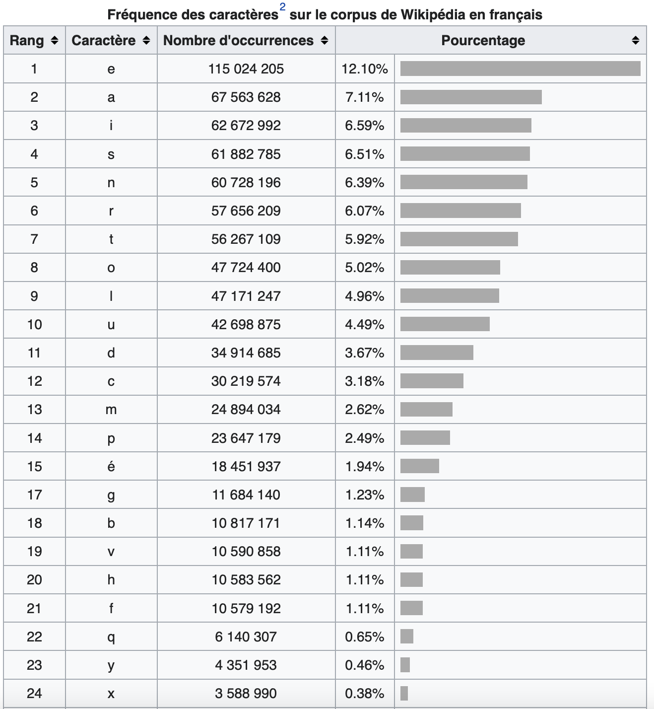
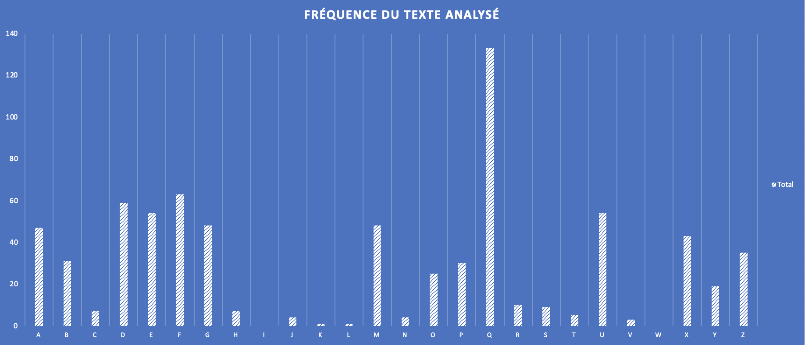
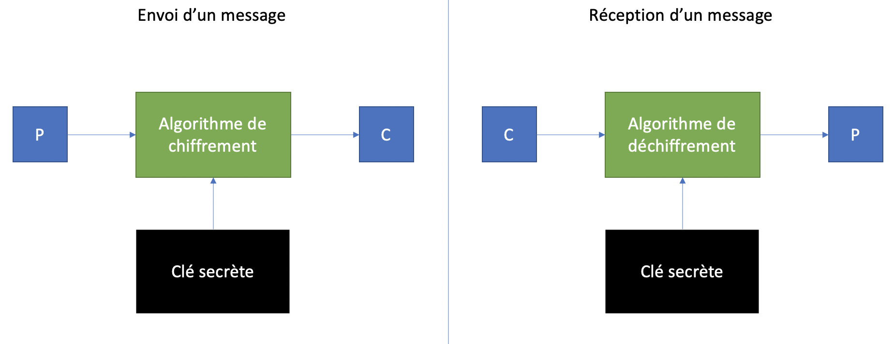
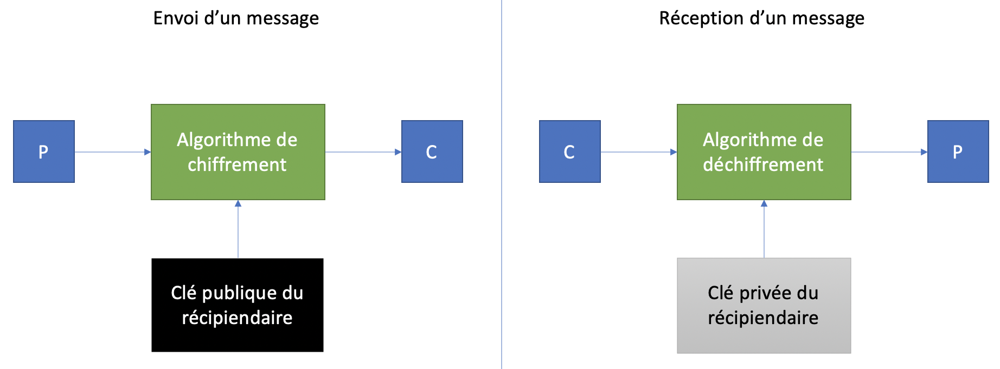
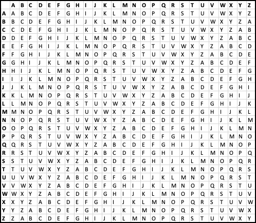
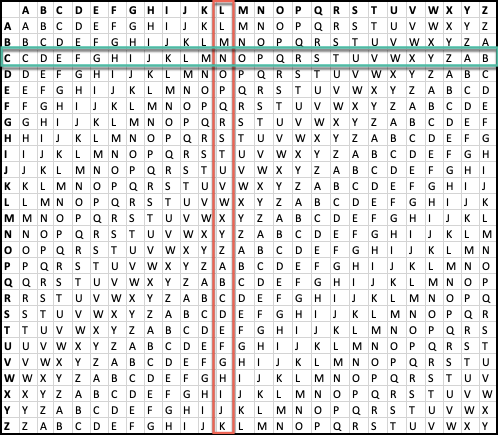
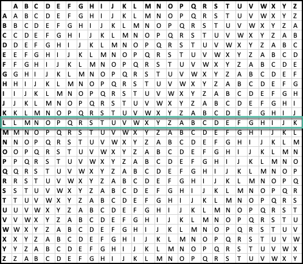
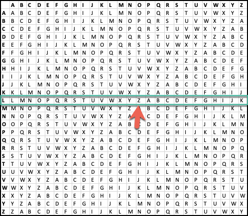
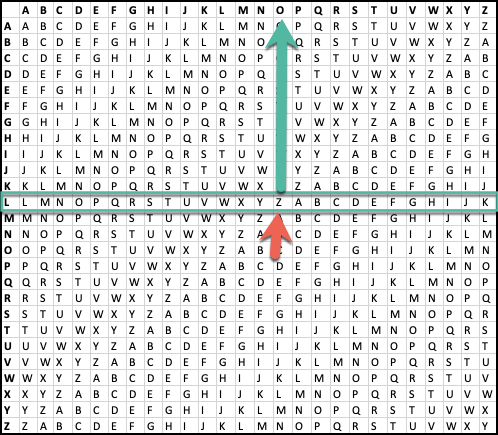

# Cryptographie

En sécurité, la cryptographie apporte de la confidentialité, de l'intégrité et de l'authentification pour l'information au repos et en transit.

C'est pour protéger l'information d'une utilisation et d'une visualisation non autorisée.

## Le chiffrement de César

Pour protéger les communications entre Rome et ses forces en Europe, César utilisait un système cryptographique. Pour chiffrer un message, il remplacait chaque lettre du message par une lettre à droite de 3. Par exemple, A devenait D, B devenait E et Z devenait C. Aujourd'hui, c'est connu sous le nom de ROT3 (Rotate 3).  

Le texte suivant :

Bonjour la gang

Devenait :

Erqmrxu od jdqj

Pour déchiffrer un message de César, il faut faire l'opération inverse, soit remplacer chaque lettre par celle à gauche de 3.

Exemple :  

MRHO

M - 3(LKJ) = J  
R - 3(QPO) = O  
H - 3(GFE) = E  
O - 3(NML) = L  

# Cracker un message de César

Les experts en cryptographie utilisent les statistiques de fréquence d'occurence des lettres pour déterminer quel serait le décalage de chaque lettre. 

Voici les statistiques de fréquence d'occurence des lettres en français :



[Source](https://fr.wikipedia.org/wiki/Fréquence_d%27apparition_des_lettres_en_français)

Vous pouvez voir que la lettre E est la plus fréquente dans un texte en français.  

Lorsque le texte est chiffré, ce ne sera pas la lettre E qui sera la plus fréquente. Alors, pour déchiffrer le message, il faut trouver le décalage de la lettre E. Si la lettre la plus fréquente est le I, le décalage serait pobablement de 4. 

Prenons un exemple d'un texte chiffré :  

"xqe xagfdqe (xgfduzmq) eazf gzq eagermyuxxq pq ymyyurqdqe omdzuhadqe pq xm rmyuxxq pqe ygefqxupqe. ux qjuefq bxgeuqgde qebqoqe pq xagfdqe, omdmofqdueqqe bmd pq oagdfqe bmffqe, pqe pausfe sdurrge qf bmxyqe (mgj bmffqe mhmzf qf mdduqdq) qf gzq xazsgq cgqgq.

oqffq eagermyuxxq m qfq pqodufq bagd xm bdqyuqdq raue qz  bmd xq laaxasuefq otmdxqexgouqz nazmbmdfq.

pmze pq zayndqgj bmke, xqe xagfdqe azf puebmdg pq fagf ag bmdfuq pq xqgd mudq zmfgdqxxq pq dqbmdfufuaz, pq yqyq cgq xqe omefade cgu bmdfmsqmuqzf xqgd yuxuqg pq huq. oqe pqgj qebqoqeoxq razf x'anvqf pqbgue gz euqoxq qzhudaz pq bdafqofuaz qf pq bdasdmyyqe ag bdavqfe pq dquzfdapgofuaz ag oazradfqyqzf pq babgxmfuaze bmd fdmzexaomfuaz. xm xagfdq qfmzf bmdfuogxuqdqyqzf pueodqfq qxxq rmuf eaghqzf x'anvqf p'gz eguhu bmd dqotqdotq p'uzpuoq (bauxe, ymdcgmsq pq fqddufaudq, buqsqe btafasdmbtucgqe) qf p'gz eguhu fqxqyqfducgq bmd bgoq qxqofdazucgq"

Voici les statistiques de fréquence pour ce texte :  

  
  
[Outil pour calculer rapidement la fréquence des lettres](https://charactercounter.com/letter-frequency-counter)  

[Outil pour déchiffrer un texte de César](https://rot13.com)

La lettre la plus fréquente dans ce texte est la lettre Q. Nous pouvons supposer que le texte a été chiffré avec un décalage de 12 (Q - E = 12).

!!! note 
    -12 est pour déchiffrer. Plusieurs outils ont un choix de chiffrement entre ROT1 et ROT25. Alors le -12 serait le ROT14 (26-12).

Voici le texte lorsqu'on le déchiffre avec -12 :  

"les loutres (lutrinae) sont une sousfamille de mammiferes carnivores de la famille des mustelides. il existe plusieurs especes de loutres, caracterisees par de courtes pattes, des doigts griffus et palmes (aux pattes avant et arriere) et une longue queue.

cette sousfamille a ete decrite pour la premiere fois en  par le zoologiste charleslucien bonaparte.

dans de nombreux pays, les loutres ont disparu de tout ou partie de leur aire naturelle de repartition, de meme que les castors qui partageaient leur milieu de vie. ces deux especescle font l'objet depuis un siecle environ de protection et de programmes ou projets de reintroduction ou confortement de populations par translocation. la loutre etant particulierement discrete elle fait souvent l'objet d'un suivi par recherche d'indice (poils, marquage de territoire, pieges photographiques) et d'un suivi telemetrique par puce electronique"  


## Bases de la cryptographie

Un système de chiffrement **symétrique** est fait en sorte que la clé de chiffrement est la même clé pour le déchiffrement.

Un système de chiffrement **asymétrique** utilise une clé pour le chiffrement et une autre pour le déchiffrement. Ce sont deux clés différentes et il est impossible de déchiffrer avec la clé de chiffrement.

**plain-texte** : Texte lisible par l'humain avant d'être chiffré (représenté par un P)

**chiffre-texte** : Texte chiffré par un algorithme de chiffrement (représenté par un C)


## Chiffrement symétrique



Le chiffrement symétrique implique que la clé secrète est partagée entre l'émetteur et le récipiendaire d'un message.

C'est bon pour la confidentialité, mais ça ne prouve pas l'identité de l'émetteur du message, car la clé secrète est connue d'au moins 2 personnes.

La distribution de la clé est un problème. Il faut avoir un canal de distribution de la clé sécuritaire pour la transmettre sans risquer de se la faire intercepter. (Ne jamais envoyer une clé secrète par courriel, par exemple)

La clé doit être régénérée souvent. En effet, lorsqu'un membre du groupe qui possède la clé quitte, la clé ne peut plus être utilisée.

## Chiffrement asymétrique

Le chiffrement asymétrique est aussi appelé chiffrement à clé publique. L'algorithme utilise une paire de clés, une privée et seulement connue du récipiendaire et l'autre publique, connue de tous.



Le chiffrement aide :

Aspect  | Impact  
--|--
Confidentialité  |  La communication ne peut être consultée sans la clé
Intégrité  |  Avec une fonction cryptographique de hashage, on peut vérifier l'intégrité des données transmises
Authentication  | Un système demande à un __client__ de chiffrer un message spécifique. Le message chiffré est la preuve que le __client__ possède la bonne clé   


## Chiffrement par transposition

Le chiffrement par transposition réarrange les lettres d'un plain-texte. Par exemple, on pourrait simplement renverser l'ordre des lettres :

POMME deviendrait EMMOP

La transposition par colonnes prend une clé et calcule la position de chaque lettre en ordre alphabétique. Si une lettre revient deux fois, la seconde prend la position suivante. Ex :

```
P A T A T E
 4 1 5 2 6 3
```

Pour chiffrer le plain-texte suivant :

`LE MOT DE PASSE EST CHEVAL123`

Il faut l'écrire dans les colonnes comme suit :

```
P A T A T E
 4 1 5 2 6 3
 L E M O T D
 E P A S S E
 E S T C H E
 V A L 1 2 3
```

Ensuite, il faut écrire le chiffre-texte selon l'ordre des colonnes :

`E P S A O S C 1 D E E 3 L E E V M A T L T S H 2`

Pour déchiffrer un message par transposition, il faut tout d'abord diviser le nombre de caractères dans le chiffre-texte par la longueur de la clé.

Ex: Le chiffre-texte suivant : TTEPAHAEUREQIGI  et la clé FROID  

Le plain-texte a 15 caractères et la clé 5 caractères.

Il faut faire une grille comme suit :  

F  | R  | O  | I  | D  
--|---|---|---|--  
  |   |   |   |    
  |   |   |   |    
  |   |   |   |    

Ensuite, remplir chaque colonne de la grille avec les caractères du chiffre-texte, en commençant avec la première position (le D de FROID) :  

**TTE**PAHAEUREQIGI

F  | R  | O  | I  | D  
--|---|---|---|--  
  |   |   |   | T  
  |   |   |   | T  
  |   |   |   | E  

La seconde colonne (le F) :  

TTE**PAH**AEUREQIGI  

F  | R  | O  | I  | D   
--|---|---|---|--  
P  |   |   |   | T  
A  |   |   |   | T  
H  |   |   |   | E  


La troisième colonne (le I) :   

TTEPAH**AEU**REQIGI  

F  | R  | O  | I  | D  
--|---|---|---|--  
P  |   |   | A  | T  
A  |   |   | E  | T  
H  |   |   | U  | E  

La quatrième colonne (le O) :   

TTEPAHAEU**REQ**IGI  

F  | R  | O  | I  | D  
--|---|---|---|--  
P  |   | R  | A  | T  
A  |   | E  | E  | T  
H  |   | Q  | U  | E  

La dernière colonne (le R) :  

TTEPAHAEUREQ**IGI**  

F  | R  | O  | I  | D  
--|---|---|---|--  
P  | I  | R  | A  | T  
A  | G  | E  | E  | T  
H  | I  | Q  | U  | E  

Lire le message par ligne :  

PIRAT  
AGEET  
HIQUE  

PIRATAGEETHIQUE  


## Chiffrement par substitution

Le chiffrement de Vigenère est un chiffrement par substitution polyalphabétique. Il utilise une charte de chiffrement et de déchiffrement démontré ici :  

  


Pour chiffrer, il faut utiliser une clé. Disons que la clé est :

`CEGEP`

Le plain-texte à chiffrer est :

`LE COURS EST SUPER`

Sous le plain-texte, il faut écrire la clé de chiffrement autant de fois que nécessaire pour avoir une ligne de texte aussi longue que le plain-texte.

Convertir chaque lettre du plain-texte en chiffre-texte :  
1. Localiser la bonne colonne avec la lettre du plain-texte  
2. Localiser la bonne ligne avec la lettre de la clé  
3. L'intersection est la lettre du chiffre-texte    




```
LE COURS EST SUPER
CE GEPCE GEP CEGEP
NI ISJTW KWI UYVIG
```

Pour le déchiffrement :  
1. Localiser la bonne ligne avec la lettre de la clé  
2. Sur cette ligne, localiser la lettre du chiffre-texte  
3. Aller dans le haut de la colonne pour avoir le plain-texte  

Ex:  

Le chiffre-texte `ZOHZI KST MQAEDI` et la clé `LUMIERE`  

Localiser la ligne :  

  

Localiser la lettre :  



Le haut de la colonne :  



```
ZOHZI KST MQAEDI
LUMIE REL UMIERE
OUVRE TOI SESAME
```

## Masque jetable  

La méthode de substitution la plus sécuritaire est celle du masque jetable (_one-time pad_). C'est une clé aléatoire aussi longue que le texte à chiffrer. C'est la seule méthode de chiffrement qui est réputée sans faille si les règles suivantes sont respectées :  

1. La clé doit être générée de manière aléatoire
2. La clé doit être protégée contre le vol, si un ennemi a la clé, le message peut être déchiffré
3. La clé doit être utilisée qu'une seule fois. Si elle est utilisée plus d'une fois, des experts peuvent en déduire la clé
4. La clé doit être aussi longue que le plain-texte

Pour envoyer un message à l'aide du chiffrement asymétrique, l'expéditeur utilise la clé publique du réceptionnaire pour chiffrer le message, qui sera déchiffré par ce dernier avec sa clé publique.

Le chiffrement asymétrique peut aussi être utilisé comme signature électronique, pour prouver que le message vient vraiment de l'expéditeur.

Comme il n'y a pas de distribution de clés privées, il est plus facile d'utiliser ce système.

Aucun besoin de régénérer des clés lorsqu'un membre du groupe quitte, il n'a jamais eu accès aux clés privées des autres membres.

Cependant, le chiffrement et déchiffrement est beaucoup plus lent que pour une clé symétrique.

## Chiffrement asymétrique avec GPG

GPG : GNU Privacy Guard

GPG est installé par défaut dans Kali.

GPG est utilisé pour le chiffrement asymétrique. Pour créer une nouvelle clé :

`gpg --gen-key`

Pour exporter une clé publique dans un format lisible :

`gpg --output cle.pgp --armor --export rivard.etienne@cegepvicto.ca`

Ça donne ceci :

```pgp
-----BEGIN PGP PUBLIC KEY BLOCK-----

mQENBF9BjU4BCADIXEtcP1Eqptrz0U/lrvYc6j41kk9UOQG5DlIkKL0t6nkm+XSY
UUDCzTcjgISUBn0UeDXVHLqx2HH6uMhksM++pCVSbajgKinEplx+W8NetLcRM9Vc
w6S6/a/5RNLXCJI+fRKIxYZCuCwF7ocdQHJ/RrxgCdPl7BOiTqD994hKtSLu6u6b
9QrwIcRijxl91CunPgDyn7taZ6AY9wsiyqXGyeVvXcvb5gKnhUKTHjUwj+9eAU84
UMH/Ui0eJSnE52iGulmKQj0xf6jbzX/2NjZKGkKR9Js4a6tAh0FgHU1MKyIDsdWg
pzUIRpFb4HrLKDFjYeGd0jSqM9ixfOlf2lf9ABEBAAG0LUV0aWVubmUgUml2YXJk
IDxyaXZhcmQuZXRpZW5uZUBjZWdlcHZpY3RvLmNhPokBVAQTAQgAPhYhBPLHtwZ+
GUBl/UYdtEfSqoWEjs27BQJfQY1OAhsDBQkDwmcABQsJCAcCBhUKCQgLAgQWAgMB
Ah4BAheAAAoJEEfSqoWEjs277p4H/0nZIJibPpw2NVSrQ9Q/L9gHH6wh29j+5Ll0
VwTNae8HhDknw3ndB44tC/svfMjmUCpwWqEk9Cwl5Mj8EH05ekQ/xvGr2rhwww5t
s0ozcixSQvvoa3Hz7o5LIi7S01XPhKZolv8TYPqZdS4LCWmV31Ub9WYrKb0V+fSh
tnlVRLzHXmIww5GSPqc9CJOir9Vmsp1rA7YzOeddxxbmdeswXdhv9C3X3sMHOxgm
hce+HHH8Ao89qO+5n2/LAShLi6/vpSz0bp6LaZiL8vWtTyrQngEyIALAueEOiM/1
NVOyB4AK9JXciix78/OaVFmnYuBi7w6m8iUOb2aavS9q1BNjMkO5AQ0EX0GNTgEI
AKZ7BhSicqwQUevugsK8JBbLUEB+QkmaHBamLYJdl6EtzWwVgTRrPKAI79PukVHW
t9reSYMZPadmRQUQQQPQqPGXRQKipmUEHFpALTSU3sxg4n+hTjUyQ2Biznl5TTjD
3rMl2WQ1jUhTGh8sADKbQNEoqf9MGsWoFeH0iJtl+0Nw3Q7KhyZfxrltA64XJciF
XkKi0cCgEXyZF+xJZMlG7LCoo8nVV1Lwc/uhgwv85mNHK8hmxV6LSvEp2Nq/2Kr9
JAry0ZpaxQeNHy74wnFfLTtcwEKRiSneDxBEdMGkSSWqyR8mhCo2iVldTZPPoPYo
nyg3gCdN5WoLSUye0XPyQhEAEQEAAYkBPAQYAQgAJhYhBPLHtwZ+GUBl/UYdtEfS
qoWEjs27BQJfQY1OAhsMBQkDwmcAAAoJEEfSqoWEjs27B10IAJrs+hIPSTqnnpJu
eke4humJo7oEJNRMMjRqlF+vcQe0+QO78gAaKOnyxTKWbMtxloQA+LqG597eU1XI
xKKyxBhDEI1cupBQV8odxXVaXnXTtofvPMloEphnC+c4sj80VEX5frqM2LVYHvKn
CRF8Z7mb6rQEPEAvgkauK6ZtfskySvqB7Dd+sbHBRojYgGfjkdobH8omOEmKAQFl
3DGyzdaZfqmz3kQRGlJ4oLVj+MY30Ykc99x/TnLyW/FLsbmvCC9UftKtkNtYJZ4i
X8d9F4qMdgyV5fO0oTbjjdpmUcKteeDXeHyTi55WmFKU1uNeU0oL8XV4Jxq4WAJA
RN/2NWY=
=GgRL
-----END PGP PUBLIC KEY BLOCK-----
```

Pour importer la clé publique du futur récipiendaire de vos messages :

`gpg --import cle.gpg`

Pour chiffrer votre message :

`gpg --output chiffre-texte.gpg --encrypt --recipient destinataire@email.com plain-texte`

Le récipiendaire pourra déchiffrer le message comme suit :

`gpg --output plain-texte --decrypt chiffre-texte.gpg`


## Testez vos connaissances  

[Petit quiz sur le chiffrement](https://forms.office.com/r/1ZSkcEBMNY)  
