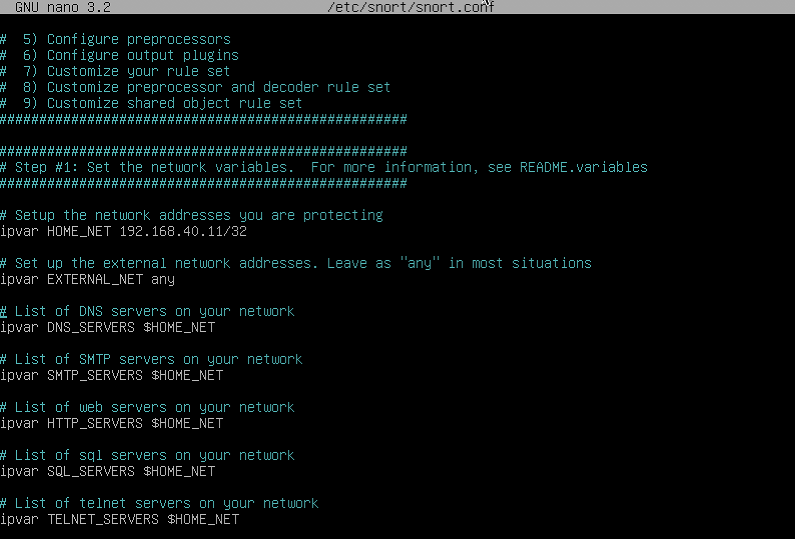
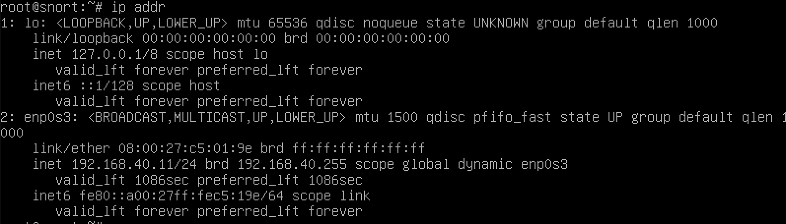
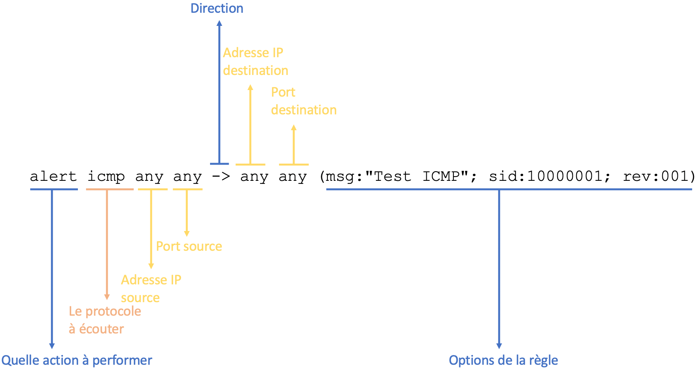
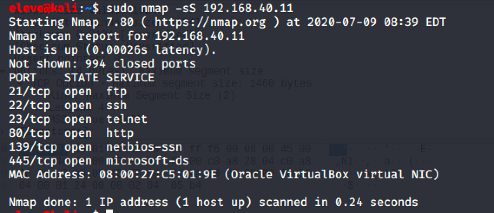
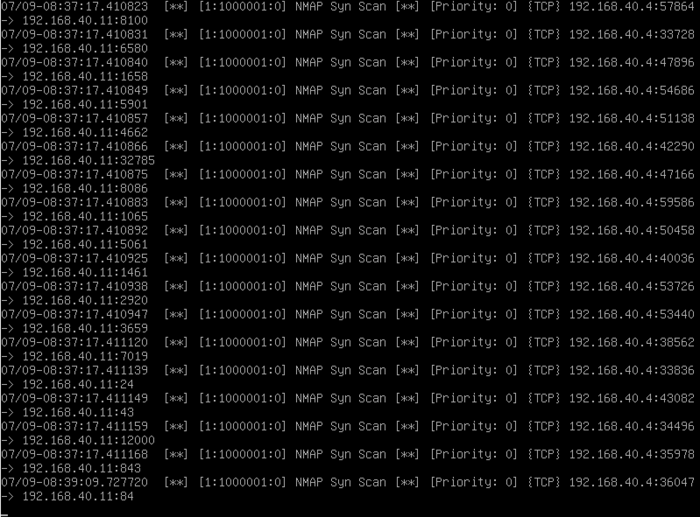
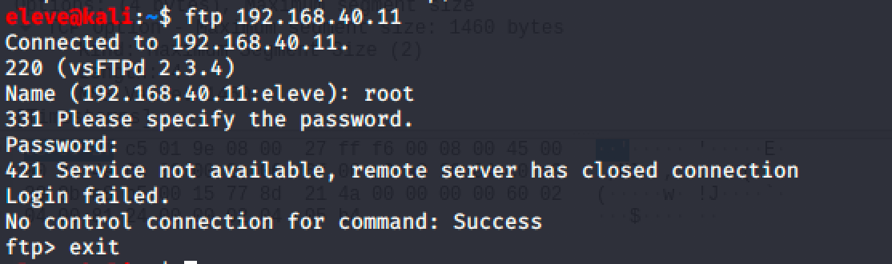
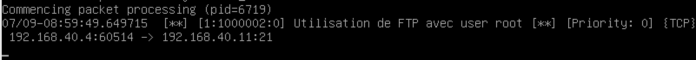
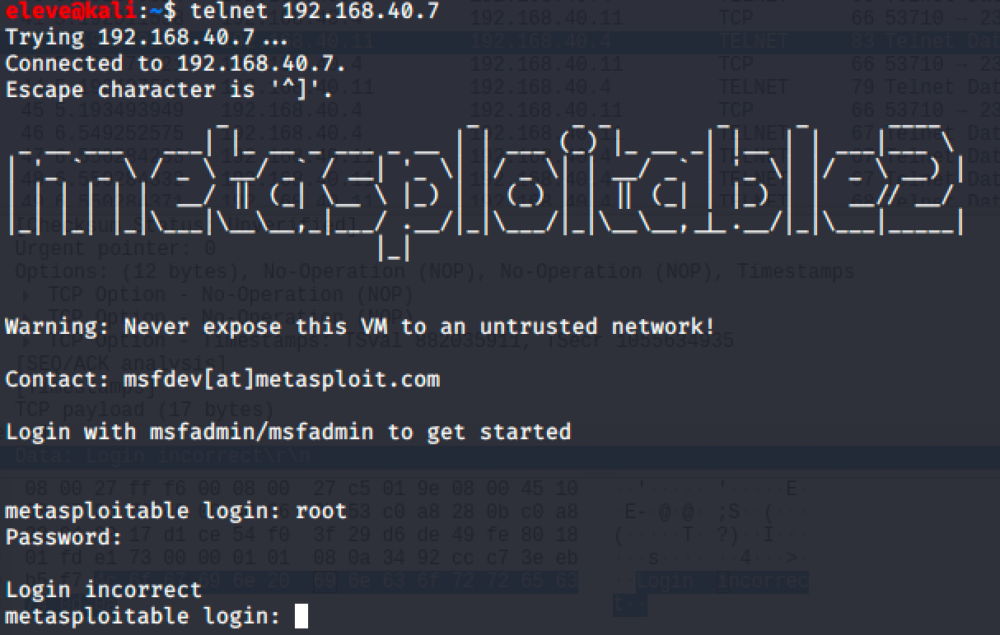
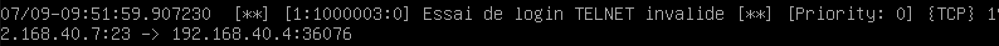

# Détection d'intrusion

Pour bien protéger un réseau d'entreprise, il est important d'avoir une visibilité sur les activités dans ce réseau.

Des systèmes nommés IDS (_Intrusion Detection System_) écoutent toutes les communications d'un réseau et lancent une alerte lorsqu'une activité suspecte survient.

D'autres systèmes sont plus avancés et permettent de prévenir une intrusion dès qu'une attaque est détectée, les IPS (_Intrusion Prevention System_). Les IPS sont normalement connectés au pare-feu ou au commutateur réseau pour terminer les communications jugées suspectes.

Principalement, un IDS écoute le réseau comme le fait Wireshark. Il peut détecter une attaque de deux façons :

1. Selon un ensemble de règles,
2. Selon une détection de comportement.

La détection par règles implique que l'opérateur du IDS écrit chaque règle qu'il veut détecter. Ce peut être par exemple pour détecter un système qui fait un ICMP ping (lors de la reconnaissance active) ou l'utilisation de services spécifiques.

La détection par comportement implique un moteur intelligent qui apprend ce que les systèmes font normalement et réagit lorsque ces systèmes agissent différemment. Ex :

Un poste de travail accède à des fichiers sur le serveur (service SMB, port 445) à chaque jour. Un jour, ce poste essaie de se connecter en SSH, puis en Telnet. Comme ce n'est pas usuel, l'IDS identifierait le poste comme suspicieux.

## Snort


Snort est un IDS/IPS Open-Source très populaire sur le marché. Il fonctionne selon un ensemble de règles.

Le fichier de configuration se trouve ici :  

`/etc/snort/snort.conf`



Il est important que l'adresse HOME_NET corresponde à l'adresse de votre serveur. Pour trouver l'adresse de votre serveur :  

`ip addr`



Pour tester la configuration, utilisez la commande suivante :  

`snort -T -c /etc/snort/snort.conf`

## Pour démarrer Snort 

`snort -A console -i enp0s7 -u snort -g snort -c /etc/snort/snort.conf` . 

Truc: Créez un fichier bash avec la commande! (dans mon cas c'est `startsnort`)   
  
  

## Règles de snort

Snort fonctionne avec des règles. Les règles sont ajoutées au fichier `/etc/snort/rules/local.rules`. Par défaut, le fichier est vide.

Écrivons notre première règle :  

`alert icmp any any -> any any (msg:"Test ICMP"; sid:10000001; rev:001;)`

Voici la structure de la règle :  



### Actions

Voici les actions possibles avec Snort :  

1. alert - génère une alerte et écrit le paquet dans l'historique  
2. log - écrit le paquet dans l'historique  
3. pass - ignore le paquet  
4. drop - bloque et écrit le paquet dans l'historique  
5. reject - bloque le paquet, écrit le paquet dans l'historique et envoi un TCP reset  
6. sdrop - bloque le paquet sans l'écrire dans l'historique  

### Protocoles

Il y a 4 protocoles disponibles avec Snort : TCP, UDP, ICMP et IP.  

### Adresses

Les adresses sont sous le format CIDR :  

CIDR  | Plage
--|--
192.168.40.0/24  | 192.168.40.1 à 192.168.40.255  
192.168.40.5/32  | 192.168.40.5 seulement
any  | n'importe quelle adresse IP

Pour exclure une plage d'adresses, utiliser le ! comme ceci :  

`!192.168.40.0/24`  veut dire toutes les adresses sauf celles entre 192.168.40.1 et 192.168.40.255.

### Ports

Vous pouvez spécifier les ports de la manière suivante :  

Ports  | Plage  
--|--
any  | n'importe quel port
21  | seulement le port 21  
1:1000  | tous les ports entre 1 et 1000  
1000:  | tous les ports plus grand ou égal à 1000  
:500  |  tous les ports plus petit ou égal à 500  
!21  | tous les ports sauf le port 21

### La direction

Vous pouvez spécifier la direction de la manière suivante :  

Direction  | Signification  
--|--
->  | communication de l'adresse source vers l'adresse de destination
<>  | communication de l'adresse source vers l'adresse de destination et la communication de la destination vers la source

Astuce : La direction <> peut être utile pour conserver la conversation entre deux adresses, par exemple une conversation telnet :  

`log tcp 192.168.40.0/24 any <> 192.168.40.0/24 23`

## Options

Il y a 4 catégories d'options aux règles :  

Catégorie  | Description
--|--
general  |  Information à propos de la règle, aucun effet durant la détection
payload  |  Inspecte le contenu d'un paquet
non-payload  |  Inspecte les informations du paquet autre que le contenu
post-detection  |  Déclencheurs qui surviennent après exécution de la règle

### Options générales

Option  | Description | Exemple
--|--|--
msg  | Imprime un message en même temps que le détail du paquet | `log tcp any any -> any 21 (msg:"Utilisation de FTP";)`
sid  | Pour identifier de manière unique une règle. Utiliser > 1 000 000 pour vos règles locales | `log tcp any any -> any 21 (sid:1000002;)`

### Options payload

Option  | Description | Exemple
--|--|--
content  | Examine le contenu du paquet | `log tcp any any -> any 80 (content:"GET"; msg:"Utilisation de HTTP";)`
pcre  | Examine le contenu du paquet avec un _regex_  |   `log tcp any any -> any 21 (pcre:"/user\s+root/i"; msg:"Utilisation de FTP avec user root";)`

### Options non-payload

Option  | Description | Exemple
--|--|--
ttl  | Examine le _time to live_  | `log ip any any -> any any (ttl:<3; sid:100000001;)`
flags  | Examine quel sémaphore est allumé |  `log ip any any -> any any (flags:SF; sid:100000001;)`

### Options post-detection

Option  | Description | Exemple
--|--|--
session  | Écrit dans l'historique le contenu de la session  | `log tcp any any -> any 23 (session:printable; sid:100000001;)`
detection_filter  | Définit le nombre d'occurence avant de déclencher une alerte  | `alert icmp any any -> any any (detection_filter:track by_src, count 30, seconds 60;sid:100000001;)`

## Fichier d'historique

Les fichiers d'historique se trouvent dans le répertoire suivant :  

`/var/log/snort`

Pour visualiser l'historique (qui est en fait un fichier pcap), deux choix :  

1. utiliser la commande `snort -r <nom fichier>`
2. Transférer le fichier dans Wireshark

## Quelques trucs

1. N'activer les règles que pour l'équipement que vous voulez protéger. Pas de serveur Web? n'activez pas les règles qui les concernent
2. Écrire les règles qui attaquent une vulnérabilité, pas pour détecter un _payload_. Les pirates peuvent changer la signature du _payload_, mais pas celle de la vulnérabilité.

## Quelques règles

### Détecter un scan NMAP des ports TCP d'un serveur.

`alert tcp any any -> any any (flags:S; detection_filter:track by_src, count 1000, seconds 60; msg:"NMAP Syn Scan"; sid:1000001;)`

Testons la règle :



La réaction de snort :  



### Détecter un essai de se connecter en FTP avec root

```
alert tcp any any -> any 21 ( \
  pcre:"/user\s+root/i"; \
  sid: 1000002; \
  msg:"Utilisation de FTP avec user root";)
```

Testons la règle :  



La réaction de snort :  



### Détecter un login de telnet invalide

```
alert tcp any 23 -> any any ( \
  content:"Login incorrect"; \
  sid: 1000003; \
  msg:"Essai de login TELNET invalide";)
```

Testons la règle :  



La réaction de snort :  



!!! important  
    Prenez quelques minutes pour faire votre [cartographie](../outils/cartographie.md) de la leçon d'aujourd'hui!   

## Testez vos connaissances  

[Petit quiz de la détection d'intrusion](https://forms.office.com/r/VzpVFmG3hm)  
