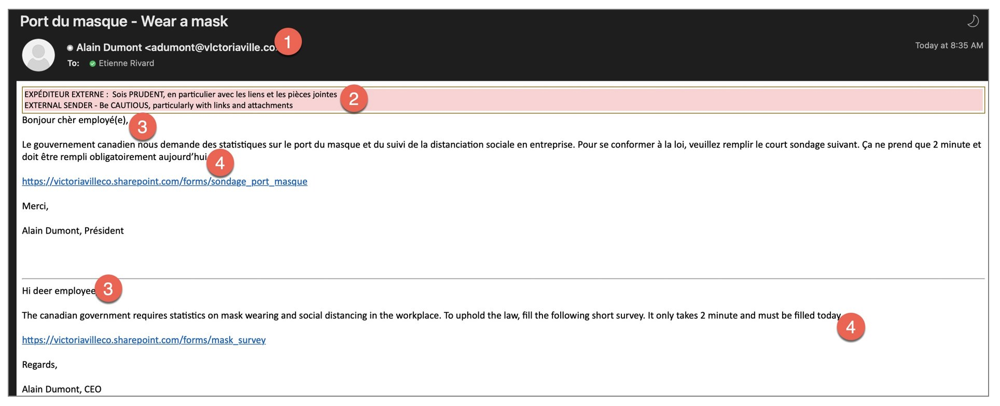

# Hameçonnage  

## Définition  

L’hameçonnage est une forme de fraude par laquelle des personnes malintentionnées utilisent de faux courriels, textos ou appels pour amener des utilisateurs à divulguer des renseignements sensibles ou à télécharger un logiciel malveillant.  

## Comment détecter un courriel d'hameçonnage  

  

1. L'adresse de courriel n'est pas exactement celle d'un utilisateur normal. Dans le cas présent le domaine a un L au lieu d'un I ce qui fait vlctoriaville au lieu de victoriaville.  
2. Le courriel vient de l'extérieur de l'entreprise, toujours douteux!  
3. Le courriel ne s'adresse pas directement à vous et il y a des fautes d'ortographes.    
4. Il y a toujours un sentiment d'urgence.  

## Comment fonctionne une attaque d'hameçonnage  

### Vol du mot de passe  

La technique la plus simple pour un attaquant est de forger une page de login pour que la victime entre son code utilisateur et son mot de passe. Dans ce cas, le lien dans le courriel d'hameçonnage pointe sur la fausse page de login.

### Prise de contrôle du PC  

L'autre technique est d'envoyer un fichier avec un *payload* qui force le PC de la victime à se connecter au serveur de l'attaquant.  

## Comment inciter la victime à cliquer sur le lien  

Plus vous connaissez la victime, plus il est facile de les faire cliquer sur un lien malicieux.  Voici quelques exemples d'attaques réussies dans la dernière année :  

- Se faire passer pour le président de l'entreprise qui fait un sondage sur l'utilisation des masques au bureau.  
- Imiter le courriel d'un gros client qui fait une plainte sur le produit.  
- Prendre l'identité d'un fournisseur qui envoie une facture en retard de paiement.  
- Faire un courriel qui vient du département des ressources humaines qui demande de remplir un formulaire pour avoir droit à un congé férié.  

## Testez vos connaissances  

[Petit quiz sur l'hameçonnage](https://forms.office.com/r/k6Uhv6ajHu)  
