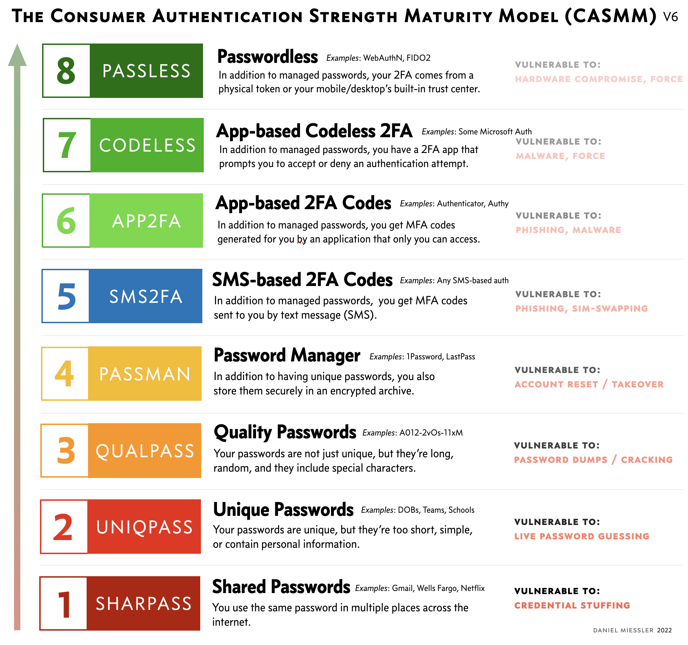

# Mots de passe

## Niveaux de maturité dans la gestion des mots de passe

!!! figure "CASMM"
    
    The Consumer Authentication Strength Maturity Model    

### Niveau 1 - Mots de passe partagés  

Vous utilisez le même mot de passe sur plusieurs sites.  

### Niveau 2 - Mots de passe uniques  

Vous utilisez des mots de passe uniques, mais souvent trop faciles à deviner ou contenant des informations personnelles. (Ex: le nom de mon chien)  

### Niveau 3 - Mots de passe de qualité  

En plus d'être uniques, vos mots de passe sont difficiles à deviner.  

### Niveau 4 - Gestionnaire de mots de passe  

Vous gérez vos mots de passe dans un outil de gestion protégé par la cryptographie.  

### Niveau 5 - Codes multifacteurs par SMS  

En plus du gestionnaire de mots de passe, vos comptes sont protégés par des codes temporaires à usage unique envoyés par SMS.  

### Niveau 6 - Codes multifacteurs par application  

En plus du gestionnaire de mots de passe, vos comptes sont protégés par des codes temporaires à usage unique générés dans une application.  

### Niveau 7 - Multifacteur sans code par application  

Au lieu d'un code généré par une application, vous recevez une notification dans une application qui vous demande d'accepter ou de refuser l'accès.  

### Niveau 8 - Sans mot de passe  

Votre accès multifacteur est géré par un jeton physique.  

## Hygiène de la gestion des mots de passe  

!!! figure "Hygiène de la gestion des mots de passe"
    
    Vu dans une université  

## Lectures supplémentaires

[CASMM](https://danielmiessler.com/blog/casmm-consumer-authentication-security-maturity-model/?mc_cid=b03795e927&mc_eid=a7207e28fa)  
 
