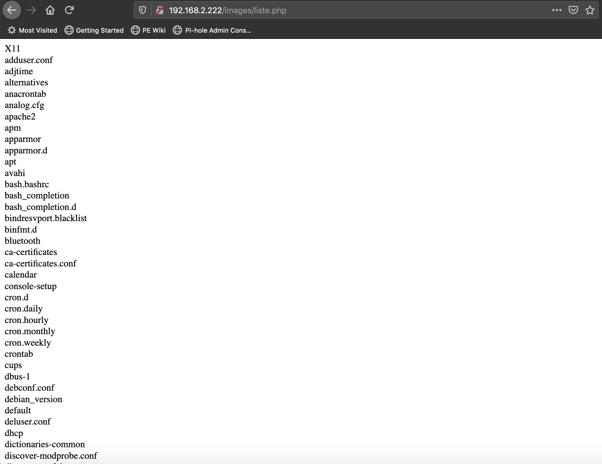

# Programmation d'applications sécurisées

[ProgrammationPHP]:https://phptherightway.com/#the_basics

À partir du cours d'aujourd'hui, nous allons prendre une application simple codée en PHP qui est insécure. À chaque cours, nous allons modifier l'application pour la rendre plus sécuritaire.  

## MonMur  

MonMur est une application qui permet à vos amis d'écrire des petits mots sur votre site Web. À la fin du cours, MonMur aura les fonctionnalités suivantes :  

- Permettre d'écrire de manière anonyme
- Permettre de créer un compte pour voir et modifier les petits mots écrits auparavant  
- Permettre à des administrateurs de visualiser les comptes utilisateurs, les supprimer et modérer les commentaires  

### Permier jet de MonMur  

```
&lt;?php
// database.php sert à interagir avec la base de données
require_once('database.php');
require_once('commun.php');

session_start();

$erreur = '';
$commentaire = '';

// Traiter l'image, s'il y a lieu
traiterImage($nom_image, $erreur);

// Ajouter le commentaire à la base de données sauf s'il y a une erreur
if(isset($_POST['commentaire'])) {
  if($_POST['commentaire'] && $_POST['commentaire'] != '') {
    $commentaire = $_POST['commentaire'];
    enregistrerCommentaire($commentaire, $nom_image, utilisateurCourant());
    retourAuMur();
    exit();
  } else {
    $erreur = 'Le commentaire est invalide. Veuillez réessayer.';
  }
}

// Dessiner l'interface utilisateur
$html = debutHtml()
 . formulaireCommentaire("monmur.php", $commentaire, 0, $erreur)
 . afficherCommentaires()
 . finHtml();

print $html;

function afficherCommentaires(){

  $resultats = listeCommentaires();

  $monmur = '';

  while($ligne = $resultats->fetch_assoc()){
    $commentaire = trim($ligne["commentaire"]);
    // Remplacer les retour de chariot par l'équivalent html
    $commentaire = str_replace("\n", '&lt;br/>', $commentaire);
    $commentaire_id = $ligne["commentaire_id"];
    $image = $ligne["image"];
    $code_utilisateur = trim($ligne["codeutilisateur"]);

    $monmur .= <<<fin
    &lt;div class="commentaire">
      &lt;div class="commentaire_entete">
        &lt;div class="utilisateur">{$code_utilisateur}&lt;/div>
        &lt;div class="commentaire_id">{$commentaire_id}&lt;/div>
      &lt;/div>
      &lt;div class="commentaire_texte">{$commentaire}&lt;/div>
    fin;

    if(!empty($image)) {
      $monmur .= "&lt;img src='/images/{$image}'/>";
    }

    // Afficher les actions seulement si c'est l'utilisateur qui est l'auteur
    if($code_utilisateur == utilisateurCourant() && utilisateurCourant() != ANON) {
      $monmur .= <<<fin
      &lt;div class="commentaire_pied">
        &lt;div class="commentaire_action">
          &lt;a href="modifier.php?id={$commentaire_id}">Modifier&lt;/a>
        &lt;/div>
        &lt;div class="commentaire_action">
          &lt;a href="javascript:ConfirmerSupression({$commentaire_id})">Supprimer&lt;/a>
        &lt;/div>
      &lt;/div>
      fin;
    }

    $monmur .= "&lt;/div>";
  }

  return $monmur;
}
?>
```

## Traitement des erreurs

Le bon traitement des erreurs dans votre code est essentiel pour :  

- Que l'utilisateur ne pense pas qu'il a brisé votre site Web dès qu'une erreur survient  
- Les pirates utilisent le contenu des erreurs brutes comme source d'information

### Conditions limites

Un aspect important pour éviter les erreurs est de se prévenir contre ce que l'utilisateur peut saisir dans notre page qui ne devrait pas y être.  

Exemples de conditions limites :  
- Entrée vide  
- Caractères de contrôle  
- Caractères non-alphanumériques  
- Entrée excessivement grande  
- Données binaires  
- Entrée dans une autre page de code (UTF-8, ASCII, etc.)    
- Injection SQL  
- Injection de code  
- XSS   

!!! important
    La règle d'or lors de l'écriture des conditions limites est de refuser tout ce qui est suspicieux.  

### Mécanisme de traitement des erreurs  

Dans votre application, certains choix devrons être faits. Est-ce que l'application devrait accepter le code HTML dans les commentaires?  D'un côté, ce peut être intéressant pour les utilisateurs de mettre en **gras** son commentaire, mais accepter le HTML ouvre la porte aux pirates.  

Pour enlever le code HTML d'une entrée :  

```
$texte_a_nettoyer = "Tu es &lt;em>le&lt;/em> meilleur!";
$texte_propre = strip_tags($texte_a_nettoyer);
```

$texte_propre aura la valeur "Tu es le meilleur!".

Au lieu de permettre le HTML pour formater les commentaires, il est possible d'utiliser un autre langage tel que Markdown. Il y a un module PHP qui aide pour ça :  

[ParseDown sur GitHub](https://github.com/erusev/parsedown)  

```
$Parsedown = new Parsedown();

$Parsedown->setSafeMode(true);

$commentaire = $Parsedown->text($ligne["commentaire"]);
```

Si c'est important pour vous de permettre le HTML, privilégiez l'utilisation d'un module tel que celui-ci :  

[HTML purifier](http://htmlpurifier.org/)  

Testons MonMur :  

Caractères de contrôle :  
```
"
```

Comment le corriger :
```
$commentaire = addslashes($commentaire);
```

Commentaire trop long :  
```
Da Da, ooooh  
Well, my friends, the time has come  
(To) raise the roof and have some fun  
Throw away the work to be done  
Let the music play on...(Play on, play on, play on.)  
Everybody sing, everybody dance  
Lose yourself in wild romance  
We're going to Party, Karamu, Fiesta, forever  
Come on and sing along!  
We're going to Party, Karamu, Fiesta, forever  
Come on and sing along!  

All night long (all night), All night (all night)  
All night long (all night), All night (all night)  
All night long (all night), All night (all night)  
All night long! (all night), Ooh, yeah (all night)  

People dancing all in the street  
See the rhythm all in their feet  
Life is good, wild and sweet  
Let the music play on...(Play on, play on, play on...)  
Feel it in your heart and feel it in your soul  
Let the music take control  
We're going to Party, Liming, Fiesta, forever  
Come on and sing along  
We're going to Party, Liming, Fiesta, forever  
Come on and sing my song!  

All night long (all night), oooh, (all night)  
All night long (all night), yeaz, (all night)  
All night long (all night), yeah, (all night)  
All night long (all night)...(all night)  

Yeah, once you get started you can't sit down  
Come join the fun, it's a merry-go-round  
Everyone's dancing their troubles away  
Come join our party, See how we play!  

[Chant}  
Tam bo li de say de moi ya  
Hey Jambo Jumbo  
Way to parti o we goin'  
Oh, jambali  
Tam bo li de say de moi ya  
Yeah, Jambo, jumbo  

Oh, O, O, O, yes  
We're going to have a party! (Yeah... ugh)  

All night long (all night), All night, (all night)  
All night long (all night), All night, (all night)  
All night long (all night), All night, (all night)  
All night long (all night)...(ugh)  

We're going to Party, Kalamu, Fiesta, forever  
Come on and sing along!  
We're going to Party, Kalamu, Fiesta, forever  
Come on and sing my song!  

All night long (all night), All night, (all night)  
All night long (all night), All night, (all night)  
All night long (all night), All night, (all night)  
All night long (all night)...(ugh)  

All night, (all night), All night, (all night),  
All night, (all night), All night, (all night),  
All night, (all night), All night, (all night),  
All night, (all night), Ugh, (all night),  

Everyone you meet (all night)  
They're jamming in the street (all night)  
All night long! (All night)  
Yeah, I said, (All night)  
Everyone you meet (All night)  
They're jamming in the street (All night)  
All night long! (All night)  
Feel good! Feel good! (All night)  
(All night to fade)  
```

[All Night long - Rhett and Link](https://youtu.be/HZb6oz0ANyA)  


Comment corriger :  

Deux choix :  

Couper le commentaire à la longueur maximale du champ de la base de données :  
```
$commentaire = substr($commentaire, 0, 1000);
```

OU  

Afficher un message d'erreur que le commentaire est trop long :  
```
if(mb_strlen($_POST['commentaire']) <= 1000) {
  $commentaire = $_POST['commentaire'];
  enregistrerCommentaire($commentaire, $nom_image, utilisateurCourant());
  retourAuMur();
  exit();
} else {
    $erreur = 'Le commentaire est trop long. Veuillez réessayer.';
}
```

XSS :  

```
&lt;script>alert('Doh!')&lt;/script>
```

Comment corriger :  

- En enlevant les tags html complètement  
- En utilisant un module qui transforme le commentaire à l'affichage (voir ParseDown)  
- En utilisant un module qui fait du ménage sélectif (voir HTML purifier)  


## Téléversement de fichiers

L'application MonMur permet de téléverser des images pour les commentaires. Un pirate peut abuser de cette fonctionnalité pour injecter du code PHP dans le serveur pour en prendre possession.

Téléversons un fichier nommé __liste.php__ :  

```
&lt;html>&lt;body>
&lt;?php echo str_replace("\n", '&lt;br/>',shell_exec("ls /etc/"));?>
&lt;/body>&lt;/html>
```

MonMur copie les images dans le répertoire `/images`.  Donc, on peut maintenant exécuter le code dans la barre d'adresse : `http://192.168.2.222/images/liste.php`  

!!! figure "Résultat de liste.php"
      

Il faut donc limiter les formats de fichier à accepter.  

Commençons par interdire les fichiers avec l'extension __.php__ :  

```
if (substr($image_cible,-3) == 'php') {
  $nom_image = '';
  $erreur = 'Ceci n\'est pas une image!';
  return 0;
}
```

On ne peut plus téléverser __liste.php__. Utilisons le bon vieux truc de la double extension et renommons le fichier `liste.php.jpg`.  

Le logiciel accepte sans problème le fichier qui peut être exécuté comme suit :  
`http://192.168.2.222/images/liste.php.jpg`  

La magie de ceci est une configuration du serveur qui permet d'exécuter tout script qui a la mention php dans son nom :  

```
&lt;FilesMatch ".+\.ph(ar|p|tml)"&gt;
    SetHandler application/x-httpd-php
&lt;/FilesMatch&gt;
&lt;FilesMatch ".+\.phps">
    SetHandler application/x-httpd-php-source
    # Deny access to raw php sources by default
    # To re-enable it's recommended to enable access to the files
    # only in specific virtual host or directory
    Require all denied
&lt;/FilesMatch>
# Deny access to files without filename (e.g. '.php')
&lt;FilesMatch "^\.ph(ar|p|ps|tml)">
    Require all denied
&lt;/FilesMatch>
```  

Corrigeons la configuration (le __$__ à la fin du regex indique que c'est à la fin du nom du fichier, donc .php accepté, .php.jpg ne l'est pas.):  

```
&lt;FilesMatch ".+\.ph(ar|p|tml$)">
    SetHandler application/x-httpd-php
&lt;/FilesMatch>
&lt;FilesMatch ".+\.phps$">
    SetHandler application/x-httpd-php-source
    # Deny access to raw php sources by default
    # To re-enable it's recommended to enable access to the files
    # only in specific virtual host or directory
    Require all denied
&lt;/FilesMatch>
# Deny access to files without filename (e.g. '.php')
&lt;FilesMatch "^\.ph(ar|p|ps|tml)$">
    Require all denied
&lt;/FilesMatch>

```

## Lectures supplémentaires  

[Documentation de MarkDown](https://www.markdownguide.org/)  
[Pirater les fichiers téléversés](https://www.hackingarticles.in/comprehensive-guide-on-unrestricted-file-upload/)  
[OWASP_Top_Ten](https://owasp.org/www-project-top-ten/)

## Testez vos connaissances  
[Petit quiz sur la programmation sécurisée](https://forms.office.com/r/WQ3z1mgvdJ)  
