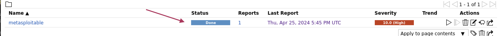
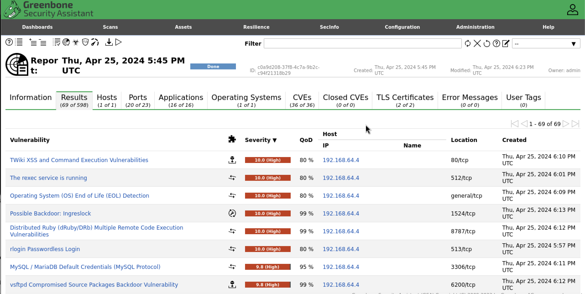

# Reconnaissance active

## Reconnaissance active avec nmap

Nous allons activement se connecter aux actifs, soit avec des ping, soit des balayages de ports. Ceci peut activer des alarmes du côté de la cible.

### Découverte d’actifs avec nmap

Nmap (network mapping) peut découvrir quels actifs se retrouvent dans un réseau

Utilise le ICMP Ping

`nmap -sn 192.168.40.0/24`

Le drapeau **–sn** sert à faire un simple ping pour chaque adresse de la plage sélectionnée.

### Découverte de services d'un actif

Nmap (network mapping) peut découvrir quels services (ports) sont ouverts chez la cible.

Une des méthodes de nmap pour découvrir les services d'un actif est de faire une connexion complète TCP. Le diagramme suivant explique l'établissement de la connexion en trois étapes.

!!! figure "Transaction TCP"
      
    3-way handshake

Pour balayer un actif :

`nmap -sT 192.168.40.2`

Le drapeau **–sT** fait une connection complète (SYN,SYN/ACK,ACK) sur tous les ports de la cible

Pour un balayage plus rapide, on peut faire un balayage à demi ouvert. On ne termine pas la connexion en trois étapes.

!!! figure " "
    
    L'actif 1 ne termine pas la connexion.

`nmap -sS 192.168.40.2`

Le drapeau **–sS** fait une connection incomplète (SYN,SYN/ACK) sur tous les ports de la cible

Autres drapeaux intéressants :

- **-vv** pour verbose (information plus détaillée)
- **-T4** pour accélérer le balayage
- **-A** pour détection de l'OS et autres scripts de détection
- **-Pn** prend pour acquis que le serveur est disponible. (Ne fait pas la découverte avec un ICMP ping)

`nmap -sS -vv -A -T4 192.168.40.2`

### Déterminer le système d'exploitation d'un actif

Nmap (network mapping) peut deviner quel OS roule sur la cible.

Utilise l’empreinte digitale de la cible.

`nmap -sS -O 192.168.40.2`

Le drapeau **–O** essaie de deviner l’OS de la cible selon les ports ouverts et leur réponse.

## Découverte active avec OpenVAS

OpenVAS est un outil qui détecte toutes les vulnérabilités connues et documentées des actifs balayés.

Pour installer OpenVAS :

[Voir la procédure d'installation.](../labo/installation_openvas.md)  

### Démarrer un balayage

!!! figure "Aller dans le menu Scan, puis l'option Tasks."
    

!!! figure "Cliquer sur l'étoile et choisir New Task."
    

!!! figure "Dans la fiche, cliquer sur l'étoile pour ajouter une cible"
    

!!! figure "Dans la fiche de la nouvelle cible, entrer le nom et son adresse IP"
    

!!! figure "Balayage créé"
    

!!! figure "Démarrer le balayage"
    

!!! figure "Attendre que le balayage se termine"
    

### Interpréter les résultats

OpenVAS donne beaucoup d'information sur les vulnérabilités trouvées :

!!! figure "Liste"  
    

!!! figure "Détails"
      
    1. Le sommaire donne un résumé de la vulnérabilité  
    2. Le résultat indique comment la vulnérabilité a été trouvée  
    3. La solution est ce qu'il faut faire pour se protéger  
    4. Ça donne un peut plus d'information sur l'attaque possible  
    5. Des informations sur le module d'OpenVAS qui a fait la détection  

!!! figure "Autres détails (selon les vulnérabilités)"
    

Parfois vous verrez une référence à un CVE (_Common Vulnerabilities and Exposures_). La liste officielle est celle du [MITRE](https://cve.mitre.org/cve/).

!!! warning "Attention"  
    Si vous êtes en charge de la sécurité de la compagnie, il est très important de régler les entrées de OpenVAS de 7 et plus de sévérité.

## Découverte d'application Web avec nikto

Nikto est un engin de balayage de serveurs web qui exécute des tests complets, dont 6500 fichiers potentiellement dangereux, évalue les version qui ne sont pas à jour de plus de 1250 serveurs et des problèmes spécifiques de plus de 270 serveurs.

Pour balayer un serveur Web avec Nikto :

`nikto -h 192.168.40.7`

!!! figure "Voici un exemple de résultat"
    
    (Dans ce cas-ci, c'est notre machine Metasploitable)

!!! figure "Voici un autre exemple, cette fois-ci un serveur sur un Raspberry PI"
    

Nikto donne des références à OSVDB (une base de données qui a fermé en 2016). Si vous voulez le CVE correspondant, utilisez [cette page de correspondance.](https://cve.mitre.org/data/refs/refmap/source-OSVDB.html)

## Testez vos connaissances  

[Petit quiz sur la reconnaissance active](https://forms.office.com/r/Vp6RsyUyfp)  
