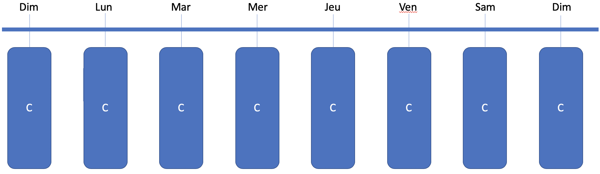
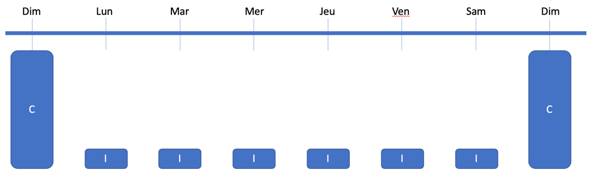
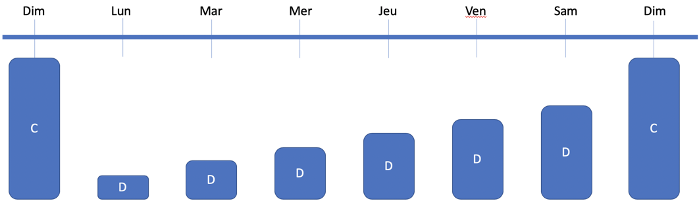

# Stratégies de sauvegarde

## Pourquoi sauvegarder

La sauvegarde est nécessaire pour récupérer un fichier, un dossier ou un système complet dans les situations suivantes:

- Suppression accidentelle d'un fichier
- Corruption d'un fichier
- Installation d'une rustine qui rend instable un système
- Corruption de disque
- Infestation de virus
- Données cryptées par un cryptovirus

## Types de sauvegarde

Type  | Description   
--|---
Complet  | Prend une image d'absolument tout     
Incrémental  | Prend ce qui a changé depuis la dernière sauvegarde    
Différentiel  | Prend ce qui a changé depuis la dernière sauvegarde complète     

### Sauvegarde complète

Dans ce scénario, une sauvegarde complète est fait chaque jour. Disons que les données sauvegardées prennent 10 gb et que le temps de sauvegarde est de 2 heures. Après 7 jours, c'est donc 70 gb d'espace qui est requis.

Avantages :  
- Besoin d'une seule sauvegarde lors de la restauration.  

Inconvénients :  
- Besoin énorme d'espace de sauvegarde  
- Temps de sauvegarde très grand  
- Impossible de faire plus d'une sauvegarde par jour  

### Sauvegarde complète avec incrémental

Dans ce scénario, une sauvegarde complète est faite une fois par semaine, les autres jours, une sauvegarde incrémentale est faite.

Poids de la sauvegarde :  
Complet : 10 gb  
Incrémental : 1 gb chaque jour  
Total : 16 gb par semaine  

La restauration doit être faite à partir du complet et de tous les incrémentals. Ex:

Vendredi matin, le serveur doit être restauré. On doit prendre la sauvegarde du dimanche (le complet) et ceux du lundi, mardi, mercredi, jeudi et vendredi.

Avantages :  
- Besoin de moins d'espace de sauvegarde  
- La sauvegarde incrémentale est plus rapide  

Inconvénients :  
- Temps de restauration très long  
- Plus de risque de corruption d'une sauvegarde  

### Sauvegarde complète avec différentiel

Dans ce scénario, une sauvegarde complète est faite une fois par semaine, les autres jours, une sauvegarde différentielle est faite.

Poids de la sauvegarde :

Complet : 10 gb

Différentiel :

Jour  | Poids de la sauvegarde  
--|--
1  | 1 gb  
2  | 2 gb
3  | 3 gb
4  | 4 gb
5  | 5 gb
6  | 6 gb

Total : 31 gb par semaine

La restauration doit être faite à partir du complet et du dernier différentiel. Ex:

Vendredi matin, le serveur doit être restauré. On doit prendre la sauvegarde du dimanche (le complet) et celui du  vendredi.

Avantages :  
- Besoin de moins d'espace de sauvegarde que le complet seulement  
- La sauvegarde différentielle est plus rapide que le complet  
- Temps de restauration moins long que l'intégral  

Inconvénients :  
- Temps de restauration plus long que le complet  
- Plus de risque de corruption d'une sauvegarde  

## Comment choisir la stratégie de sauvegarde

Voici quelques points à considérer lors de l'analyse du besoin de sauvegarde :  

1. Capacité du médium de sauvegarde  
2. Fréquence de sauvegarde  
3. Rétention des sauvegardes  
4. RTO (Recovery time objective)  
5. RPO (Recovery point objective)  

### RTO vs RPO

#### **1. RPO (Recovery Point Objective) :**

- **Définition :** Le RPO représente la période maximale pendant laquelle des données peuvent être perdues en cas de panne.
- **Dans ce contexte :** Étant donné que le serveur est sauvegardé une fois par jour, le RPO peut atteindre jusqu'à **24 heures**. Cela signifie que toutes les données modifiées entre la dernière sauvegarde et le moment du crash risquent d'être perdues.

#### **2. RTO (Recovery Time Objective) :**

- **Définition :** Le RTO est le temps maximal acceptable pour restaurer le système après une panne et reprendre les opérations normales.
- **Dans ce contexte :** Il s'agit du temps écoulé entre le **crash du serveur** et le moment où le **système est pleinement opérationnel** après la restauration. Par exemple, si la restauration prend **7 heures**, alors le RTO est de **7 heures**.

### **Scénario détaillé :**

1. **Sauvegarde quotidienne :** Le serveur effectue une sauvegarde complète chaque jour à une heure fixe (par exemple, à minuit).
2. **Crash du serveur :** Une panne survient à un moment imprévu (par exemple, à 15h00).
3. **Perte de données (RPO) :** Les données créées ou modifiées entre la dernière sauvegarde (minuit) et le crash (15h00) peuvent être perdues.
4. **Restauration du système (RTO) :** Le temps nécessaire pour restaurer le serveur à partir de la dernière sauvegarde et remettre le système en service (par exemple, de 15h00 à 22h00).

### **Conclusion :**

- **RPO (15 heures dans cet exemple) :** Indique la quantité maximale de données susceptibles d'être perdues.
- **RTO (7 heures dans cet exemple) :** Indique le temps maximal pour rétablir le service après une panne.

**Remarque :** Pour réduire le RPO et le RTO, vous pourriez envisager des stratégies telles que des sauvegardes plus fréquentes, la mise en place de systèmes redondants ou l'utilisation de solutions de récupération d'urgence avancées.

### Scénario 1

La compagnie X doit faire la sauvegarde d'un serveur de 20 gb. La compagnie a une capacité de sauvegarde de 1 tb. Un requis est de conserver les sauvegardes 30 jours.

Point  | Valeur
--|--
Capacité  | 1 tb = 50 sauvegardes
Fréquence  | 1 fois par jour
Rétention  | 30 jours
RTO  | Non mentionné
RPO  | Non mentionné

Suggestion :

Comme la compagnie a la capacité de conserver au moins 30 sauvegardes complètes, il est préférable de faire une sauvegarde complète à chaque jour, pour réduire le RTO.

### Scénario 2

La compagnie Y doit faire la sauvegarde d'un serveur de 20 gb. Elle est ouverte de 8h à 17h. Elle veut ne perdre qu'au maximum 4 heures de données dans la journée. Il y a environ 2% de données modifiées par jour et 1 gb de nouvelles données par semaine. Un requis est de conserver les sauvegardes 90 jours. Une sauvegarde complète prend 2 heures.

Point  | Valeur
--|--
Capacité  | Non mentionnée
Fréquence  | 1 fois par jour
Rétention  | 90 jours
RTO  | Non mentionné
RPO  | 4h

Suggestion :

Le point important est la mention de la perte de données de moins de 4 heures. Comme la compagnie travaille de 8h à 17h, il y a donc 8 heures de travail. Une sauvegarde par jour n'est pas suffisante. La sauvegarde complète prend 2 heures, trop long pour l'heure du lunch. Dans ce cas, je proposerais une sauvegarde complète tous les soirs et une sauvegarde incrémentale le midi.

## Médium de sauvegarde

Médium | Coûts | Vitesse | Accessibilité | Protection en cas de feu
--|--|--|--|--
NAS | $$ | +++ | Toujours | Non
HDD Externe  | $  | ++ | Quand connecté | Quand entreposé hors du bâtiment
Librairie de rubans  | $$ | ++ | Quand le ruban est dans le lecteur | Quand entreposé hors du bâtiment
Infonuagique  | $$ | + | Toujours | Oui

### Stratégie typique

La stratégie d'une entreprise sérieuse et de mélanger deux médiums ou plus.

Par exemple :

Sauvegarde aux heures dans le NAS. Sauvegarde tous les soirs sur ruban.

### Stratégie de l'attaquant

Les hackers modernes qui ciblent les entreprises ont développé une stratégie efficace contre les sauvegardes.

Il y a quelques années, lorsqu'une entreprise subissait une attaque de cryptovirus, les TI faisaient un formatage complet et une restauration à partir de la dernière sauvegarde. Les hackers ont appris et dans leurs protocoles d'attaque, ils s'assurent que tous les sauvegardes soient détruites avant de lancer l'attaque, obligeant l'entreprise à payer pour la clé de décryption.

Dans un but de prévenir ce genre d'attaque, il est fortement recommandé d'avoir un type de sauvegarde hors ligne, qui ne peut être accessible que physiquement. Ce peut être un ruban qu'on retire du lecteur à tous les jours ou un disque dur externe qui n'est connecté que lors de la sauvegarde. Le NAS et l'infonuagique peuvent être compromis à distance.

!!! important  
    Prenez quelques minutes pour faire votre [cartographie](../outils/cartographie.md) de la leçon d'aujourd'hui!   

## Testez vos connaissances

[Petit quiz sur les stratégies de sauvegarde](https://forms.office.com/r/j06fAxj1ZM)  
