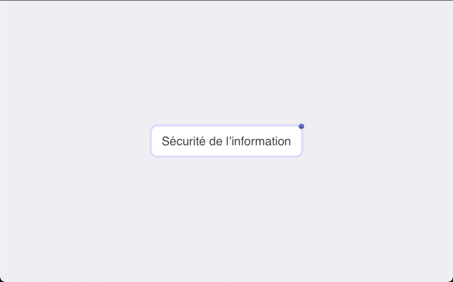
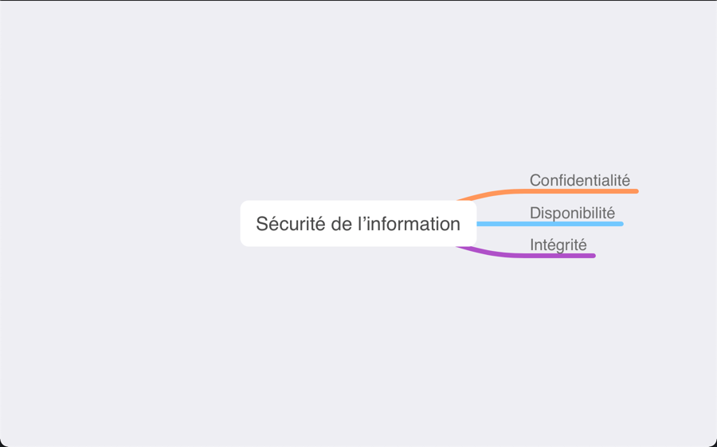
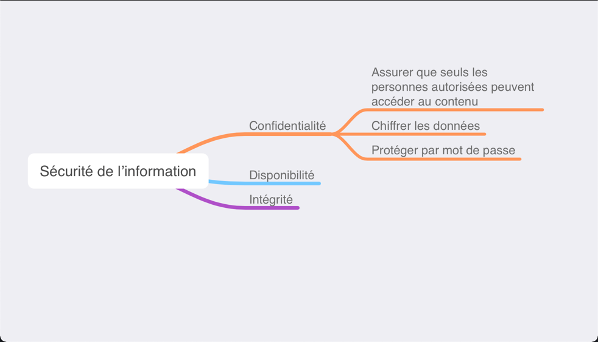

# Cartographie des connaissances  

La cartographie des connaissances est une méthode de stockage, d’organisation, de priorisation, d’apprentissage, de révision et de mémorisation de l’information. Ça permet de visualiser un concept et de se créer un modèle mental. C'est un outil d'aide à l'apprentissage.

Une cartographie peut être très personnelle.  

Commençons avec le concept central du cours, la sécurité de l'information.  

!!! figure "Concept central"
    
    La base de la sécurité de l'information    

Durant le cours, vous allez découvrir des sujets reliés au concept central :  

!!! figure "Concept avec sujets reliés"
    
    Quelques sujets du triangle de sécurité    

Pour bien comprendre le sujet, il faut parfois faire des recherches pour approfondir certains aspects. Par exemple, la confidentialité pourrait être détaillée comme suit :  

!!! figure "Approfondir un aspect"
    
    Détail du concept de confidentialité

Outil que vous pouvez utiliser pour créer vos cartographies :  

[Git Mind](https://gitmind.com)   
